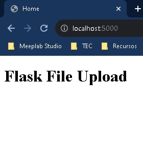

# Manejo de archivos en Flask

## Objetivo

En este laboratorio continuaremos explorando Flask, así como algunas librerías adicionales para poder subir archivos a nuestro servidor.

Dependiendo el proyecto de ciencia de datos que realices el manejo de archivos o imágenes puede ser esencial para tu proyecto, realiza el laboratorio a conciencia para facilitarte el uso de herramientas en tu proyecto.
## Instrucciones

Sigue los pasos descritos en la siguiente práctica, si tienes algún problema no olvides que tus profesores están para apoyarte.

**Nota: El laboratorio estará desarrollado para Windows, pero pueden seguirse los mismos pasos para Linux o Mac.**

## Laboratorio
### Paso 1 Instalación de librerías necesarias para comenzar.

En el laboratorio anterior, instalamos Flask como librería, por lo que ya deberías tenerlo instalado, en caso de que no te dejo el comando para realizarlo. 

Para comenzar debemos instalar las siguientes librerías en nuestra computadora, por lo tanto desde tu terminal instala lo siguiente:

```
pip install flask
pip install flask_wtf
pip install wtforms
```

### Paso 2 Preparar tu entorno de desarrollo
Crea una carpeta para tu laboratorio en tu computadora, en mi caso estoy creando la carpeta **lab2.**


Ahora abre **Visual Studio Code**, si quieres aprender algo nuevo, desde terminal y en la ruta de tu carpeta puedes ejecutar el comando **code .** y esto abre la carpeta desde donde estás, en el caso de que lo hagas manual arrastra la carpeta de tu laboratorio.

Ya que tenemos Visual Studio Code abierto vamos a crear un nuevo archivo llamado **main.py**.

Ahora vamos a añadir el código inicial para correr nuestro servidor, recordarás la base que vimos en el laboratorio pasado, por facilidad vamos a extender un poco lo que hicimos con otra forma de trabajar con Flask que podrías encontrar en tutoriales de internet.

```
from flask import Flask, render_template

app = Flask(__name__)

@app.route('/')
@app.route('/home')
def home():
    return "Hello from Flask."

if __name__ == '__main__':
    app.run(debug=True)
```

Algunos cambios respecto al laboratorio anterior:

1. En vez de definir las clases y luego añadirlas a una url, ahora usamos los decoradores previo a definir una función para mapearla como url. Más adelante veremos como aplicar los métodos estándar GET y POST.
2. Al momento de ejecutar el servidor utilizamos la variable debug, y pasamos un valor de True, esto nos permitirá visualizar todos los errores que aparezcan en nuestro servidor, mantener esta variable activa durante el desarrollo es recomendado pero al momento de usar el servidor en producción no olvides colocarla en False para evitar que tus usuarios vean errores innecesarios.

En sí el código es muy simple pero esta será nuestra base para lo siguiente.

### Paso 2 Usar plantillas para cargar código HTML

Cuando trabajamos con proyectos de desarrollo Web es muy común utilizar archivos HTML, estos contienen la vista que queremos desplegar a nuestros usuarios para desplegar información, solicitarla a partir de un formulario, etc.

En este paso veremos como crear estos archivos HTML y como a partir de nuestro servidor empezar a servirlos.

Antes que nada necesitamos crear una nueva carpeta en nuestro proyecto de laboratorio que se llame **templates**.


Dentro de esta nueva carpeta vamos a crear un archivo **index.html**


Ahora, bien puedes agregar el siguiente código copiando y pegando, pero intenta lo siguiente, coloca un signo de exclamación en visual studio **!** y aparecerá un mini menú de opciones, selecciona la primera y te generará el código HTML más básico que existe y que todo sitio web debe de tener.


El código generado es el siguiente:

```
<!DOCTYPE html>
<html lang="en">
<head>
    <meta charset="UTF-8">
    <meta name="viewport" content="width=device-width, initial-scale=1.0">
    <title>Document</title>
</head>

<body>

</body>
</html>
```

Vamos a editar el título de sitio y añadir una etiqueta a desplegar en pantalla como lo siguiente:

```
<!DOCTYPE html>
<html lang="en">
<head>
    <meta charset="UTF-8">
    <meta name="viewport" content="width=device-width, initial-scale=1.0">
    <title>Home</title>
</head>

<body>
    <h1>Flask File Upload</h1>
</body>
</html>
```

Ahora, para poder renderizar este archivo **index.html**, dentro de nuestro servidor volvamos a **main.py**

Dentro de la línea 8, tenemos la instrucción **return "Hello from Flask."**, esta la vamos a modificar y nota que usaremos la librería que importamos de Flask **render_template**.

```
return render_template('index.html')
```

Tan simple como eso indicaremos a Flask que sirva nuestro archivo **index.html**, si volvemos a correr el servidor el resultado debe mostrarnos la etiqueta **H1** que definimos.



### Paso 3 Crear formularios para el envío de archivos

Para este paso vamos a hacer uso de las librerías instaladas al inicio del laboratorio, por favor añade lo siguiente debajo de la importación de Flask:

```
from flask_wtf import FlaskForm
from wtforms import FileField, SubmitField
```

Ahora con estas clases vamos a poder crear formularios dinámicos, si bien este paso lo podemos hacer manualmente escribiendo todo el código HTML, Python nos da la flexibilidad de conectar fácilmente estos datos para hacer más fácil el trabajo.

Debajo de la definición de **app** vamos a añadir el siguiente código

```
class UploadFileForm(FlaskForm):
    file = FileField("File")
    submit = SubmitField("UploadFile")
```

Dentro de esta clase definimos el **form**, todo formulario puede contener campos de texto, campos de archivo como es nuestro caso y al final es común ver el botón de envío que es el que se encarga de unificar todo y mandarlo a través del **body** de la petición.

En el laboratorio anterior usamos el método **POST** para crear un nuevo video al final de nuestra lista, en este caso haremos algo similar pero enviando el archivo del formulario.

Para hacer esto nos falta decirle a nuestro render que mande nuestro form al html, para hacer esto debemos actualizar el render a lo siguiente:

```
form = UploadFileForm()
return render_template('index.html', form=form)
```

Ahora por default en la mayoría de los servidores, si no definimos el método se usa el **GET**, como ya dijimos debemos utilizar el **POST**, que en lo general para los formularios es el método más común a utilizar, y esto por que todo va dentro del **body** en la petición HTTP y hace más fácil obtener la información que queremos, en el caso de los archivos verás que tenemos que hacer un ajuste adicional puesto que no son datos simples como texto, sino que ya estamos hablando de archivos binarios y esto complica ligeramente las cosas.

Para poder usar el método post vamos a actualizar las **url** con lo siguiente

```
@app.route('/', methods=['GET','POST'])
@app.route('/home', methods=['GET','POST'])
```

Esto nos permite seguir utilizando nuestras urls como hasta el momento cargando el **index.html** pero cuando definamos el formulario que regrese a través de la misma URL en el **POST**.

Ahora por configuración de Python, debemos configurar una llave secreta para nuestro formularios. Debajo de la definición de **app**, vamos a colocar lo siguiente:

```
app.config['SECRET_KEY'] = 'supersecretkey'
```

**Nota: Recuerda que estamos en desarrollo y aprendiendo, pero en un entorno de producción real debes sustituir el secret key por algo que realmente brinde seguridad a tu proyecto.**

Ahora ya que finalizamos de configurar nuestro formulario, vamos a proceder a añadirlo a nuestro **index.html**.

Debajo de la etiqueta **h1** que creamos vamos a añadir lo siguiente:

```
<form method="POST">
        {{form.hidden_tag()}}
        {{form.file()}}
        {{form.submit()}}
</form>
```

Como te decía, bien podemos genera el código HTML puro, pero con wforms, podemos definir nuestro form y aplicarlo directamente sobre el código html, esto nos permite crear componentes genéricos para el manejo de formularios con Python.

También observa la definición del método **POST**, dentro del formulario.

Si reiniciamos el servidor el resultado deberá ser el siguiente:


Solo un punto a mencionar con el uso del **secret key** y con la llamada **{{form.hidden_tag()}}** es que esto lo utilizamos para evitar ataques de tipo [CSRF](https://owasp.org/www-community/attacks/csrf) que pueden vulnerar nuestros formularios y dejar vulnerables a nuestros servidores.

Todo nuestro código funciona, pero como te mencioné antes al trabajar con archivos los datos no están en texto plano y por ello necesitamos añadir una instrucción a nuestro form, actualiza la siguiente línea a lo siguiente en **index.html**

```
 <form method="POST" enctype="multipart/form-data">
```

El **enctype** nos ayuda a que en caso de subir un archivo pesado, este se suba en pequeñas partes, pero también le indica al servidor a que tiene que esperar todas estas partes antes de continuar, facilitando la traducción del archivo y su envío al servidor.

### Paso 4 Subir archivos al servidor

Ya que está hecha la base para subir archivos, ahora solo falta recibirlos, vamos a comenzar importando unas librerías adicionales al proyecto, vamos a hacer esto debajo de **wtforms**.

```
from werkzeug.utils import secure_filename
import os
```

Estas librerías no requieren de instalación adicional ya que **werkzeug.utils** es parte de Flask, y **OS** es nativa de Python para el manejo de archivos.

Ahora vamos a crear una carpeta **static** en nuestro proyecto ya que es el estándar dentro de un desarrollo web y dentro de esta agregaremos otra carpeta llamada **files**.


Ahora necesitamos decirle a Flask que nuestro folder default para subir archivos es este, por lo que debajo de la definición del **secret key** vamos a añadir lo siguiente

```
app.config['UPLOAD_FOLDER'] = 'static/files'
```

Ya que esta configurado, dentro de nuestra función **home()**, debajo de la definición del **form** vamos a decirle a nuestro código que debe hacer en caso de que el usuario presione el **submit**.

```
if form.validate_on_submit():
        file = form.file.data
        file.save(
            os.path.join(
                os.path.abspath(
                    os.path.dirname(__file__)
                ),
                app.config['UPLOAD_FOLDER'],
                secure_filename(file.filename)
            )
        )
        return "File has been uploaded"
```

Dentro de este código hacemos 3 cosas principales:
1. Recuperar el archivo del form
2. Guardar el archivo
3. Regresar un mensaje al usuario

La segunda instrucción que es la más compleja, lo único que hace es obtener las rutas de nuestra carpeta para los archivos estáticos y concatenarla al nombre del archivo para guardarlo en su correspondiente.

Si reinicias tu servidor e intentas subir un archivo verás el resultado.

Más allá de lo que sucede en el navegador que al momento de subir el archivo te debe mostrar el mensaje


Si ves en tu carpeta del laboratorio, deberías tener visible el archivo


Ahora intenta hacer un submit sin haber cargado un archivo previamente.

Si llegaste a esto estás en buen camino.


### Paso 5 Validación de campos requeridos por el formulario

Es muy común evitar errores como el anterior marcando que campos de nuestro campos son obligatorios y cuales no, el último paso a realizar en el laboratorio es añadir este elemento a nuestro campo de archivo, para hacerlo vamos a **main.py** y debajo del import a **OS**, vamos a añadir lo siguiente

```
from wtforms.validators import InputRequired
```

Y dentro de nuesto **UploadFileForm** en el campo de **File** vamos a actualizar a lo siguiente

```
file = FileField("File", validators=[InputRequired()])
```

Nuevamente, reinicia el servidor e intenta hacer la prueba sin ningún archivo seleccionado.


El resultado deberá ser algo como lo anterior, donde se solicita forzosamente el archivo para poder continuar.

Si tuviste algún problema te dejo el código de **main.py**

```
from flask import Flask, render_template
from flask_wtf import FlaskForm
from wtforms import FileField, SubmitField
from werkzeug.utils import secure_filename
import os
from wtforms.validators import InputRequired

app = Flask(__name__)
app.config['SECRET_KEY'] = 'supersecretkey'
app.config['UPLOAD_FOLDER'] = 'static/files'

class UploadFileForm(FlaskForm):
    file = FileField("File", validators=[InputRequired()])
    submit = SubmitField("UploadFile")

@app.route('/', methods=['GET','POST'])
@app.route('/home', methods=['GET','POST'])
def home():
    form = UploadFileForm()
    if form.validate_on_submit():
        file = form.file.data
        file.save(
            os.path.join(
                os.path.abspath(
                    os.path.dirname(__file__)
                ),
                app.config['UPLOAD_FOLDER'],
                secure_filename(file.filename)
            )
        )
        return "File has been uploaded"
    return render_template('index.html', form=form)

if __name__ == '__main__':
    app.run(debug=True)
```

Y el código de **index.html**

```
<!DOCTYPE html>
<html lang="en">
<head>
    <meta charset="UTF-8">
    <meta name="viewport" content="width=device-width, initial-scale=1.0">
    <title>Home</title>
</head>

<body>
    <h1>Flask File Upload</h1>
    <form method="POST" enctype="multipart/form-data">
        {{form.hidden_tag()}}
        {{form.file()}}
        {{form.submit()}}
    </form>
</body>
</html>
```

## Conclusión

Subir archivos es bastante sencillo con Flask, cuida los detalles de nombres de campos, rutas y la seguridad.

Si tu proyecto utiliza imágenes para tus modelos, estructura bien como se deben almacenar los archivos, en ese caso puede que necesites expandir un poco más tu manejo de los forms y de las rutas, pero con el conocimiento que ya tienes puedes investigar por tu cuenta lo que puedes hacer.