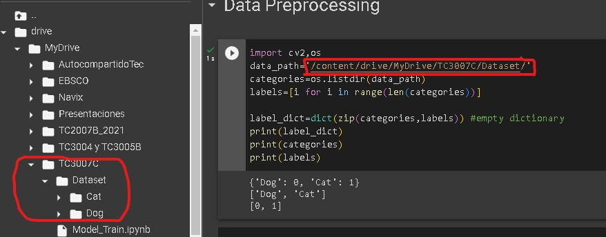
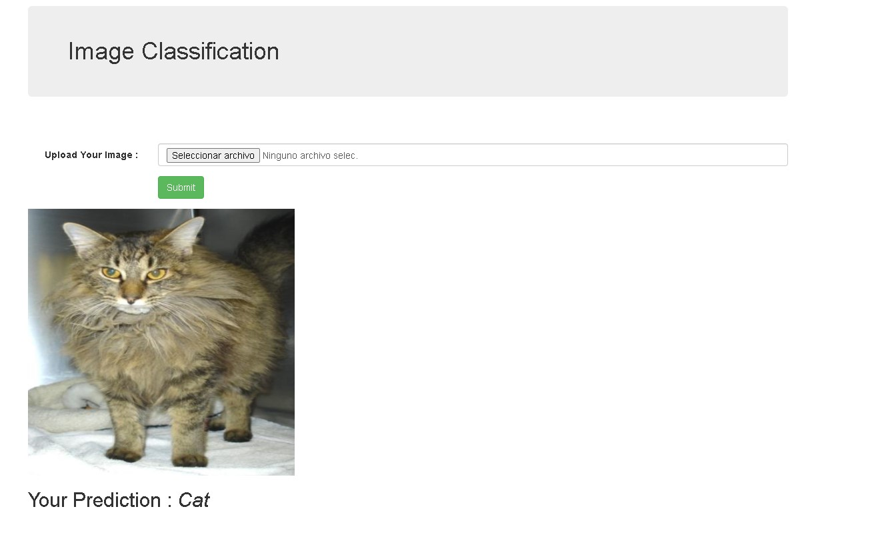

# Modelos de Inteligencia Artificial con Flask

## Objetivo

En este laboratorio vamos a explorar el como generar un modelo inteligente y a partir de él, veremos como poder exportarlo y agregarlo a una aplicación desarrollada en Flask.

## Instrucciones

Sigue los pasos descritos en la siguiente práctica, si tienes algún problema no olvides que tus profesores están para apoyarte.

**Nota: El laboratorio estará desarrollado para Windows, pero pueden seguirse los mismos pasos para Linux o Mac.**

**Nota 2: No vamos a explorar demasiado el modelo ya que este lo veras más a detalle en otro momento del curso.**

## Laboratorio
### Paso 1 Instalación de librerías necesarias para comenzar.

```
pip install keras
pip install tensorflow
```

Si bien Keras es parte de Tensorflow en ocasiones por las versiones pueden darse algunos conflictos por eso instalamos ambas.


### Paso 2 Preparando el modelo

El modelo que utilizaremos para este laboratorio es sobre un problema de clasificación de imágenes, esto nos permitirá conectar lo visto en el último laboratorio en donde a partir del servidor Flask podemos subir archivos.

Ahora con ese mismo conocimiento vamos a subir un archivo al servidor y clasificarlo.

Las imágenes que vamos a utilizar son de perros y gatos tratando de identificar correctamente a cada uno.

Algunos puntos importantes a partir de este laboratorio es que no te daré el modelo tal cual, si tendrás acceso al **colab** que genera el modelo y por tanto al código, pero es parte del laboratorio generarlo.

Un punto y aparte en ese sentido es que las aplicaciones inteligentes separan el proceso de la generación de modelos de su uso en producción, puede darse incluso el caso en que aplicaciones permitan el acceso a diferentes versiones de los modelos según su entrenamiento o capacidad, tal como ChatGPT.

#### Dataset
Como cualquier problema de inteligencia de datos, es necesario tener un dataset, para el caso de nuestro laboratorio utilizaremos un entrenamiento con 100 fotos tanto de perros y gatos, pero te comparto un dataset para que puedas explorar más allá.

[Revisar el Dataset](https://www.kaggle.com/datasets/shaunthesheep/microsoft-catsvsdogs-dataset)

El DataSet contiene imágenes de perros y gatos en una proporción de 12 mil aproximadamente para cada uno.

No olvides que es importante la cantidad de datos que pasas al entrenamiento, sobra decir que las 100 imágenes que vamos a pasar de inicio son **muy pocas**, para obtener mejores resultados se requieren más, pero intenta una prueba como viene en el laboratorio y expande tu conocimiento abarcando diferentes cantidades, incluso intenta generar varios modelos a forma de versiones y observa las diferencias reales de cada uno al momento de generar un resultado.

Para poder acceder al modelo te dejare el siguiente [link de Drive](https://drive.google.com/drive/folders/13fY68udJgjwVxwdXDkJSWt02hilpuqzz?usp=sharing), desde aquí puedes usar el Dataset ajustado a como yo lo utilice para el laboratorio.


Ahora vamos a abrir **Model_Train.ipynb** con **Colab**.


Ya que tenemos nuestro código listo podemos comenzar a preparar el modelo.


Empezaremos cargando la unidad de Drive a este notebook, deberá pedirte un permiso no olvides otorgarlo.


Ya tenemos cargada nuestra unidad, ahora vamos a especificar donde van a estar nuestros archivos, no olvides modificar al tuyo, sea que hayas cambiado la extensión del Path o que hayas cambiado el nombre, el mío es

```
/content/drive/MyDrive/TC3007C
```


Ahora debemos cargar tensorflow, las librerías de Colab traen las versiones actualizadas donde por lo general ahora es la versión 2.


Ahora en la sección de **Data Preprocessing** vamos a listar las carpetas de nuestro Dataset, nuevamente, verifica el path de tu Dataset para que coincida con el código.



Ahora empezará el preprocesamiento ajustando las imágenes a un tamaño de 100x100, esto para estandarizar las imágenes dentro del dataset.

Si el resultado te regresa algunas excepciones no te preocupes el código funciona correctamente. Si ves algún error diferente puede que sea algún otro error, verifica con tu profesor en ese caso.


Ahora ejecuta las generación de categorías para el modelo.


Ahora vamos a generar la red neuronal, al ejecutar el último paso del **model.summary()** puedes ver el resumen del modelo para ver más detalles de la red neuronal.

Ahora una vez creada la red neuronal, vamos a realizar los pasos de entrenamiento, previo a terminar asegura de ejecutar el paso de guardar el guardar el modelo en el archivo **model.h5** que es el que usaremos en nuestra aplicación.

Para revisar detalles adicionales del modelo ejecuta la creación de la gráfica, al agregar más datos de entrenamiento su comportamiento varía, utiliza estos datos para mejorar más adelante tu modelo.


El resultado final debe ser la generación del modelo **model.h5** y en caso de haberlo creado la imagen del reporte del modelo **CNN_Model.png**


### Paso 3 Preparar tu entorno de desarrollo
Crea una carpeta para tu laboratorio en tu computadora, en mi caso estoy creando la carpeta **lab3.**


Ahora abre **Visual Studio Code**, si quieres aprender algo nuevo, desde terminal y en la ruta de tu carpeta puedes ejecutar el comando **code .** y esto abre la carpeta desde donde estás, en el caso de que lo hagas manual arrastra la carpeta de tu laboratorio.

Ya que tenemos Visual Studio Code abierto vamos a crear un nuevo archivo llamado **main.py**.

Ahora vamos a añadir el código inicial este código no debe ser desconocido pues es la configuración básica de una app Flask.

```
from flask import Flask, render_template, request

app = Flask(__name__)

# routes
@app.route("/", methods=['GET', 'POST'])
def main():
    return "Hello World"

if __name__ =='__main__':
    #app.debug = True
    app.run(debug = True)
```

Realiza una prueba de corrida del servidor para verificar que todo está en orden y proseguir al siguiente paso.

### Paso 4 Manejando la plantilla del servidor

Ya que tenemos la base del servidor corriendo ahora vamos a agregar la plantilla del código HTML para desplegar nuestro formulario que recibe imágenes.

Vamos a crear en la carpeta del proyecto la carpeta **templates** y dentro de ella el archivo **index.html**.

Los detalles los vimos el laboratorio anterior, por ahora solo pasaremos a agregar el código en **index.html**

```
<!DOCTYPE html>
<html lang="en">
<head>
  <title>Image Classification</title>
  <meta charset="utf-8">
  <meta name="viewport" content="width=device-width, initial-scale=1">
  <link rel="stylesheet" href="https://maxcdn.bootstrapcdn.com/bootstrap/3.4.1/css/bootstrap.min.css">
  <script src="https://ajax.googleapis.com/ajax/libs/jquery/3.5.1/jquery.min.js"></script>
  <script src="https://maxcdn.bootstrapcdn.com/bootstrap/3.4.1/js/bootstrap.min.js"></script>

</head>

<body>
<div class="container">
  <h1 class="jumbotron bg-primary">Image Classification</h1>
  <br><br>
  <form class="form-horizontal" action="/submit" method="post" enctype="multipart/form-data">
    <div class="form-group">
      <label class="control-label col-sm-2" for="pwd">Upload Your Image :</label>
      <div class="col-sm-10">          
        <input type="file" class="form-control" placeholder="Hours Studied"  name="my_image" id="pwd">
      </div>
    </div>

    <div class="form-group">        
      <div class="col-sm-offset-2 col-sm-10">
        <button type="submit" class="btn btn-success">Submit</button>
      </div>
    </div>
  </form>

    
  
    <h2> Your Prediction   : <i> {{prediction}} </i></h2>
    

</div>
</body>
</html>
```

Este código nos permite agregar el formulario de archivos y servirlo a través del método **POST** con lo que hemos realizado en los laboratorios hasta el momento.

Algunos puntos adicionales a destacar son los  siguientes:

```
<link rel="stylesheet" href="https://maxcdn.bootstrapcdn.com/bootstrap/3.4.1/css/bootstrap.min.css">
  <script src="https://ajax.googleapis.com/ajax/libs/jquery/3.5.1/jquery.min.js"></script>
  <script src="https://maxcdn.bootstrapcdn.com/bootstrap/3.4.1/js/bootstrap.min.js"></script>
```

El uso de librerías externas para agregar un mejor diseño a nuestra presentación así como algunas funciones del lado del cliente a través de Javascript. Esta parte tiene más detalles sobre un curso de desarrollo Web, si necesitas apoyo en esta parte habla con tu profesor.

Por último esta sección:

```

  
    <h2> Your Prediction   : <i> {{prediction}} </i></h2>

```

Hasta el momento hemos visto el uso de código estático en HTML, pero observa que con Flask podemos insertar código de Python dentro de nuestro HTML, y esto es posible mediante un proceso de pre-render de las plantillas que ocurre en el servidor.

Cuando una petición se realiza la función de **route**  puede devolver datos o valores, para poder interpretarlos podemos manejar la inserción de datos de Flask y agregar detalles al código HTML estático, esto termina la petición y finalmente cuando todo está listo se envía al cliente, por tanto en el navegador lo que se ve es un código HTML estático como si nada hubiera pasado.

**Nota: Es importante que entiendas cuando ocurre este proceso de render en la plantilla ya que muchos errores al inicio se dan por no entender cuando ocurre y creer que el paso se da después de que se carga en el navegador la información, lo cual es incorrecto.**

Por último vamos a cargar la plantilla en la url principal modificando el código en **main.py**.

```
# routes
@app.route("/", methods=['GET', 'POST'])
def main():
    return render_template("index.html")
```


Ahora bien, al correr nuestro servidor deberíamos ver algo como lo siguiente:


Por último vamos a interpretar la subida de archivos agregando la carpeta **static** al proyecto.

### Paso 5 Manejando la plantilla del servidor


Y dentro de **main.py** agregamos una nueva ruta que maneje los archivos, a diferencia del laboratorio pasado donde realizábamos el manejo en la misma url principal, vamos a extender lo que sabemos con esta nueva url que de hecho definimos en el código HTML en:

```
<form class="form-horizontal" action="/submit" method="post" enctype="multipart/form-data">
```

El **action** nos ayuda a definir la url que queremos se ejecute cuando el usuario da clic en el botón de nuestro formulario.

Nuestra nueva ruta se deberá ver de la siguiente manera:

```
@app.route("/submit", methods = ['POST'])
def get_output():
    if request.method == 'POST':
        img = request.files['my_image']
        img_path = "static/" + img.filename
        img.save(img_path)
    return render_template("index.html", prediction = "My prediction", img_path = img_path)
```

Lo que podemos visualizar del código anterior es que en primera instancia al llamara a **/submit** haciendo un **POST** se obtiene un archivo con id **my_image**, de este obtenemos su path donde será alojado en la carpeta estática y su nombre original. 

Después se guarda el archivo y por último se regresa el render de la plantilla **index.html** pero nota como agregamos parámetros adicionales.

Estos parámetros son los que utiliza el pre-render con la información que necesitamos pasar a la plantilla, inicialmente el prediction al cual más adelante pasaremos el resultado de si es Perro o Gato y el path de la imagen para desplegarla en el mismo render.

Si volvemos a correr el servidor y hacemos una prueba subiendo imágenes veremos como se agregan a la carpeta estática y dentro del navegador nos va mostrando los resultados estáticos.

**Nota: Ve preparando imágenes adicionales del dataset que no hayas utilizado en el entrenamiento de tu modelo**


### Paso 6 Usando un modelo inteligente con el servidor Flask

Ya que hemos entrenado nuestro modelo y que tenemos la aplicación Flask lista, ahora solo necesitamos conectar ambos para ver como funciona nuestro clasificador.

Para comenzar, necesitamos agregar nuestro modelo al proyecto, el archivo **model.h5** que descargamos vamos a colocarlo en nuestro proyecto del servidor.


Al cargar nuestro modelo solo hace falta llamar a las predicciones y definir un resultado. Pero para poder comunicarnos con el modelo, necesitamos importar en **main.py** las librerías de tensorflow y en este caso de keras, que nos permiten comunicar el modelo.

Debajo de la línea 1 en las importaciones de Flask agrega lo siguiente:

```
from keras.models import load_model
from keras.preprocessing import image
```

Ahora, debajo de la declaración de **app** vamos a agregar lo siguiente:

```
dic = {0 : 'Cat', 1 : 'Dog'}

model = load_model('model.h5')

model.make_predict_function()
```

Primero declaramos un diccionario para definir una etiqueta dependiendo del resultado obtenido, este diccionario es nuestro y es para visualizar mejor el resultado y no en formato cuantitativo.

La segunda línea carga nuestro modelo dentro de nuestro entorno de ejecución que para este caso es nuestro servidor.

Por último se hace la llamada a la función de predicción del modelo. Estas líneas dependerán de tu modelo enteramente, pueden existir configuraciones adicionales si tu modelo lo requiere, pero en el caso más básico esto es lo necesario, revisa la documentación de keras y tensorflow para los ajustes adicionales.

Ahora dentro de la ruta de **/submit** justo después de guardar la imagen y antes del return de **index.html** vamos a agregar la siguiente línea.

```
p = predict_label(img_path)
```

Y vamos a actualizar nuestro return para incorporar el resultado de esta predicción.

```
return render_template("index.html", prediction = p, img_path = img_path)
```

La idea con estas líneas es pasar nuestra imagen y predecir con el modelo el resultado, la función **predict_label** la crearemos en un momento, pero su resultado deberá ser un string con la predicción realizada en el mejor caso y en caso de no tener el suficiente valor de confianza para predecir regresaremos el valor entre 0 y 1 que para desarrollo nos puede servir como información valiosa para mejorar el modelo.

Debajo de **model.make_predict_function()** vamos a crear la función **predict_label**

```
def predict_label(img_path):
    i = image.load_img(img_path, target_size=(100,100))
    i = image.img_to_array(i)/255.0
    i = i.reshape(1, 100,100,3)

    p = model.predict(i)
    prediction_value = p[0][0]

    if prediction_value > 0.85 :
        return dic[1]
    elif prediction_value < 0.15:
        return dic[0]
    else:
        return prediction_value
```

Esta función tiene 3 pasos principales:

1. Reajustar la imagen a un tamaño de 100x100, recuerda que dentro de nuestro modelo es el tamaño que definimos para el entrenamiento, esto nos ayuda a mantener el estándar definido.
2. Llamar a tensorflow con el método predict, el cual llama al modelo y obtiene un arreglo de Numpy con el resultado entre 0 y 1 de nuestro clasificador y su valor de confianza. Por como se definió el modelo vamos a obtener valores cercanos a 0 en caso de ser Gatos y valores cercanos a 1 en caso de ser Perros.
3. Interpretar los resultados obtenidos y a partir del diccionario que definimos antes regresar la etiqueta correspondiente, en caso de no tener un buen nivel de confianza regresaremos el valor obtenido, este último paso depende enteramente de nosotros en como queremos interpretar los resultados.

Vamos a hacer una prueba en el servidor y ver los resultados.




En mi caso el primer resultado no me da el valor suficiente según el valor que solicito del 85% para decir que es un perro, sin embargo al ver que el valor es de un 79% hay mas tendencia a que sea un perro que un gato. Como te mencioné estos valores van a variar con cada entrenamiento y con la cantidad de datos introducidos en el dataset.

Veamos que por su lado la segunda prueba si nos da con certeza el valor que esperamos de Gato, aquí es cuestión de jugar con los resultados, puesto que podría guardar estos resultados de cada consulta en un archivo json y estos a su vez utilizarlos para mejorar el modelo ya sea por ajuste de parámetros o como ya dijimos mejorar el set de entrenamiento.

Las posibilidades son amplias, intenta mejorar el set de entrenamiento con más opciones y juega con varios modelos para ver el comportamiento de la aplicación.

## Conclusión

Con lo que sabemos hasta el momento ya somos capaces de crear aplicaciones que conectan modelos inteligentes y consumirlos, así como tener un proceso de mejora continua entre los modelos y la aplicación.

Utiliza lo aprendido para realizar tu proyecto del curso y si tienes alguna duda acércate a tus profesores.