# Introducción a desarrollo Android

## Objetivo

En este laboratorio vamos a explorar una introducción al framework **Flask**, este es un entorno de desarrollo para Python que permite generar aplicaciones web rápidamente.

  

Este lo comenzaremos a utilizar para el desarrollo de un **API** (interfaz de programación de aplicaciones), sea que ya tengas los conocimientos de como funcionan o no, dentro del laboratorio exploraremos la sintaxis de construcción así como los conceptos.

  

## Requerimientos

  

Lo único que necesitamos previo al desarrollo del laboratorio:

- Python (3.10.1)

- PIP (23.2.1)

- Visual Studio Code o equivalente (Los comandos y vistas utilizados serán usando el editor)

- Postman (Esta herramienta nos ayudará a visualizar el resultado de nuestro servidor)

  

Las versiones presentadas no necesariamente tienen que ser las mismas, al momento de la realización de este laboratorio fueron las utilizadas.

  

**Nota: Recuerda que existe diferencia entre la versión 3 y 2.7 de Python, que son las únicas que podrían marcarte una diferencia, al día de hoy ya no es tan común utilizar la versión 2.7 aunque algunos materiales y tutoriales en internet lo utilizan.**

  

Realiza las instalaciones correspondientes para poder comenzar con tu laboratorio.

  

## Instrucciones

  

Sigue los pasos descritos en la siguiente práctica, si tienes algún problema no olvides que tus profesores están para apoyarte.

  

**Nota: Si ya tienes conocimiento de los virtual environment o de jupyter notebook de python, puedes utilizarlos, el laboratorio esta pensado para comenzar desde lo más simple para facilitar su aprendizaje uy aplicación durante el curso.**

  

**Nota 2: El laboratorio estará desarrollado para Windows, pero pueden seguirse los mismos pasos para Linux o Mac.**

  

## Laboratorio

### Paso 1 Instalación de librerías necesarias para comenzar.

  

Para comenzar debemos instalar las siguientes librerías en nuestra computadora, por lo tanto desde tu terminal instala lo siguiente:

  

```

pip install flask

pip install flask-restful

```

  

El resultado deber verse como el siguiente

  

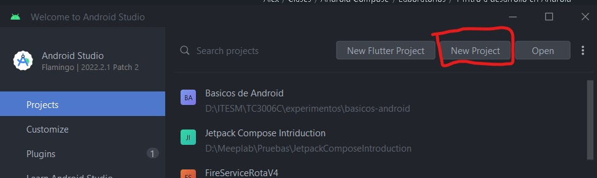

  

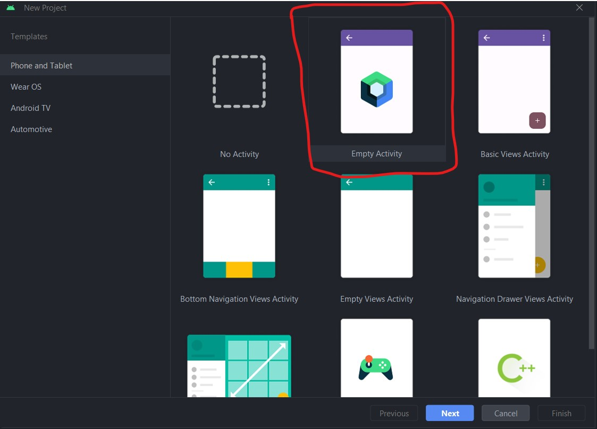

  

En mi caso ya tenía instaladas las librerías por lo que el resultado puede ser más extenso en tu caso y tardar un poco, espera a que termine para continuar.

  

### Paso 2 Preparar tu entorno de desarrollo

Crea una carpeta para tu laboratorio en tu computadora, en mi caso estoy creando la carpeta **lab1.**

  

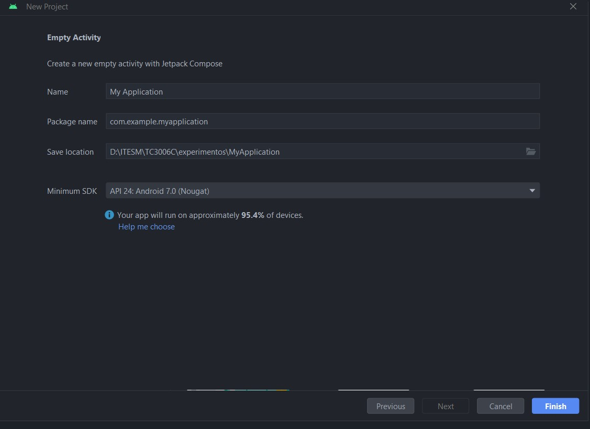

  

Ahora abre **Visual Studio Code**, si quieres aprender algo nuevo, desde terminal y en la ruta de tu carpeta puedes ejecutar el comando **code .** y esto abre la carpeta desde donde estás, en el caso de que lo hagas manual arrastra la carpeta de tu laboratorio para tener un resultado como el siguiente.

  

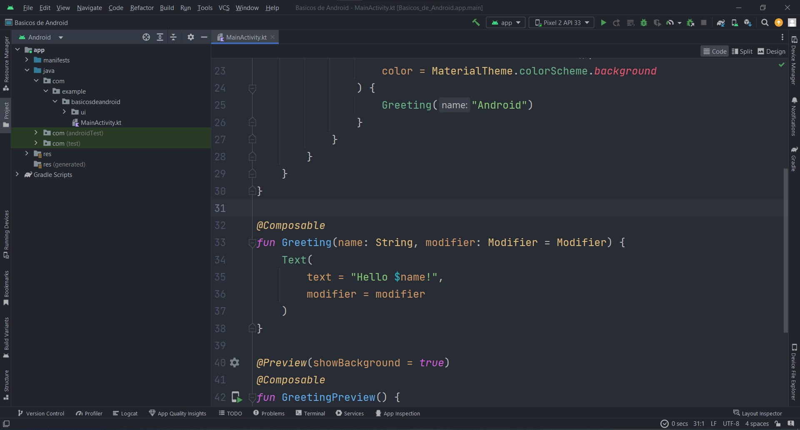

  

Ya que tenemos Visual Studio Code abierto vamos a crear un nuevo archivo llamado **main.py**.

  

Dentro de este archivo realizaremos todo nuestro laboratorio, por facilidad la mayoría de los principales de python tienen este nombre, al menos en la parte de servicios web.

  

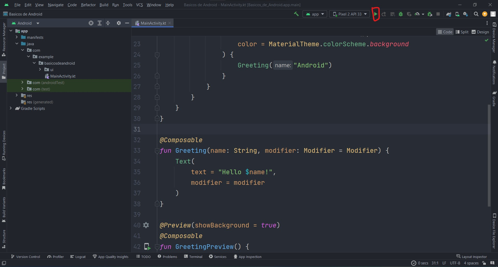

  

### Paso 3 La  petición más básica

  

Ahora vamos a empezar con el código de nuestro proyecto, comenzaremos importando las librerías que utilizaremos:

  

```

from flask import Flask

from flask_restful import Resource, Api, reqparse, abort  

  

import json

```

  

Las primeras 2 como puedes observar hacen una llamada a las librerías que acabamos de importar con pip, en donde la primera es la que nos permitirá correr un servidor Flask, y la segunda es la que nos permite generar y administrar todas las peticiones de dicho servidor.

  

Por último importamos la librería **json** para poder realizar manejo de archivos de este tipo.

  

El siguiente código nos permitirá configurar nuestro servidor

  

```

app = Flask("VideoAPI")

api = Api(app)

```

  

Ahora vamos a definir una clase que permita realizar una petición a nuestro servidor, esto lo haremos con el siguiente bloque de código:

  

```

class Index(Resource):

    def get(self):

        return "Hello World!", 200

```

  

**Nota: Si haces copy paste del laboratorio revisa que no tengas errores en el indentado o con las tabulaciones de Python, ya que al copiar y pegar pueden modificarse**

  

El código que acabamos de colocar define la clase **Index**, esta puede llamarse como tu quieras y es la que identifica la función que estamos cargando, en nuestro caso el índice o la primera llamada del servidor.

  

Después viene una definición y observa la parte **get**, si ya tienes experiencia en desarrollo web, verás que aquí es donde vamos a definir los métodos HTTP del servidor que pueden ser: **GET**, **POST**, **PUT** y **DELETE**. Si no los conocías estos métodos corresponden como su nombre lo indica a las operaciones de **create**, **read**, **update** y **delete** o mejor conocido como **operaciones CRUD.** Existen algunos otros métodos pero son usados con menor frecuencia.

  

Ahora bien, con el código que definimos realizamos una operación de lectura **GET**, la cual recibe como parámetro **self**, esta variable nos permite acceder más adelante a otros parámetros internos del paquete HTTP los cuales no cubriremos de momento.

  

Por último vamos a regresar como resultado un **return** y un String. Notarás que adelante del String tenemos separado con una coma un número entero. Este no es obligatorio, pero es necesario que te acostumbres a que en desarrollo web y en todas tus peticiones del API se valide el código de error de la llamada, así sea en un nivel básico o a un nivel extensivo puesto que muchas APIs cometen el error de no definirlo y esto puede llevar a errores que generan muchos conflictos en niveles productivos.

  

Ya casi estamos, pero ahora nos falta que cada ocasión que mandamos llamar nuestro navegador, se ejecute la clase que acabamos de crear.

  

Es importante que observes que al definir una **url** debe corresponder una clase, podemos hacer diferentes tipos de combinaciones como veremos más adelante, pero al menos para iniciar usaremos la más simple.

  

```

api.add_resource(Index, "/")

```

  

En esta última llamada de código observa que de nuestra variable **api** llamamos el método **interno add_resource** que recibe como parámetros la clase **Index** y define la **url** que vamos a utilizar, en este caso **/**, cuando hablamos de servidores la diagonal marca el inicio de cualquier sistema web.

  

Por último vamos a terminar de configurar el servidor con el siguiente código, el cual le dice a nuestro archivo **main.py** que ejecute el servidor.

  

```

if __name__ == "__main__":

    app.run()

```

  

Para ejecutar nuestro servidor abre tu terminal o usa la terminal de visual studio **(Terminal>New Terminal)** y **desde la carpeta de tu laboratorio** ejecuta el siguiente comando:

  

```

python main.py

```

  

El resultado debe verse como el siguiente:

  

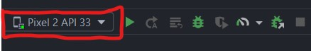

  

Desde aquí puedes ver que tu servidor esta corriendo en la ip **127.0.0.1** mejor conocida como **localhost** y adelante viene el puerto que por default es el **5000**.

  

Si abres el navegador y colocas la dirección:

  

- http://127.0.0.1:5000

- localhost:5000

  

Deberías ver el String resultado de **Hello World!**

  

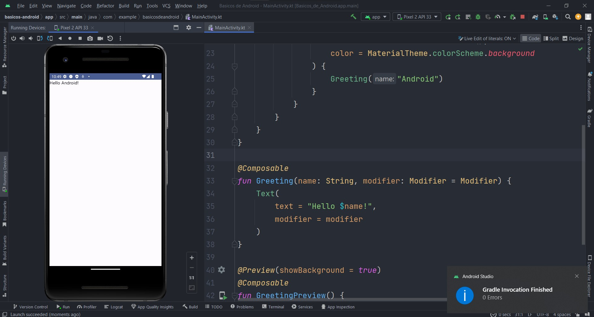

  

Como te mencioné en los requerimientos del laboratorio vamos a usar la herramienta **POSTMAN** para visualizar mejor nuestros resultados, de aquí en adelante estaré visualizando desde esta herramienta, esto por que no todas las visualizaciones se pueden hacer desde el navegador.

  

Desde postman crea una nueva conexión y revisando que está seleccionado el **GET** deberías poder visualizar lo siguiente.

  


  

Con esto ya tenemos nuestra primera llamada, ahora empecemos a jugar con datos e información.

  

### Paso 3 Datos en formato JSON

  

Antes de seguir con el código vamos a hacer una pequeña mención de los **diccionarios**, o datos en formato **JSON**. Si ya estás familiarizado con esta parte puedes saltarte hasta el **Paso 4**.

  

Si aún no estás familiarizado con este formato de texto, entonces verás que no es nada complicado. JSON es completamente independiente del lenguaje pero utiliza convenciones conocidas por los programadores.

  

Existen 2 tipos principales **Objetos { }** y **Arreglos [ ]**,  la convención dicta que el dato es uno u otro, y a partir de ello podemos modelar cualquier estructura compleja de datos.

  

En el mundo de desarrollo de software, tenemos bases de datos que se conocen como de forma **no relacional** estas utilizan algo conocido como **documentos** para estructurar y guardar la información, esto no es nada más que el uso estandarizado y optimizado de el formato **JSON**. Uno de los ejemplos más conocidos es la base de datos no relacional **MongoDB**, aunque existen muchas que manejan este formato.

  

Dentro de Python, este formato es mejor conocido como un diccionario, y si en algún momento viste en estructuras de datos los **hashes** también son similares.

  

Dentro de un objeto **JSON** se tienen dos partes básicas, la **llave** y el **valor**.

  

- La **llave** es un String único dentro del objeto que permite acceder al valor de manera automática, visto desde otro punto, cuando manejas un arreglo en cualquier lenguaje de programación para acceder al valor utilizas el índice, por ejemplo **arreglo[index]**, el índice debe ser un entero en dicho arreglo, en el caso del diccionario debe ser un String permitiendo cualquier combinación alfanumérica, esto puede ser tan sencillo como una etiqueta o tan complejo como un índice especializado. Dentro de las base de datos no relacionales este índice es especializado para evitar que se repita en tablas donde puede haber millones de datos.

  

- El **valor** es cualquier dato que puede tomar el objeto que pueden ser (string, number, boolean, null,object,array). Como puedes ver los últimos permiten reestructurar objetos en objetos o en su defecto otro arreglos.

  

Los Arreglos en **JSON** o en los diccionarios funcionan igual que los arreglos en programación con la diferencia que pueden al igual que los Objetos contener (string, number, boolean, null,object,array).

  

Para más detalle del formato JSON puedes tomar nota desde su [página oficial](https://www.json.org/json-es.html).

  

Ahora veamos un ejemplo rápido de diferentes objetos **JSON**.

  

```

{

    "llave_1" : 'valor',

    "llave_2" : 1,

    "llave_3" : 1.0,

    "llave_4" : -1,

    "llave_5" : true,

    "llave_6" : false,

    "llave_7" : null,

    "llave_8" : {

        "sub_llave_1" : "valor"

    },

    "llave_9" : [0,1,2,3,4,5],

    "llave_10" : [

        {

            "sub_llave_1" : "valor_1"

        },

        {

            "sub_llave_1" : "valor_2"

        },

    ]

}

```

  

Si quieres visualizar un texto en formato json existen varias formas, desde plugins que puedes instalar en tu navegador o en el mismo visual studio. Una página que te puede servir es la [siguiente](https://jsonviewer.stack.hu/)

  

Desde está última página puedes pegar el **JSON** anterior y en la pestaña de **viewer** podrás visualizarlo mejor.

  

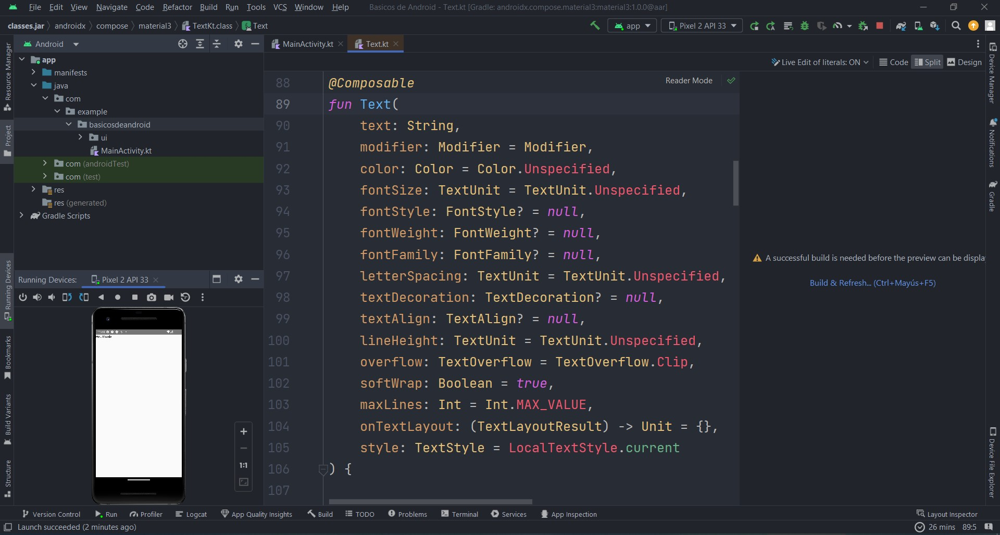

  

Si observas la estructura del **JSON** notarás las siguientes reglas importantes:

  

1. Las **llaves** y **valores** siempre en string pueden ser con " " ó con ' '. En ocasiones algunos lenguajes omiten las comillas en las **llaves**, pero eso es incorrecto y un parser normal marcará error.

2. Los objetos siempre llevan **{ }** mientras que los arreglos o listas llevan **[ ]**.

3. El siguiente valor debe ser delimitado por una **,**

4. El último elemento no debe de llevar la **,** en ocasiones algunos lenguajes lo permiten pero por estándar no se recomienda.

  

Si queremos acceder a los valores de un objeto **JSON**, puede variar de lenguaje a lenguaje pero por lo general solo usan una de las siguientes 2 formas:

  

1. Notación de arreglos: Usan una forma similar a un arreglo con su índice, por ejemplo: si queremos obtener el **valor_2** de  la **llave_10** con esta notación sería algo como:

```

mi_objeto["llave_10"][1]["sub_llave_1"]

```

  

**Nota: Al acceder a llave_10 accedemos al arreglo y en este caso mandamos llamar el índice numérico del mismo que para ser el índice 2 empezamos desde 0 y luego 1.

  

2. Notación punto: Un poco más alineada a la programación orientada a objetos pero igual de válida que la anterior:

```

mi_objeto.llave_10[1].sub_llave_1

  

mi_objeto.llave_10.get(1).sub_llave_1

```

  

Aquí tienes el ejemplo de 2 formas en notación punto, y como mencioné depende enteramente del lenguaje, pero sigue siendo válido.

  

Ahora que tienes mejor conocimiento del formato **JSON**, podemos seguir con el código del laboratorio.

  

### Paso 4 Regresar estructuras en formato JSON

  

Actualmente muchas APIs usan el formato JSON como estándar para regresar la información, existen otros formatos como el XML que es por ejemplo el que usan los sistemas de facturación para el SAT en México. Todos los formatos tienen sus pro y sus contras, igualmente el formato JSON, pero al menos hoy en día es uno de los más versátiles y como ya mencionamos estandarizado.

  

Para seguir con nuestro código debajo de la línea 7 **api = Api(app)** vamos a agregar lo siguiente

  

```

videos = {

    'video1': {'title': 'Hello World in Python','uploadDate':20210917},

    'video2': { 'title': 'Why Matlab is the best language Ever','uploadDate':20211117 }

}

```

  

Donde vamos a definir el diccionario **videos** con la estructura JSON que contiene 2 objetos con valores de objetos que a su vez incluyen un título y una fecha de subida del video.

  

**Nota: Para el laboratorio la fecha sigue la notación YYYYMMDD, en formato entero, DE NINGUNA MANERA vayas a usar esta notación en un ambiente productivo, para ello usa formatos de fecha o timestamps en formato string, esto lo hacemos por facilidad de nuestro laboratorio.**

  

Ahora vamos a extender las peticiones de nuestro servidor definiendo una nueva clase debajo de la **Index** que ya teniamos:

  

```

class AllVideos(Resource):

    def get(self):

        return videos

```

  

Nuevamente agregamos una **url** pero ahora la vamos a definir para **/videos**, esto nos servirá para que al momento de llamar esta url nos devuelva todos el valor actual de **videos**.

  

```

api.add_resource(AllVideos,"/videos")

```

  

Para ver los nuevos resultados en nuestro servidor es necesario detenerlo primero desde la terminal con **CTRL+C** y volver a ejecutarlo con:

  

```

python main.py

```

  

Si ejecutamos la url de **/videos** obtendremos el resultado:

  

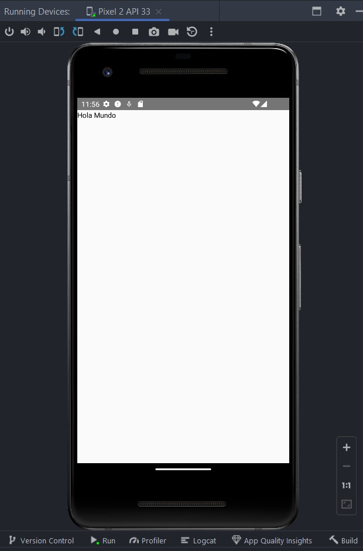

  

Esta última llamada nos permitió definir un diccionario y a partir de una llamada **GET** definir la url **/videos** y obtener este resultado.

  

En el siguiente paso empezaremos a modificar este diccionario.

  

### Paso 5 Buscar y obtener 1 video a partir de su llave

  

La llamada de **/videos** nos sirve para regresar toda la información, pero ¿Qué pasa si queremos obtener un valor específico?, para ello debemos obtener la llave y regresar el resultado, la ventaja de usar el JSON, es que sabemos que el índice o llave es único por lo que solo basta con acceder a él, pero ¿cómo hacemos esto con Flesk?

  

Para empezar, este es un resumen de nuestro código hasta el momento por si tienes alguna duda o problema

  

```

from flask import Flask

from flask_restful import Resource, Api, reqparse, abort

  

import json

  

app = Flask("VideoAPI")

api = Api(app)

  

videos = {

    'video1': {'title': 'Hello World in Python','uploadDate':20210917},

    'video2': { 'title': 'Why Matlab is the best language Ever','uploadDate':20211117 }

}

  
  

class Index(Resource):

    def get(self):

        return "Hello World!", 200

  

class AllVideos(Resource):

    def get(self):

        return videos, 200

  

api.add_resource(Index, "/")

api.add_resource(AllVideos,"/videos")

  

if __name__ == "__main__":

    app.run()

```

  

Ahora vamos a comenzar definiendo una nueva clase debajo de **AllVideos**:

  

```

class IdVideo(Resource):

    def get(self,video_id):

        allIds = videos.keys()

        if(not video_id in allIds):

            abort(404, message =f"Video {video_id} not found!")

        else:

            return videos[video_id], 200

```

  

Con esta clase vamos a hacer algo más complejo, pero no tanto.

  

Después de definir la clase nota un cambio en el **get**:

  

```

def get(self,video_id):

```

  

Ahora no recibimos solo el **self**, sino también un parámetro adicional que nosotros definimos, el **video_id**, esta variable como su nombre nos dice contiene el valor de la llave a buscar.

  

El siguiente paso sería obtener el valor, pero un punto importante a tener en cuenta siempre considera el peor caso para todos los posibles escenarios, ¿Qué pasa si la llave no existe?, para ese caso es importante que el servidor nos regrese un error, pero antes de ello debemos validar que efectivamente existe o no existe.

  

Estas validaciones pueden ser tediosas al principio, pero bien hechas pueden ahorrarte muchos problemas con proyectos más grandes y complejos, **acostúmbrate a validar siempre todos los casos**, esto es una buena práctica.

  

Para hacer la validación son las líneas:

  

```

allIds = videos.keys()

if(not video_id in allIds):

```

  

En la primera obtenemos todas las llaves de nuestro diccionario, Python facilita mucho el manejo de diccionarios con este tipo de métodos.

  

Dentro del if validamos la existencia de la llave de búsqueda con los valores actuales.

  

En caso de no existir regresamos la notación de error en Flesk

  

```

abort(404, message =f"Video {video_id} not found!")

```

  

Aquí pasamos un código 404 estándar de error para **Not Found**, y concatenamos en un string el error que queremos que el usuario vea.

  

Como te mencioné es importante utilizar el estándar de códigos, siempre puedes consultarlos puesto que son un [estándar](https://developer.mozilla.org/es/docs/Web/HTTP/Status).

  

En caso de que exista la llave entonces regresamos el valor que contiene

  

```

return videos[video_id], 200

```

  

Por último no te olvide de agregar la nueva **url**, pero vamos a realizar un pequeño cambio, ya que debemos pasar como **parámetro** la llave a buscar. Esto supone un pequeño cambio con lo que hemos visto de las **url** hasta el momento, observa:

  

```

api.add_resource(IdVideo,"/video/<video_id>")

```

  

Si bien definimos, la **url** pasando la clase que creamos de **IdVideo** y definimos lka url **/video**, ahora añadimos el **parámetro** colocando el mismo nombre que recibe el parámetro en el **GET** si recuerdas es: get(self,**video_id**), eneste caso deben coincidir para poder llamar desde el código el parámetro. También checa que la variable se encuentra dentro de **< >**, esto también viene como parte de la definición de parámetros.

  

Reinicia tu servidor y prueba con las siguientes **url**

  

- localhost:5000/video/video1

- localhost:5000/video/video2

- localhost:5000/video/video3

  

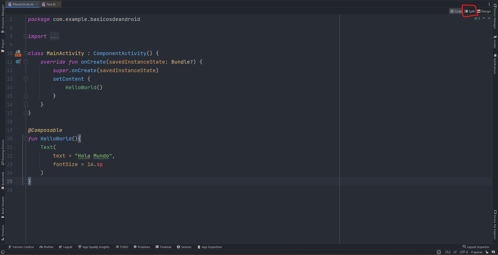

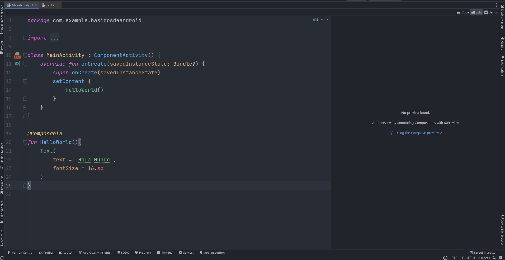

  

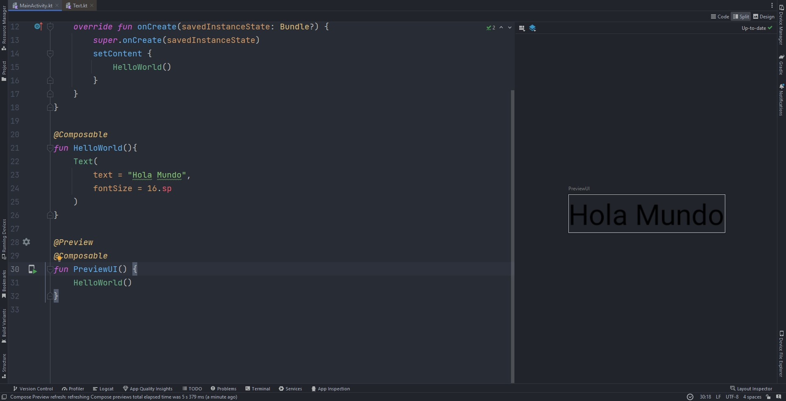

Si intentas alguna otra combinación no existente nos regresará el error.

  

### Paso 6 Agregar un nuevo video

  

Ahora vamos a agregar un nuevo video al diccionario de **videos**, espero que empieces a familiarizarte con la sintaxis ya que empezaremos a ir un poco más rápido.

  

Aquí tienes el resumen del código al momento:

  

```

from flask import Flask

from flask_restful import Resource, Api, reqparse, abort

  
  

import json

  
  

app = Flask("VideoAPI")

api = Api(app)

  

videos = {

  

    'video1': {'title': 'Hello World in Python','uploadDate':20210917},

  

    'video2': { 'title': 'Why Matlab is the best language Ever','uploadDate':20211117 }

  

}

  

class Index(Resource):

    def get(self)

        return "Hello World!", 200

  

class AllVideos(Resource):

    def get(self):

        return videos, 200

  

class IdVideo(Resource):

    def get(self,video_id):

        allIds = videos.keys()

        if(not video_id in allIds):

            abort(404, message =f"Video {video_id} not found!")

        else:

            return videos[video_id]

  

api.add_resource(Index, "/")

api.add_resource(AllVideos,"/videos")

api.add_resource(IdVideo,"/video/<video_id>")

  

if __name__ == "__main__":

    app.run()

```

  

Debajo de la línea 7 o de la instrucción **api = Api(app)** vamos a agregar lo siguiente:

  

```

parser = reqparse.RequestParser()

parser.add_argument('title', required = True)

parser.add_argument('uploadDate', type=int, required = False)

```

  

En este espacio vamos a usar la clase parser para definir los parámetros de entrada, en primer caso para **title** vamos a hacerlo obligatorio mientras que **uploadDate**, además de definir un tipo diferente a string, en este caso entero, será opcional.

  

Este parser nos permite abstraer información desde el **body** de la petición **http**, si no lo definimos no podremos acceder al valor, en contraste date cuenta que es otra forma de recibir parámetros a la vista en el paso anterior.

  

Ahora dentro de nuestra clase **IdVideo** vamos a agregar un método, hasta ahora hemos visto el **GET** que se usa como lectura, pero como queremos agregar 1 nuevo valor específico, entonces vamos a utilizar el **PUT** agregando el siguiente código.

  

```

class IdVideo(Resource):

    def get(self,video_id):

        allIds = videos.keys()

        if(not video_id in allIds):

            abort(404, message =f"Video {video_id} not found!")

        else:

            return videos[video_id], 200

  

    def put(self, video_id):

        args = parser.parse_args()

        new_video = {'title':args['title'],

                     'uploadDate':args['uploadDate']}

        videos[video_id] = new_video

        write_changes_to_file()

        return {video_id: videos[video_id]}, 201

```

  

Si aislamos el nuevo código es el siguiente:

  

```

def put(self, video_id):

    args = parser.parse_args()

    new_video = {'title':args['title'],

                 'uploadDate':args['uploadDate']}

    videos[video_id] = new_video

    return {video_id: videos[video_id]}, 201

```

  

Es importante que lo coloques dentro de **IdVideo**, esto lo explicaré más adelante.

  

Como te mencioné, utilizamos el método **PUT** y nuevamente necesitamos recibir la **llave**, pero no para buscarla, ahora servirá para agregar el elemento, el código crea un nuevo video y vamos a destacar los parámetros:

  

```

args['title']

args['uploadDate']

```

  

Estos nos permiten recuperar los valores del **body**, después se agrega el video a **videos** y como buena práctica regresamos el nuevo video con el código estándar de éxito de creación 201.

  

Resetea tu servidor, si ya sabes usar **Postman** intenta agregar el elemento y has diferentes pruebas una vez hecho puedes ir al siguiente paso.

  

En caso de que no vamos a configurar el **PUT** en **Postman**.

  

Abre una nueva pestaña de conexión y dentro del selector cambia el **GET** por el **PUT**, para la **url** usa la siguiente

  

- localhost:5000/video/video3

  

Dentro de las opciones debajo selecciona la que dice **raw**, esto es para agregar manualmente los parámetros del **body**, si bien puedes hacerlo con la GUI de Postman de **form-data** en ocasiones da problemas no reconociendo bien los parámetros.

  

Ahora dentro de **raw** verás el espacio para escribir código, agrega el siguiente:

  

```

{

    "title":"My New Video"

}

```

  

**Antes de ejecutar, al final de las opciones en donde esta raw, está seleccionado TEXT, modifica la selección por JSON, observa como cambian los colores con el estándar de JSON.**

  

Ejecuta la petición, el resultado debe verse como el siguiente:

  

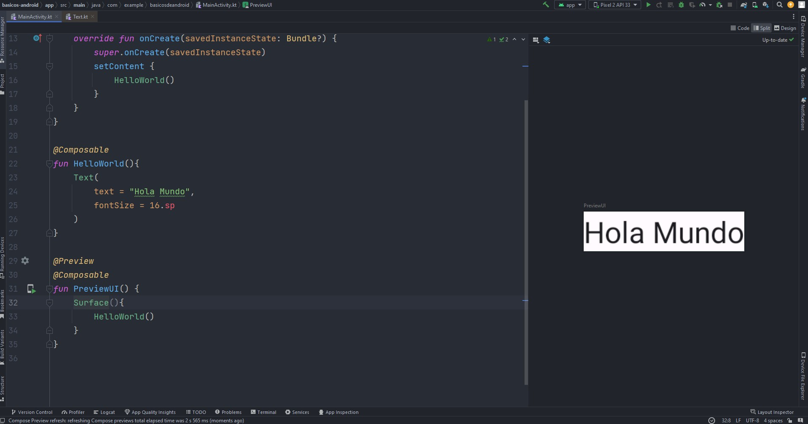

  

Prueba añadiendo diferentes combinaciones con otras etiquetas y agregando la fecha de subida.

  

También observa que pasa si reinicias el servidor, usa como apoyo la llamada a

  

- localhost:5000/videos

  

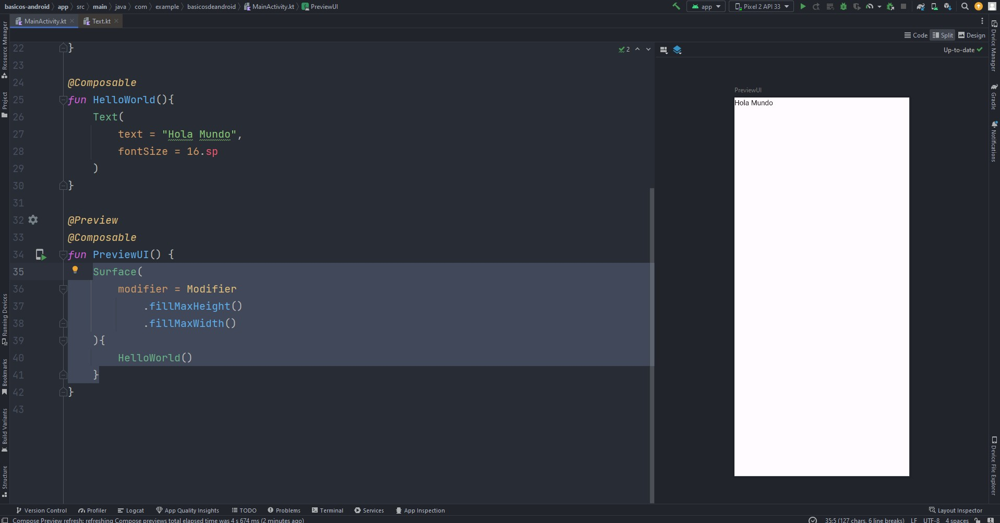

  

### Paso 7 Eliminar un video

  

Ya utilizamos el **PUT** para agregar un video, ahora vamos a eliminar cualquiera de **videos** usando **DELETE**, nuevamente dentro de la clase **IdVideo** vamos a agregar:

  

```

class IdVideo(Resource):

    def get(self,video_id):

        allIds = videos.keys()

        if(not video_id in allIds):

            abort(404, message =f"Video {video_id} not found!")

        else:

            return videos[video_id]

  

    def put(self, video_id):

        args = parser.parse_args()

        new_video = {'title':args['title'],

                     'uploadDate':args['uploadDate']}

        videos[video_id] = new_video

        return {video_id: videos[video_id]}, 201

  

    def delete(self,video_id):

        if video_id not in videos:

            abort(404, message =f"Video {video_id} not found!")

        del videos[video_id]

        return "", 204

```

  

Nuevamente, aislamos el código nuevo a:

  

```

def delete(self,video_id):

        if video_id not in videos:

            abort(404, message =f"Video {video_id} not found!")

        del videos[video_id]

        return "", 204

```

  

Pasando la llave como parámetro solamente, primero debemos validar si el video en cuestión existe, en caso de que no lanzamos un error como al inicio, y en caso de que si exista, lo eliminamos usando **del**, aquí observa que el resultado es un vacío para mostrar significativamente la eliminación y el código estándar 204 para dicho caso.

  

Nuevamente define en **Postman** el caso de eliminación, este es más simple ya que no recibe parámetros más que la llave.

  

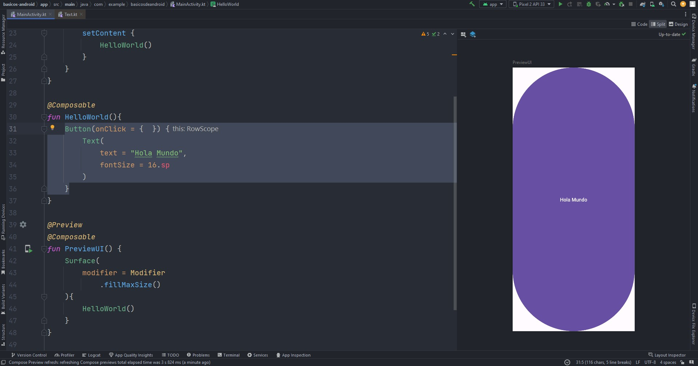

  

Como el resultado es vacío, podemos ver que se ejecuta correctamente con el código estandarizado de error, por esto mismo es que te recomiendo usarlos, a veces los programadores no regresan resultados que permitan validar la información, el código estándar asegura un estándar.

  

Para verlo desde otro ángulo, ejecuta **/videos**

  

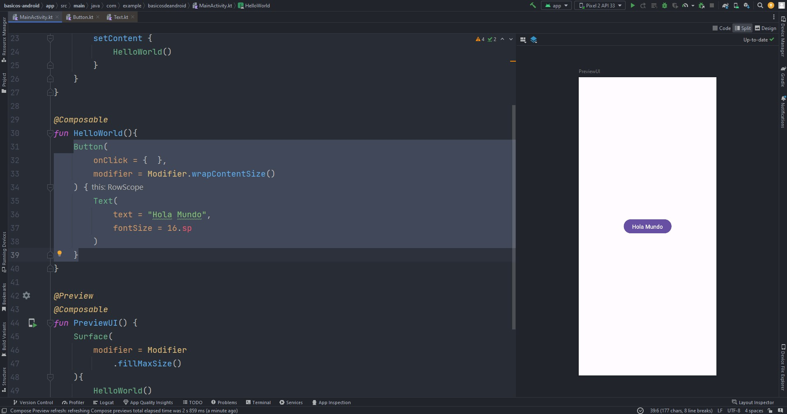

  

Aquí es más visible que se eliminó el video2.

  

### Paso 8 Agregar un video al final del diccionario

  

Nuestro **PUT** agrega elementos con una llave específica, pero que pasa si no queremos estar escribiendo siempre una llave, sobre todo por que nuestras llaves son índices continuos en formato de llave.

 - video1

 - video2

 - video3

 - video4

 - ...

  

Para ello usaremos el último método, el **POST**, pero a diferencia de los anteriores los cuales estuvimos definiendo en **IdVideo**, ya no necesitamos pasar la llave, por lo que vamos a definirlo en una nueva clase que se llame **VideoSchedule**, esta la colocaremos debajo de **IdVideo** de la siguiente manera:

  

```

class VideoSchedule(Resource):

    def post(self):

        args = parser.parse_args()

        new_video = {'title':args['title'],

                     'uploadDate':args['uploadDate']}

        video_id = max(int(v.lstrip('video')) for v in videos.keys()) + 1

        video_id = f"video{video_id}"

        videos[video_id] = new_video

        return videos[video_id], 201

```

  

El código anterior es una combinación de lo que hemos visto hasta el momento, la única diferencia es la generación de la llave, existen muchas formas más simples de hacer esto pero para ver un poco de sintaxis en python usaremos

  

```

video_id = max(int(v.lstrip('video')) for v in videos.keys()) + 1

```

  

Aquí en la última llave, por ejemplo **video2**, extraemos el string **video** y al entero resultante le sumamos 1 para dar el **3** como resultado.

  

Después concatenamos nuevamente el string **video** con

  

```

video_id = f"video{video_id}"

```

  

Ahora tenemos un pequeño problema, como anexamos esta nueva clase, puesto que ya definimos **/videos**, lo más lógico sería hacerlo en esta misma **url** puesto que se añade el libro a la lista de videos, además **/videos** no recibe ningún parámetro. Debajo de **api.add_resource(AllVideos,"/videos")** vamos a añadir lo siguiente:

  

```

api.add_resource(VideoSchedule,"/videos")

```

  

Y tal como ves, no pasa absolutamente nada, mientras los parámetros de las funciones hagan match y no existan errores de sintaxis puedes agregar tantas clases como métodos quieras.

  

Basándonos en el estándar la **url** **/videos** puede tener sus **CRUD** completo de **GET**, **PUT**, **DELETE** y **POST** en la misma clase. La diferencia es que el **GET único**, el **PUT** y el **DELETE** usan por lo general un id, mientras que el **GET** y el **POST** pueden no necesariamente utilizarlo. Esto ya es mas cuestión de como construyes el API, en caso de que por error duplicaras un método en varias clases, Flesk tomará el primero que encuentre, cuida estandarizar tus clases para evitar duplicados.

  

Regresemos a ver el resultado de nuestro código del **POST**. Reinicia tu servidor y has pruebas.

  

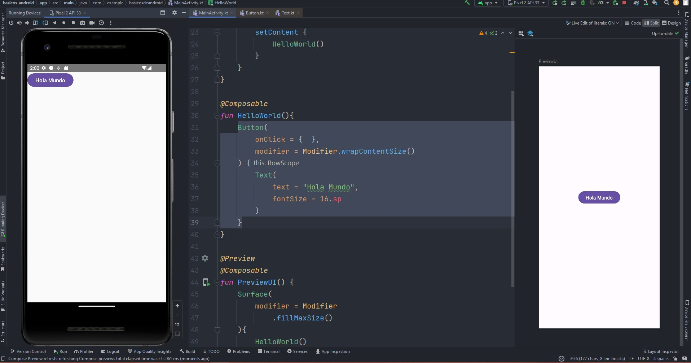

  

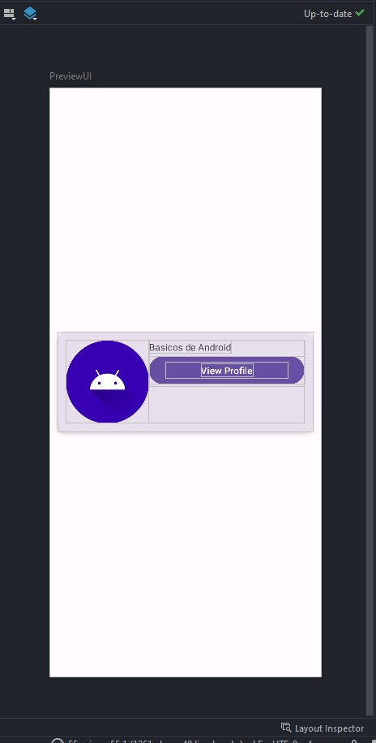

  

Ya tenemos todo listo, un API completa y un servidor completo, pero hasta este punto espero que notes un minúsculo detalle con todo lo que hemos realizado hasta ahora.

  

Cada vez que reinicias el servidor, el resultado nos da los 2 libros que definimos, pero de ninguna forma se están manteniendo los cambios que realizamos en cada ejecución del servidor. Para pruebas esto es suficiente, pero en un entorno real esto no es aceptable, si bien existen las bases de datos, requerimos de todo un curso para ver las estrategias de guardado de datos, pero otra forma de hacerlo que no es la más óptima pero es aceptable, es guardar los archivos en un archivo. Esto lo veremos en el último paso del laboratorio.

  

### Paso 9 Datos persistentes

  

Al guardar en un archivo adicional, separamos nuestros datos del código del servidor, así sin importar cuantas veces reiniciemos el servidor los datos se mantendrán según el último estado. Ojo, esto es un arma de doble filo, ya que si bien se guardarán todos los nuevos, también se perderán todos lo que eliminemos, así que nuestro estado inicial puede llegar a no ser el que siempre tenemos de inicio, piensa en estrategias de respaldo de los datos, en una aplicación más allá del código los datos son lo más importante.

  

En IA los sets de entrenamiento son tan importantes como el método inteligente a aplicar, procura proteger bien tus datos.

  

Antes de continuar, te comparto el estatus del código al momento:

  

```

from flask import Flask

from flask_restful import Resource, Api, reqparse, abort

  

import json

  

app = Flask("VideoAPI")

api = Api(app)

  

parser = reqparse.RequestParser()

parser.add_argument('title', required = True)

parser.add_argument('uploadDate', type=int, required = False)

  

videos = {

    'video1': {'title': 'Hello World in Python','uploadDate':20210917},

  

    'video2': { 'title': 'Why Matlab is the best language Ever','uploadDate':20211117 }

}

  

class Index(Resource):

    def get(self):

        return "Hello World!", 200

  

class AllVideos(Resource):

    def get(self):

        return videos, 200

  

class IdVideo(Resource):

    def get(self,video_id):

        allIds = videos.keys()

        if(not video_id in allIds):

            abort(404, message =f"Video {video_id} not found!")

        else:

            return videos[video_id],200

  

    def put(self, video_id):

        args = parser.parse_args()

        new_video = {'title':args['title'],

                     'uploadDate':args['uploadDate']}

        videos[video_id] = new_video

        return {video_id: videos[video_id]}, 201

  

    def delete(self,video_id):

        if video_id not in videos:

            abort(404, message =f"Video {video_id} not found!")

        del videos[video_id]

        return "", 204

  

class VideoSchedule(Resource):

    def post(self):

        args = parser.parse_args()

        new_video = {'title':args['title'],

                     'uploadDate':args['uploadDate']}

        video_id = max(int(v.lstrip('video')) for v in videos.keys()) + 1

        video_id = f"video{video_id}"

        videos[video_id] = new_video

        return videos[video_id], 201

  

api.add_resource(Index, "/")

api.add_resource(AllVideos,"/videos")

api.add_resource(VideoSchedule,"/videos")

api.add_resource(IdVideo,"/video/<video_id>")

  

if __name__ == "__main__":

    app.run()

```

  

Debajo de la línea 13, donde definimos el diccionario de **videos** vamos a agregar las siguiente función:

  

```

def write_changes_to_file():

    global videos

    videos = { k: v for k, v in sorted(videos.items(),key=lambda video: video[1]["uploadDate"])}

    with open("videos.json", 'w') as f:

        json.dump(videos, f)

```

  

Vamos a definir nuestra variable **videos** como global y vamos crear el archivo **videos.json**, la función crea el archivo en cada ocasión, la idea es que en cada cambio de los métodos se ejecute para actualizar el archivo.

  

Justo debajo de esta función vamos a llamarla:

  

```

write_changes_to_file()

```

  

Esto lo haremos solo 1 vez, ya que necesitamos crear el archivo por primera vez.

  

Reinicia tu servidor y observa como se crea el archivo en visual studio code, o en tu carpeta del laboratorio.

  

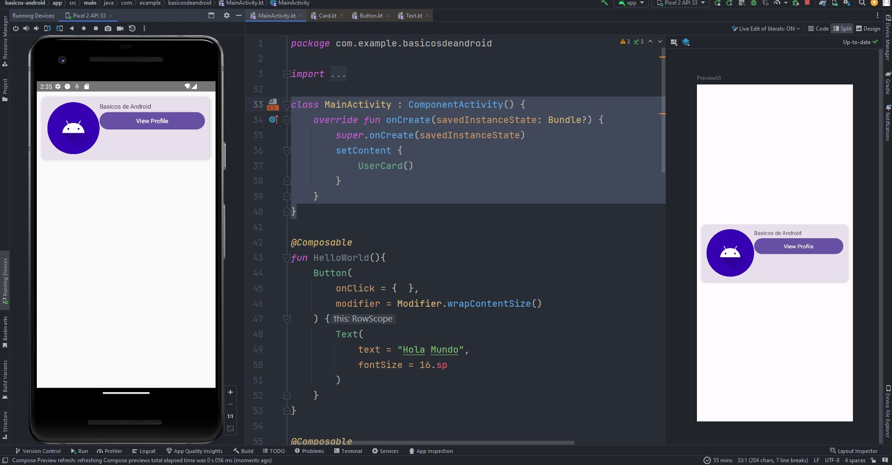

  

Al crearse el archivo se crea en una sola línea, visual studio code, nos permite formatear el código, da clic derecho y selecciona la opción **format document**.

  

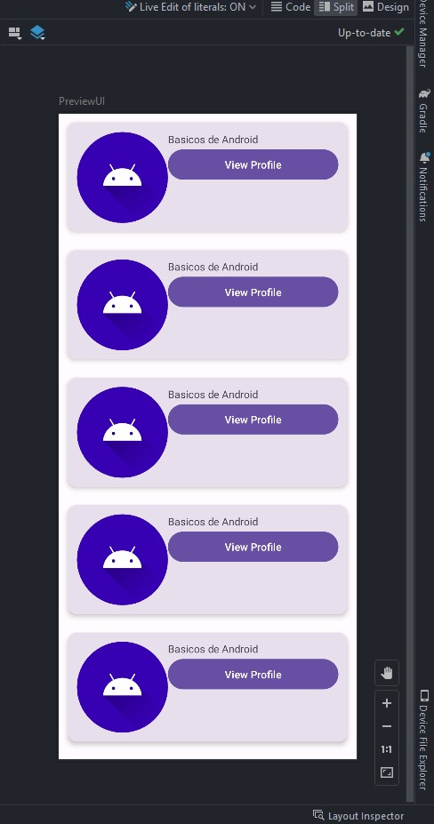

  

El resultado nos permite visualizar de mejor forma el archivo.

  

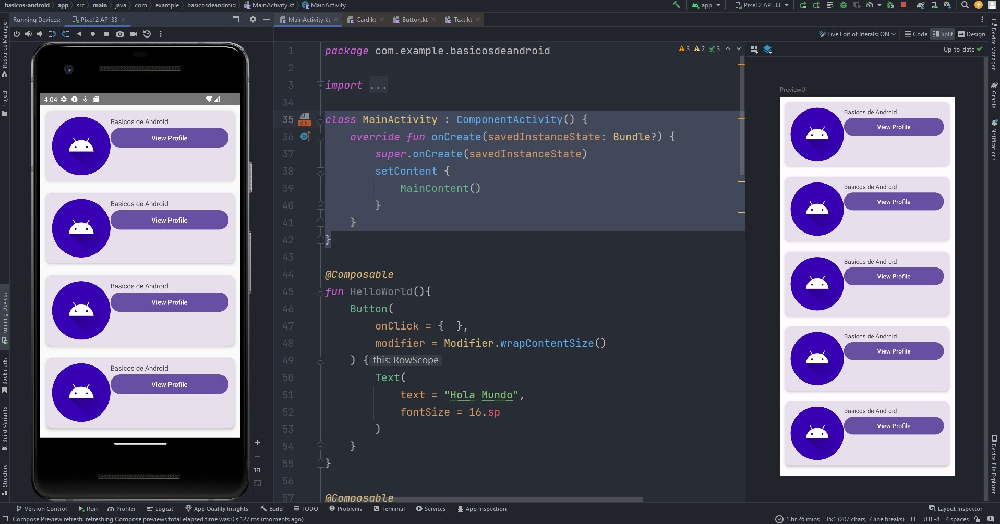

  

Si bien para nosotros es más fácil de visualizar el archivo, esto agrega mucho overhead al documento por todos los saltos de línea y tabuladores, una vez que tengas todo controlado es mejor dejarlo en 1 sola línea.

  

Ahora vamos a comentar la línea **write_changes_to_file()** y la de nuestro diccionario **videos**

  

**Nota: Si no comentas las líneas, cosas malas sucederán**

  

**Nota 2: En serio comenta las líneas**

  

**NOTA FINAL: 3er AVISO... COMENTA LAS LÍNEAS**

  

Sobre aviso no hay engaño...

  

El resultado debe quedar como el siguiente:

  

```

'''

videos = {

    'video1': {'title': 'Hello World in Python','uploadDate':20210917},

    'video2': { 'title': 'Why Matlab is the best language Ever','uploadDate':20211117 }

}

'''

  

def write_changes_to_file():

    global videos

    videos = { k: v for k, v in sorted(videos.items(),key=lambda video: video[1]["uploadDate"])}

    with open("videos.json", 'w') as f:

        json.dump(videos, f)

  

#write_changes_to_file()

```

  

Ya tenemos nuestro archivo, pero ahora necesitamos leerlo cada vez para cargar al servidor los datos. Esto lo aremos con la siguiente instrucción

  

```

with open('videos.json','r') as f:

    videos = json.load(f)

```

  

Por último necesitamos agregar **write_changes_to_file()** cada vez que realizamos un cambio.

  

Como reto para el laboratorio, agrega la instrucción y realiza pruebas para ver que sucede.

  

Te dejo la versión final aquí mismo.

  

```

from flask import Flask

from flask_restful import Resource, Api, reqparse, abort

  

import json

  

app = Flask("VideoAPI")

api = Api(app)

  

parser = reqparse.RequestParser()

parser.add_argument('title', required = True)

parser.add_argument('uploadDate', type=int, required = False)

  

'''

videos = {

    'video1': {'title': 'Hello World in Python','uploadDate':20210917},

    'video2': { 'title': 'Why Matlab is the best language Ever','uploadDate':20211117 }

}

'''

with open('videos.json','r') as f:

    videos = json.load(f)

  

def write_changes_to_file():

    global videos

    videos = { k: v for k, v in sorted(videos.items(),key=lambda video: video[1]["uploadDate"])}

    with open("videos.json", 'w') as f:

        json.dump(videos, f)

#write_changes_to_file()

  

class Index(Resource):

    def get(self):

        return "Hello World!", 200

class AllVideos(Resource):

    def get(self):

        return videos, 200

  

class IdVideo(Resource):

    def get(self,video_id):

        allIds = videos.keys()

        if(not video_id in allIds):

            abort(404, message =f"Video {video_id} not found!")

        else:

            return videos[video_id],200

    def put(self, video_id):

        args = parser.parse_args()

        new_video = {'title':args['title'],

                     'uploadDate':args['uploadDate']}

        videos[video_id] = new_video

        write_changes_to_file()

        return {video_id: videos[video_id]}, 201

  

    def delete(self,video_id):

        if video_id not in videos:

            abort(404, message =f"Video {video_id} not found!")

        del videos[video_id]

        write_changes_to_file()

        return "", 204

  

class VideoSchedule(Resource):

    def post(self):

        args = parser.parse_args()

        new_video = {'title':args['title'],

                     'uploadDate':args['uploadDate']}

        video_id = max(int(v.lstrip('video')) for v in videos.keys()) + 1

        video_id = f"video{video_id}"

        videos[video_id] = new_video

        write_changes_to_file()

        return videos[video_id], 201

  

api.add_resource(Index, "/")

api.add_resource(AllVideos,"/videos")

api.add_resource(VideoSchedule,"/videos")

api.add_resource(IdVideo,"/video/<video_id>")

  

if __name__ == "__main__":

    app.run()

```

  

También te dejo la versión inicial de los datos de **videos.json**, en caso de que algo haya salido mal.

  

```

{

    "video1": {

        "title": "Hello World in Python",

        "uploadDate": 20210917

    },

    "video2": {

        "title": "Why Matlab is the best language Ever",

        "uploadDate": 20211117

    }

}

```

  

Como resumen ahora eres capaz de:

  

- Configurar un micro servidor en Flask

- Crear un API para manipular diccionarios

- Guardar los datos persistentes para interpretarlos

  

## Reto para el laboratorio

1. Busca alguna dataset de datos en formato JSON que puedas manipular, intenta que contenga la mayor cantidad de datos para que veas hasta donde puedes manipular el archivo o cuando empieza a generar conflictos de lectura ya sea por tu computadora o por memoria heap.

2. Carga en tus datos el dataset y desarrolla un pequeño API que permita obtener la información filtrada de dicho dataset.

3. Prepara una presentación de como modelaste tu solución y los resultados obtenidos.

4. Tu presentación debe considerar la solución a un problema del dataset que elegiste, aunque no lo vayas a implementar. Es decir tu dataset debe venir de una problemática real y debes pensar en una alternativa de solución.

  

## Recursos de ejemplo para el dataset de datos

  

[Catalog Data USA](https://catalog.data.gov/dataset/?res_format=JSON)

  

## Conclusión

Levantar un servidor Flask, es bastante sencillo aunque no es la mejor opción para una aplicación real, utiliza el conocimiento adquirido para realizar los prototipos de tu proyecto y poder estableces comunicación con el objeto generador de datos que va desde sensores, hardware especializado o sets de datos predefinidos.