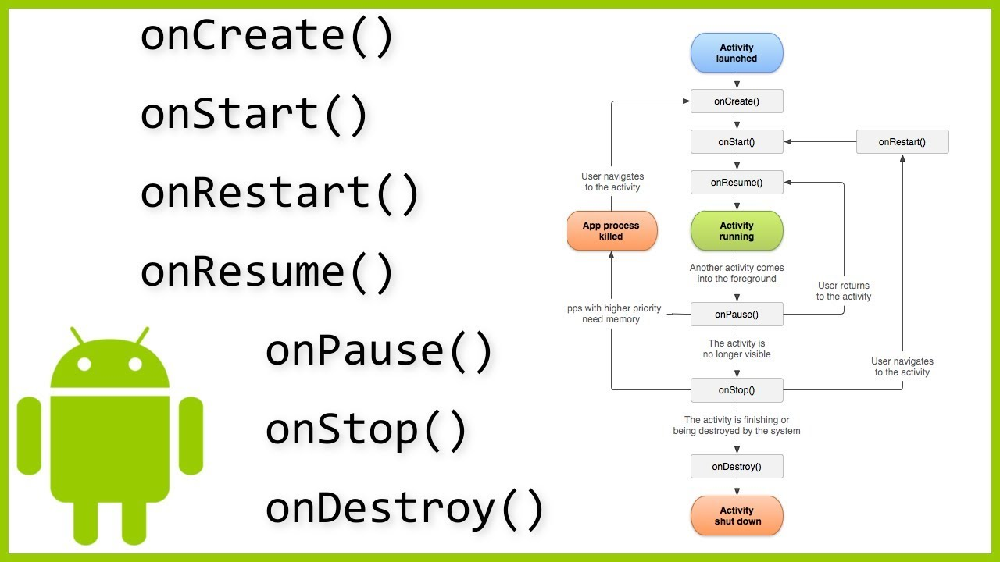

# Introducción a Kotlin

## Objetivo

En este laboratorio exploraremos los principios básicos de Android y como crear una interfaz simple.

Si bien atenderemos las bases del lenguaje de programación para que estés más familiarizado con el mismo. **Este no es un curso sobre Kotlin, por lo que conceptos avanzados deberás ir buscándolos conforme avance el curso, no te preocupes el lenguaje no es complicado**.

## Instrucciones

Sigue los pasos descritos en la siguiente práctica, si tienes algún problema no olvides que tus profesores están para apoyarte.

## Pre-requisitos
Se requiere que tengas Android Studio instalado para hacer las prácticas, por facilidad te recomiendo tener un dispositivo Android para hacer pruebas.

## Como empezar
### Para la clase necesitarás lo siguiente:

- Android Studio en su versión más actual.
- Java en su versión más actual.
- Kotlin (lo bajarás al configurar nuevos proyectos en Android por lo que no requieres configuración adicional)
- En caso de no contar con un dispositivo Android deberás hacer uso del emulador. Aquí podrás encontrar una guía de como configurarlo. [Guía](https://developer.android.com/design-for-safety/privacy-sandbox/download?hl=es-419#:~:text=Set%20up%20an%20Android%20device%20emulator%20image,-To%20set%20up&text=Install%20the%20latest%20Canary%20build,it%20isn't%20already%20installed.) **Nota: El emulador tiende a hacer uso de muchos recursos de la computadora, verifica que tu computadora pueda correrlo en caso de usarlo.**
- En caso de contar con un dispositivo Android sea la versión que sea deberás habilitar las opciones de desarrollador las cuales podrás encontrar en la siguiente [guía](https://developer.android.com/studio/debug/dev-options?hl=es-419).

## Laboratorio
### Paso 1 Herramienta de trabajo

Crea un nuevo proyecto, al entrar a Android Studio busca la opción.


En el segundo paso selecciona en proyecto el que está en morado y un **empty project**, la diferencia entre el verde y el morado, es que los proyectos en **verde** son los llamados proyectos con desarrollo tradicional, estos usan para el desarrollo de la interfaz XML.

Los proyectos en **morado** son la nueva forma de desarrollo de interfaz, en donde se utiliza Jetpack Compose, la forma de creación de la interfaz es diferente en este caso.

No hay forma mejor a otra, ambas tienen sus pro y contra, simplemente depende de que aproximación tengas al desarrollo en Android.

Para los laboratorios utilizaremos Jetpack Compose ya que no requiere más que el conocimiento de Kotlin como lenguaje.


Una vez seleccionado el tipo de proyecto, sustituye los valores para el nombre del proyecto y para el paquete del mismo, así como en donde almacenarás tu proyecto.

El package name es especial, por lo general es un identificador único del proyecto, en caso de subir tu app a la Play Store este se verifica y no debe tener coincidencia con algún otro proyecto que ya se encuentre arriba.

La selección del Minimum SDK puedes dejarla en el API 24, de momento no entraremos en mucho detalle para esto, entre modifiquemos más arriba la versión más actual será pero menos dispositivos podrán correrla. En Android el ecosistema abarca un gran número de versiones, es difícil identificar que tanto, pero el IDE nos muestra un aproximado de la cantidad de dispositivos que lo corren de acuerdo a datos de la Play Store.


Al crear nuestro proyecto vamos a ver algo como lo siguiente:


El proyecto trae un hola mundo default, si corremos el proyecto dependiendo de que tenemos configurado es en donde correrá.


En mi caso tengo seleccionado un emulador, si no tienes nada configurado, el IDE te solicitará crear un nuevo emulador, si es el caso selecciona alguna de las últimas versiones para trabajarlo.

En caso de que tengas un dispositivo físico, este deberá aparecer para seleccionarlo, igualmente si tienes corriendo el emulador y uno o varios dispositivos podrás seleccionarlos.

Al ejecutar el proyecto podrás ver algo como lo siguiente:


Nota que en mi caso el emulador está a la izquierda, en tu caso debería aparecer a la derecha, esto nos permite mostrar que todas las opciones del IDE pueden modificarse cambiando de tamaño, forma y dirección las diferentes pestañas.

### Paso 2 Empezando con Jetpack Compose

Vamos a comenzar borrando el contenido actual del archivo MainActivity, excepto la primer línea que dice  **package...** ya que esta indica donde se encuentra localizado el archivo del proyecto, en mi caso dice **package com.example.basicosdeandroid**, aquí depende de como definiste el package del proyecto.

```
import android.os.Bundle  
import androidx.activity.ComponentActivity  
import androidx.activity.compose.setContent  
  
class MainActivity : ComponentActivity() {  
    override fun onCreate(savedInstanceState: Bundle?) {  
        super.onCreate(savedInstanceState)   
    }  
}
```

Vamos a observar algunos puntos importantes antes de avanzar.

En primer lugar el **: ComponentActivity()**, esta indicación nos dice que la clase que estamos definiendo **MainActivity** va a heredar de la super clase **Activity** que es la base  para correr una vista en Android, y desde el **Activity**, existen varias sub clases que podemos aplicar, pero para este caso y para usar Jetpack en nuestro proyecto, necesitamos la **ComponentActivity**.

Después vamos a ver que tenemos el método **onCreate()** este método es parte el ciclo de vida del **Activity**. Este ciclo de vida permite saber cuando un Activity muestra información según el estado, por ejemplo cuando la vista muestra la información en pantalla debe pasar por este paso para cargarse, pero al contrario cuando cerramos la vista sea por bloquear el dispositivo o cambiar la aplicación se ejecutan los métodos de cierre.



Aquí te dejo una imagen de referencia de estos métodos y este ciclo de vida, toma en cuenta que la mayor parte de Android usa este ciclo de vida, para la aplicación como un todo, para cada vista, para cada fragmento, etc.

Con esto dicho podemos comenzar a hacer cosas.

Para trabajar con la interfaz, vamos a definir una nueva función, después de la llave que cierra final del archivo vamos a empezar con lo siguiente

```
@Composable  
fun HelloWorld(){  
      
}
```

Cuando vamos a trabajar con Compose, necesitamos utilizar el decorador **@Composable**, este tipo de decoradores se utilizan dentro de Kotlin y en Android para marcar comportamientos específicos del lenguaje, no siempre son obligatorios pero sirve a identificar los comportamientos que tiene una función o una clase en particular. Hoy en día existen muchos decoradores diferentes se aprenden más en la práctica que por tener una lista particular de ellos.

Si el **@Composable** te marca error, pon tu cursor en la palabra y da clic+enter para que se haga el import correspondiente. Cada vez que te marque algún error el IDE, **recuerda realizar el import de la librería.**

Otro elemento a notar es la forma en que se define la función **HelloWorld()**, este formato usa el estándar PascalCase, donde la primer letra es mayúscula. En Android y en Kotlin por lo general se usa camelCase, pero para compose se agregó el PascalCase, ten cuidado para identificar correctamente tus funciones.

Para comenzar a crear interfaz de Usuario, vamos a usar el paradigma de programación declarativa que utiliza Compose, este tipo de programación implica declarar el resultado que necesitamos, en este caso el componente de interfaz que queremos utilizar.

Kotlin se utiliza con diferente paradigmas de programación: Orientada a Objetos, Funcional, Declarativa, etc.

Vamos a declarar lo siguiente:

```
Text(text = "Hola Mundo")
```

Tan sencillo como esto estamos declarando un componente de Texto, y le estamos asignando un String, si bien podemos añadir el string directamente, lo normal en compose es agregar la propiedad para identificar que estamos modificando, en este caso text. Si quieres saber que propiedades tiene Text para modificar, así como hiciste para el import de las librerías, realiza lo mismo en una clase declarada, esto te llevará a su definición y para el caso de Text a sus propiedades.


Ya tenemos nuestra interfaz, pero si corremos el proyecto no pasará nada, esto por que desde el MainActivity no estamos haciendo nada.

Para cargar nuestra función necesitamos declarar lo siguiente debajo de **super.onCreate(savedInstanceState)**

```
class MainActivity : ComponentActivity() {  
    override fun onCreate(savedInstanceState: Bundle?) {  
        super.onCreate(savedInstanceState)  
        setContent {  
            HelloWorld()  
        }  
    }  
}
```

La función lamda **setcontent{}** nos permite cargar todo lo referente a compose. Lo ideal es definir una función inicial, como  **HelloWorld** y sobre esa, definir toda la vista o sub-vistas que necesitamos declarar.

Si ejecutamos el proyecto debemos ver lo siguiente:


### Paso 3 Modificadores en compose

Ya que definimos un componente, vamos a ver como modificar detalles del mismo.

Como ya mencionamos la clase Text tiene varias propiedades que pueden ser accedidas desde el constructor del componente, un resumen de las propiedades de la clase sería algo como lo siguiente:

```
fun Text(  
    text: String,  
    modifier: Modifier = Modifier,  
    color: Color = Color.Unspecified,  
    fontSize: TextUnit = TextUnit.Unspecified,  
    fontStyle: FontStyle? = null,  
    fontWeight: FontWeight? = null,  
    fontFamily: FontFamily? = null,  
    letterSpacing: TextUnit = TextUnit.Unspecified,  
    textDecoration: TextDecoration? = null,  
    textAlign: TextAlign? = null,  
    lineHeight: TextUnit = TextUnit.Unspecified,  
    overflow: TextOverflow = TextOverflow.Clip,  
    softWrap: Boolean = true,  
    maxLines: Int = Int.MAX_VALUE,  
    onTextLayout: (TextLayoutResult) -> Unit = {},  
    style: TextStyle = LocalTextStyle.current  
)
```

Para comenzar vamos a modificar el tamaño de la letra con el fontSize.

Dentro del componente que tenemos vamos a añadir un tamaño de 16 sp. Los **sp** son la unidad recomendada para las tipografías en android así como los **dp** son los recomendados para todas las demás dimensiones. A diferencia de los **px** tanto los **sp** y los **dp** tienen una relación estricta con el tamaño y la gama de la pantalla del dispositivo.

```
Text(  
    text = "Hola Mundo",  
    fontSize = 16.sp  
)
```

La notación punto al declarar el 16 nos permite llamar a el tipo de unidad que queremos utilizar, en este caso los **sp** y nota como se pide un import para las unidades en este, caso.

Ahora bien, hasta el momento la única forma de ver los cambios es a través de correr la aplicación y ver directamente la modificación en el dispositivo.

Existe una forma de ver el preview para Jetpack Compose, pero debemos configurarlo.

Para empezar, selecciona la vista dividida en el código.


Ahora, dentro del código, debajo de la función @Composable HelloWorld que definimos vamos a declarar lo siguiente

```
```
@Preview@Composablefun PreviewGreeting() {    Greeting("Android")}
```
@Preview  
@Composable  
fun PreviewUI() {  
    HelloWorld()  
}
```

Nuevamente haremos uso de un decorador llamado **@Preview**, lo demás es declarar una función **@Composable** que llame nuestra función **HelloWorld**.

Al colocar esta función nota como el split muestra como se ve nuestro texto hasta el momento.


Este último cambio nos permite estar modificando nuestra vista sin tener que correr la aplicación.

Vamos a hacer un cambio en **PreviewUI()**, ya que al momento solo cargamos el texto tal cual como se declara, y esto puede hacer difícil visualizar como se verá exactamente en la pantalla, para ello haremos uso de otro componente de Compose llamado **Surface**, este nos permitirá crear una especie de lienzo.

```
Surface(){
	HelloWorld()
}
```

Este último cambio funciona añadiendo un fondo blanco al texto.


Ahora necesitamos extender este **Surface** al tamaño de la pantalla para simular lo más que se pueda un dispositivo real.

Esto nos lleva a usar una clase que todos los compontentes de Compose tienen, el **Modifier**. Esta clase permite añadir propiedades adicionales a cualquier componente de Compose que no se encuentre en las propiedades normales del componente. Existen un gran número de propiedades pero algunas de las más importantes son las de modificación de alto, ancho o de tipos de margen de los componentes.

Para nuestro caso vamos a aplicar la extensión del tamaño completo del contenedor.

```
Surface(  
    modifier = Modifier  
        .fillMaxHeight()  
        .fillMaxWidth()  
){  
    HelloWorld()  
}
```

Al agregar nuestro **Modifier**, agrego las propiedades **fillMaxHeight()** y **fillMaxWidth()** las cuales me van a complementar al tamaño de la pantalla.

**Nota: Observa como voy ordenando las llamadas y agregando propiedades para no perder el orden de como se van llamando las cosas.**


**fillMaxHeight()** y **fillMaxWidth()**, me sirven para realizar la tarea, pero existe otra propiedad que puede simplificar estas llamadas, **fillMaxSize()** que utiliza ambas propiedades.

Al trabajar con alto y ancho, debemos siempre tomar en cuentas sus medidas para cualquier componente, por default esto se ajustará a los tamaños que pueda tomar el componente, pero por recomendación siempre es bueno definirle sus tamaños, los cuales pueden ser fijos, como en nuestro caso, del tamaño del elemento que los contiene, siendo el padre más grande la pantalla contenedora o si queremos ajustar al tamaño ajustado que toma el componente podemos usar las propiedades de **wrapContentHeight()**, **wrapContentWidth()** y **wrapContentSize()**.

Regresemos a nuestra funcion **HelloWorld()** y ahora vamos a cambiar nuestro **Text** por un botón, para que empieces a ver la composición de componentes.

Un botón se compone de un **Button** y un **Text**, por tanto no borres lo que tenemos, vamos a agregar lo siguiente:

```
Button(onClick = { /*TODO*/ }) {  
      
}
```

La definición del botón me obliga a añadir su click listener, de momento no queremos que realice ninguna acción, por lo que podemos dejarlo vacío o regresar un null.

Dentro del lamda del botón vamos a colocar nuestro **Text**, de la siguiente forma:

```
Button(onClick = {  }) {  
    Text(  
        text = "Hola Mundo",  
        fontSize = 16.sp  
    )  
}
```

A nivel de código esto está muy bien, pero observa el preview.


El botón se extiende completamente al tamaño de la superficie que lo contiene, en este caso es demasiado, por lo que añadiremos un **Modifier** para modificar su tamaño.

```
Button(  
    onClick = {  },  
    modifier = Modifier.wrapContentSize()  
) {  
    Text(  
        text = "Hola Mundo",  
        fontSize = 16.sp  
    )  
}
```

Al modificar a la propiedad **wrapContentSize()** ajustaremos el tamaño al contenido, en este caso al **Text** de nuestro botón.


Si ejecutamos la aplicación veremos un resultado similar, pero con un pequeño detalle como diferencia.


La posición que adopta el botón en el preview, es diferente a la desplegada en el dispositivo, y esto es normal, puesto que el preview solo es una representación rápida de lo que estamos dibujando, más no es el despliegue directo de un dispositivo. Ten esto muy en cuenta ya que no es lo mismo diseñar el UI que desplegarlo en el dispositivo final, pues puede que requieras de propiedades adicionales para trabajar en él.

### Paso 4 Componentes anidados

Lo siguiente que vamos a hacer es utilizar 3 componentes nuevos de Compose para hacer algo más interesante. Estos componentes son **Card**, **Row**, **Column** e **Image**.

**Card** por su parte es un componente que dibuja una especie de tarjeta con relieve en pantalla, esta es muy común al utilizar diseño estilo Material Design, y un componente muy visto y popular en las aplicaciones de Android.

**Row** es un contenedor como **Surface**, pero su diferencia radica en como coloca los componentes, ya que todo lo que contenga lo va añadiendo de forma horizontal. En perspectiva también existe el componente **Column** y su funcionamiento es el mismo que **Row**, pero en vez de hacerlo de manera horizontal, lo hace de manera vertical. Estos 2 son los más comunes para la generación de interfaz.

**Image** por su parte como su nombre indica es el que nos permite desplegar imágenes desde nuestro folder de assets del proyecto.

Para comenzar vamos a definir una nueva función en Compose que se llame **UserCard()**.

```
@Composable  
fun UserCard(){

}
```

Dentro de nuestro Preview, vamos a cambiar la llamada a **HelloWorld()** y la vamos a sustituir por **UserCard()**.

```
@Preview  
@Composable  
fun PreviewUI() {  
    Surface(  
        modifier = Modifier  
            .fillMaxSize()  
    ){  
        UserCard()  
    }  
}
```

Dentro de **UserCard()** vamos a agregar nuestro primer **Card**

```
Card(  
    elevation = CardDefaults.cardElevation(defaultElevation = 4.dp) ,  
    modifier = Modifier  
        .fillMaxWidth()  
        .wrapContentHeight()  
        .padding(12.dp)  
) {

}
```

Poco a poco voy a ir explicándote menos cada propiedad que vamos utilizando ya que tan solo eso podría ser un curso completo, intenta ir al paso con el resultado obtenido en la vista y la propiedad usada, por lo general son muy visuales, si existe alguna muy especial te lo haré saber.

Para el caso de **elevation** observa que recibe una clase ya definida que justamente realiza la elevación del **Card**, estas clases puedes acceder a ellas desde la definición de **Card**, no olvides ctrl+clic, y esto te permitirá saber que parámetros recibe.

Ahora dentro del **Card** vamos a añadir un **Row** con lo siguiente

```
Row(  
    modifier = Modifier  
        .fillMaxWidth()  
        .wrapContentHeight()  
        .padding(12.dp)  
) {

}
```

Y dentro de **Row** vamos a agregar **Image** y **Column**

```
Image(  
    painter = painterResource(id = R.drawable.ic_launcher_foreground),  
    modifier = Modifier  
        .background(  
            color = colorResource(id = R.color.purple_700),  
            shape = CircleShape  
        )  
        .size(120.dp),  
    contentDescription = ""  
)  
Column {  
  
}
```

**Image** nos trae las propiedades para cargar colores y un asset desde nuestra carpeta, en este caso de **drawable** la cual contiene un archivo default llamado **ic_launcher_foreground**. Igualmente hace la llamada al archivo de colores de la aplicación utilizando el pre definido **purple_700**. Por último las imágenes pueden aplicar a modificaciones en su forma, como es una tarjeta de usuario, es común verlo en un tamaño circular. Por último el **contentDescription** viene por default en todas la imágenes que declaremos, este permite añadir un texto guía a la imagen. Esto sirve para en caso de que un usuario tenga activada la función talkback que se dirige a personas con discapacidad visual que puedan escuchar el texto al que pertenece la imagen.

Por último dentro de **Column** vamos a añadir nuestro ya conocido **Button** y **Text**.

```
Text(text = stringResource(id = R.string.app_name))  
Button(  
    onClick = {  
        //perfom button click action here  
    },  
    modifier = Modifier  
        .wrapContentHeight()  
        .fillMaxWidth()  
) {  
    Text(text = "View Profile")  
}
```

La definición completa se deberá ver como lo siguiente

```
@Composable  
fun UserCard(){  
    Card(  
        elevation = CardDefaults.cardElevation(defaultElevation = 4.dp) ,  
        modifier = Modifier  
            .fillMaxWidth()  
            .wrapContentHeight()  
            .padding(12.dp)  
    ) {  
        Row(  
            modifier = Modifier  
                .fillMaxWidth()  
                .wrapContentHeight()  
                .padding(12.dp)  
        ) {  
            Image(  
                painter = painterResource(id = R.drawable.ic_launcher_foreground),  
                modifier = Modifier  
                    .background(  
                        color = colorResource(id = R.color.purple_700),  
                        shape = CircleShape  
                    )  
                    .size(120.dp),  
                contentDescription = ""  
            )  
            Column {  
                Text(text = stringResource(id = R.string.app_name))  
                Button(  
                    onClick = {  
                        //perfom button click action here  
                    },  
                    modifier = Modifier  
                        .wrapContentHeight()  
                        .fillMaxWidth()  
                ) {  
                    Text(text = "View Profile")  
                }  
            }  
        }  
    }  
}
```

Y el resultado en el preview, deberá verse así


Finalmente antes de ejecutar el proyecto no olvides modificar la llamada a **HelloWorld()** en el **setContent{}** del **MainActivity**

```
class MainActivity : ComponentActivity() {  
    override fun onCreate(savedInstanceState: Bundle?) {  
        super.onCreate(savedInstanceState)  
        setContent {  
            UserCard()  
        }  
    }  
}
```


**Nota: En compose no existe la propiedad de margin, solo padding. Si queremos añadir margen, debemos declarar 2 veces el padding para que se aplique, tal como sucede en el Card que tiene su padding, y dentro el Row tiene su propio padding.**

### Paso 5 Listas

Todo lo anterior que hemos estado trabajando hasta el momento en cuestión de interfaz, es lo que conocemos como detalles. Dentro de las aplicaciones móviles, y en Android, tenemos detalles de diferentes tipos, inicio de sesión, mapas, detalles con información, etc. Realmente los detalles son las unidades básicas de cualquier aplicación, pero su complemento serían las listas. Una aplicación sea sencilla o compleja utiliza el concepto de lista y detalle para dibujar toda la navegación que existe dentro de la aplicación.

Cuando hablamos de celdas, debemos hablar de celdas que son los elementos de interfaz que los contienen. Una lista contiene celdas que en su momento utilizamos para llenarlas de información.

La función **UserCard** que creamos nos servirá como la celda de la lista que vamos a crear a continuación.

Para comenzar vamos a declarar una nueva función **@Composable** llamada **MainContent()**, esta función nos permitirá crear una lista y llamar los métodos correspondientes.

```
@Composable  
fun MainContent(){  
      
}
```

Dentro de la función vamos a declara la siguiente lista de datos.

```
val users = mutableListOf<Int>(1,2,3,4,5)
```

Ahora vamos a declarar otra función **@Composable** llamada **UserList()**

```
@Composable  
fun UserList(users:List<Int>){  
  
}
```

Dentro de esta función vamos a utilizar un nuevo componente llamado **LazyColumn**, este componente nos permite construir listas, y por tanto una de sus propiedades es recibir la lista de datos que queremos visualizar, observa la diferencia puesto que los items se reciben de manera diferente a las propiedades.

```
@Composable  
fun UserList(users:List<Int>){  
    LazyColumn{  
        items(users){user ->  
            
        }  
    }  
}
```

El **LazyColumn** utiliza un iterador que recibe la lista de datos y carga cada celda. Con lo anterior solo nos falta 1 cosa para pintar nuestra lista, añadirle la llamada nuestra función **UserCard()**.

```
@Composable  
fun UserList(users:List<Int>){  
    LazyColumn{  
        items(users){user ->  
            UserCard()
        }  
    }  
}
```

Continuamos con **MainContent()** y de la misma manera, debajo de la lista que creamos debemos hacer la llamada a **UserList()** en donde como parte de la información pasaremos nuestra lista de datos.

```
@Composable  
fun MainContent(){  
    val users = mutableListOf<Int>(1,2,3,4,5)  
    UserList(users = users)  
}
```

Ahora vamos a actualizar nuestro **PreviewUI()** llamando a **MainContent()**.

```
@Preview  
@Composable  
fun PreviewUI() {  
    Surface(  
        modifier = Modifier  
            .fillMaxSize()  
    ){  
        MainContent()  
    }  
}
```

El preview debe mostrarte como se vería nuestra lista de datos.


Y por último actualizamos nuestro **MainActivity** en el **setContent** y ejecutamos la aplicación.

```
class MainActivity : ComponentActivity() {  
    override fun onCreate(savedInstanceState: Bundle?) {  
        super.onCreate(savedInstanceState)  
        setContent {  
            MainContent()  
        }  
    }  
}
```


A diferencia del preview el dispositivo no carga toda nuestra lista, pero prueba a hacer scroll vertical para ver el quinto elemento que falta. Experimenta añadiendo algunos elementos adicionales a la lista para ver como se comporta.

```
@Composable  
fun MainContent(){  
    val users = mutableListOf<Int>()  
    for(i in 1..1000){  
        users.add(i)  
    }  
  
    UserList(users = users)  
}
```

Algo importante a mencionar es que esta lista utiliza un concepto de android llamado **RecyclerView**, como su nombre nos dice, este tipo de listas recicla todo los elementos que hay en pantalla, es decir, solo lo que está en pantalla es lo que está utilizando recursos del dispositivo, ya que de la lista de 1000 elementos solo podemos ver 4, solo estos 4 son los que utilizan la carga de datos visuales de interfaz.

Esto es muy efectivo justo para listas grandes de datos en donde los dispositivos de gama baja no pueden ver todo de golpe dada su baja cantidad de recursos disponibles.

### Paso 6 Modelos de datos
En un mundo ideal, nuestra lista se quedaría como en el paso anterior, sin embargo aún nos falta otro elemento importante, los datos. Cualquier interfaz de usuario o lista, debe desplegar un conjunto de datos para hacer o realizar una función.

Uno de los pasos para visualizar datos es seguir todo un flujo desde su obtención hasta su pintado en pantalla. La parte de la obtención la veremos con más detalle en próximos laboratorios.

Por ahora vamos a comenzar preparando la aplicación para poder recibir estos datos. Para hacer esto debemos crear un **modelo**, los modelos son estructuras que permiten como su nombre lo dice, modelar como necesitamos obtener la información de una fuente externa como puede ser: un API, una base de datos externa, una base de datos local, un archivo, etc.

Dentro de Android y Kotlin, estos **modelos** tienen su propio desglose y son conocidos como **data classes**. En esencia estas son clases que su única función es modelar la información que queremos tener.

Típicamente un resultado de base de datos puede traer un índice y un nombre para un objeto User como el que tenemos preparado de interfaz en la aplicación.

Vamos a comenzar modelando este  **modelo** de tipo **User**.

```
data class User(  
    val id:Int,  
    val name:String  
)
```

Algo importante que no debes olvidar en los **data classes** es que sus parámetros van como parte de los receptores del objeto, diferente a lo que normalmente hacemos de definirlo y después con las llaves **{ }** crear todo el cuerpo de la función.

En este caso solo se reciben los parámetros de entrada y no hay una función en sí, ya que no se requiere modificar la información. Tampoco tenemos constructores, getters o setters por que Kotlin en automático los genera por nosotros en momento de compilación.

Ahora, dentro de la función **MainContent** vamos a modificar la lista de users de tipo **Int** por el tipo **User** que acabamos de definir.

```
@Composable  
fun MainContent(){  
    val users = mutableListOf<User>()  
    for(i in 1..1000){  
        users.add(i)  
    }  
    UserList(users = users)  
}
```

Con este cambio notarás que el compilador manda el error debido a que necesitamos agregar bien los parámetros que recibe la clase **User**. Para hacerlo debemos modificar como lo siguiente:

```
for (i in 1..1000) {  
    users.add(User(i, "Nombre"))  
}
```

Por último al enviar la lista a  **UserList** también nos marcará un error por el tipo de lista que recibe, nuevamente solo necesitamos modificar **Int** por **User**.

```
fun UserList(users:List<User>){
	...
}
```

Ahora que recibimos la lista de usuarios, podemos hacer que cada elemento de la lista pinte tanto el **id** como el **nombre**. Para hacerlo debemos modificar **UserCard** que de momento no recibe nada, pero podemos hacer que reciba el usuario que estamos cargando.

```
fun UserCard(user:User){
	...
}
```

Este cambio afectará a la función **UserList** que es la que se encarga de llamar a **UserCard**, has el ajuste enviando el parámetro del usuario actual.

```
fun UserList(users:List<User>){  
    LazyColumn{  
        items(users){user ->  
            UserCard(user)  
        }  
    }  
}
```

Para colocar el índice y el nombre vamos a **UserCard** y vamos a buscar el texto que sustituye al momento por el nombre de la aplicación. Y en su propiedad **text** vamos a sustituirlo por lo siguiente:

```
Text(text = "${user.id} ${user.name}")
```

Observa como desde el preview, ya se visualiza la información correctamente.


Si nuevamente ejecutamos la aplicación y hacemos un scroll largo podemos ver lo siguiente


En este último paso conectamos un modelo con nuestra interfaz. En una aplicación normal solo necesitaríamos hacer la llamada al servidor correspondiente para crear nuestro modelo de datos completo y tendríamos una gran diferencia en como se ve nuestra aplicación.
## Conclusión
Levantar una aplicación con compose requiere de práctica y estar conociendo las propiedades que te permiten la generación de una interfaz. Busca en internet ejemplos de aplicaciones que puedas replicar para practicar, esto te dará más confianza para hacer desarrollos más complejos.