# Conexión con API en Android

## Objetivo

En el laboratorio anterior trabajamos con los elementos base de desarrollo de interfaces de Android con Compose. En este laboratorio aprenderás a conectar un servicio externo para visualizarlo.

Esto te permitirá conectarte a cualquier API que desees.

## Pre-requisitos
Crea una cuenta en [TMDB](https://www.themoviedb.org/) y genera un API KEY para utilizar el API que trae por default. Si tienes problemas consulta la guía de desarrollo y de uso del API desde [aquí.](https://developer.themoviedb.org/docs/getting-started)

## Instrucciones

Sigue los pasos descritos en la siguiente práctica, si tienes algún problema no olvides que tus profesores están para apoyarte.

Contarás con una carpeta de recursos base del proyecto que podrás revisar aquí.

## Laboratorio
### Paso 1 Preparar la base del proyecto

Al igual que en laboratorio anterior vamos a empezar creando un nuevo proyecto de Android, no olvides que debes seleccionar el **Empty Activity** que utiliza **Compose**.

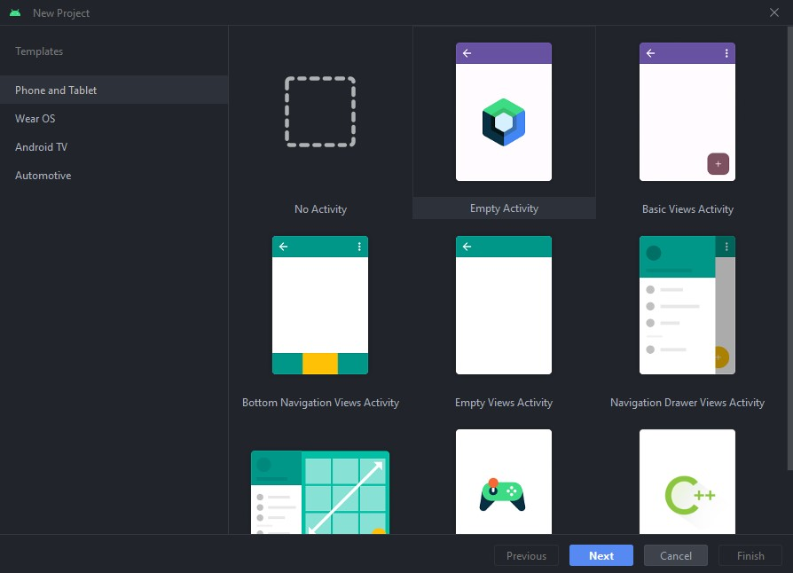

Los parámetros adicionales configúralos como prefieras.

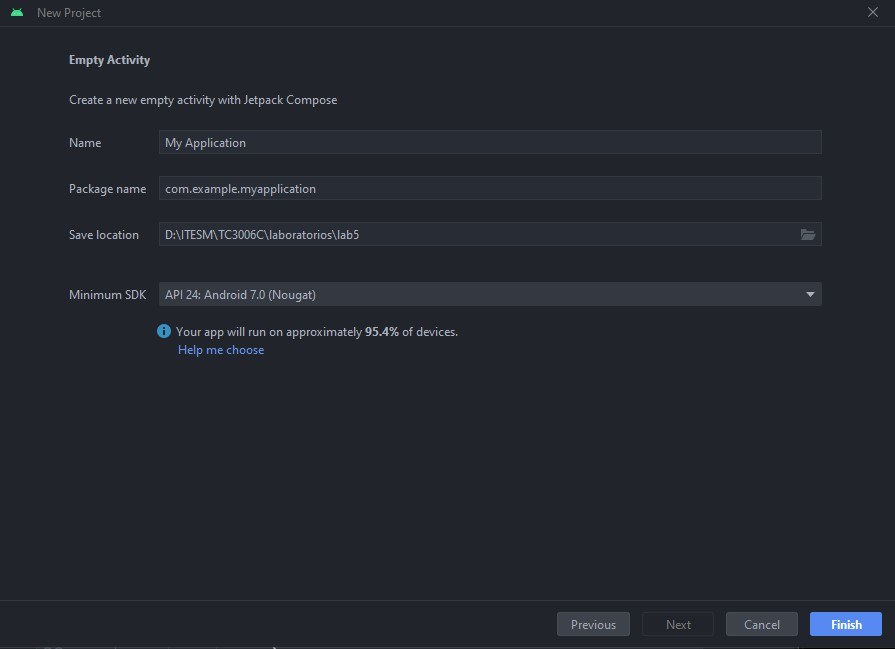

Ahora vamos a comenzar configurando los plugins y librerías necesarios para crear una especie de plantilla inicial del proyecto.

Dentro de la estructura del proyecto despliega la opción de **gradle** y abre el primer archivo que trae. Este archivo **build.gradle** contiene la configuración de todo el proyecto.

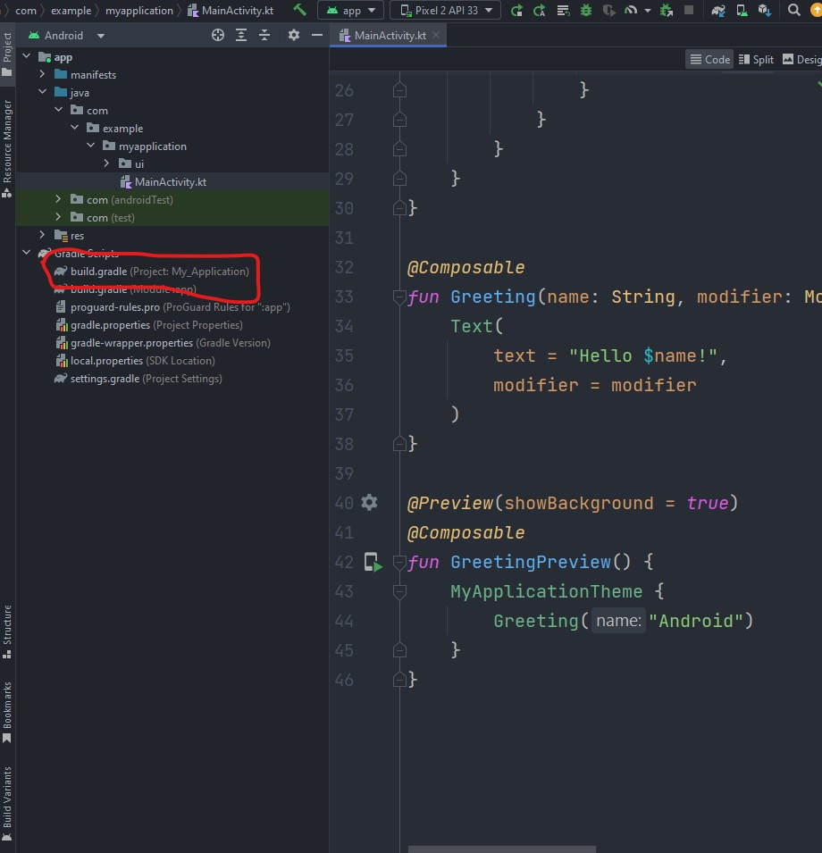

El código que deberás ver es el siguiente

```
// Top-level build file where you can add configuration options common to all sub-projects/modules.  
plugins {  
    id 'com.android.application' version '8.0.2' apply false  
    id 'com.android.library' version '8.0.2' apply false  
    id 'org.jetbrains.kotlin.android' version '1.7.20' apply false  
}
```

Para este proyecto es necesario agregar un plugin para poder convertir las llamadas al API en formato JSON en modelos o clases internas **data classes** como vimos en el laboratorio anterior.

Por ahora solo agrega al final la siguiente línea de cóidigo

```
id "org.jetbrains.kotlin.plugin.serialization" version "1.7.20" apply false
```

Ahora vamos a abrir el segundo archivo **build.gradle**, debe de decir (Module:app).

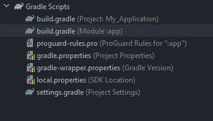

Este archivo contiene toda la configuración de nuestra aplicación, existen 2 archivos **build.gradle** por que todos los proyectos de Android pueden tener proyectos base y librerías, que a su vez se desarrollan como proyectos base. Esta jerarquía permite tener un buen sistema de desarrollo a terceros que permite la estabilidad del proyecto sin afectarse por librerías adicionales.

Ahora bien, en el archivo en la parte superior verás la sección de **plugins**, agrega al final de esta sección lo siguiente.

```
id "org.jetbrains.kotlin.plugin.serialization"  
id "kotlin-kapt"
```

Nuevamente damos seguimiento al plugin que instalamos anteriormente para importarlo al proyecto.

Ahora vamos a la sección inferior que se llama **dependencies**, en esta sección podemos agregar todas las librerías oficiales o de terceros que queramos usar para el proyecto. Estas librerías tienen la siguiente notación:

- implementation: Son todas las librerías que corren en el proyecto base.
- testImplementation: Son librerías que no se cargan en la aplicación pero que sirven para pruebas unitarias.
- androidTestImplementation: Son librerías que no se cargan en la aplicación pero que sirve para pruebas de instrumentación.

Para este curso solo utilizaremos las de **implementation**. Ahora agrega las librerías siguientes al proyecto.

```
//kotlinx serialization  
implementation "org.jetbrains.kotlinx:kotlinx-serialization-json:1.4.1"  
  
//ktor client, serialization and logging  
implementation "io.ktor:ktor-client-android:1.5.0"  
implementation "io.ktor:ktor-client-serialization:1.5.0"  
implementation "io.ktor:ktor-client-logging-jvm:1.5.0"  
  
implementation "androidx.lifecycle:lifecycle-runtime-ktx:2.6.1"  
implementation "androidx.lifecycle:lifecycle-viewmodel-compose:2.6.1"  
  
implementation "org.jetbrains.kotlinx:kotlinx-coroutines-android:1.6.4"  
  
implementation "io.coil-kt:coil-compose:2.2.2"
```

**Por último debemos sincronizar gradle para que todos los cambios que agregamos surtan efecto, puedes buscar el botón del elefante o cuando generes un cambio en la parte superior debe aparecer un botón de Sync now**

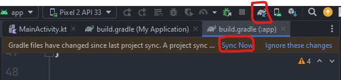

La sincronización puede tomar un momento ya que se descargan de internet las librerías y plugins necesarios.

Ahora dentro de la jerarquía del proyecto necesitamos abrir el archivo del manifest.

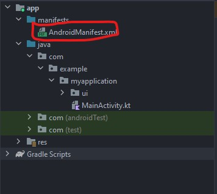

El manifest es el archivo más importante de toda la aplicación en Android, pues le indica al compilador la estructura que tiene la aplicación, los permisos que tiene y la forma en que se comporta cada vista.

Nosotros vamos a agregar el permiso de Internet a la aplicación, esto le indicará al Sistema Operativo que nuestra aplicación realizará llamadas a Internet. En caso de no colocarlo, nuestra aplicación se vería bloqueada a cualquier comunicación con el exterior.

Para colocar el permiso, realiza la acción arriba de la etiqueta **<application**

```
<uses-permission android:name="android.permission.INTERNET" />
```

Los permisos normalmente van en la parte superior, pero en orden no importa si van arriba o abajo mientras estén dentro de la etiqueta **manifest** y fuera de la etiqueta **application**.

Ahora nuevamente en la jerarquía del proyecto vamos a abrir la carpeta **res**.

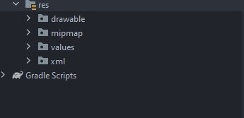

Esta carpeta contiene archivos default usados para el proyecto. Estas carpetas son especiales para android, vamos a agregar una nueva para agregar un font al proyecto. Da clic derecho en **res > New > Android resource directory**

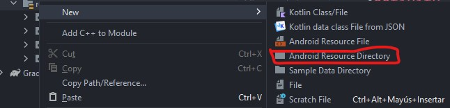

En la ventana que aparece seleccionamos **resource > font**. Y damos clic en **Ok.**

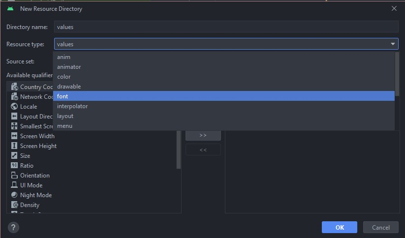

El resultado es que se nos agrega la carpeta de **font** a la cual le podemos agregar la nueva tipografía que queremos utilizar para el proyecto.

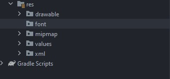

Si damos clic derecho en la nueva carpeta y seleccionamos **Open In > Explorer (Finder)**, nos abrirá la nueva carpeta en nuestro visualizador. Dentro de la carpeta agrega los archivos de font que trae tu archivo de recursos base del proyecto.

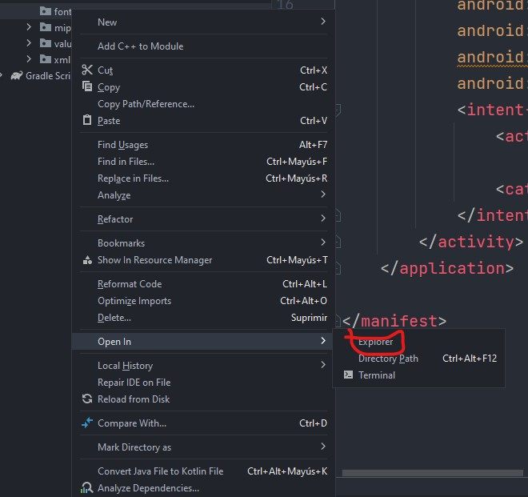

Una vez que los agregues, regresa a Android Studio y espera un momento a que se recarguen. El resultado debe verse como el siguiente.

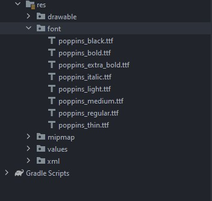

Dentro de tus recursos para el proyecto verás que tienes 2 imágenes en la carpeta **drawable**, agrega estas imágenes al proyecto también.

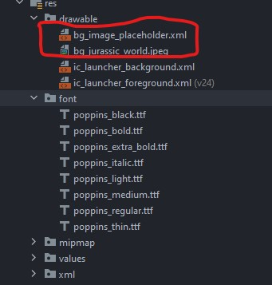

Con esta base ya podemos empezar con el proyecto, vamos a trabajar con la interfaz primero.

### Paso 2 Crear UI del proyecto

Si abrimos nuestro paquete principal del proyecto vamos a ver lo siguiente.

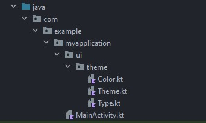

Esto es muy similar al laboratorio anterior, donde ya contamos un **MainActivity** y dentro de este un HelloWorld estructurado con Compose.

**Nota: si no puedes ver los paquetes como yo los veo, realiza la siguiente configuración. Da clic en settings en la jerarquía del proyecto.**

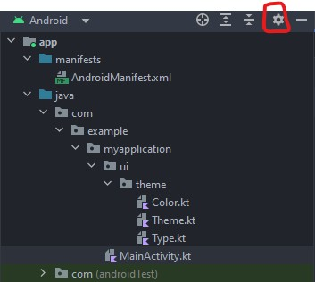

Después quita la selección de **Tree appearance > Compact Middle Packages**

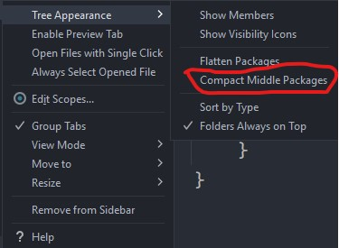

Más adelante vamos a crear nuevos paquetes y Android Studio a veces los unifica no permitiendo trabajar con los paquetes intermedios, de esta manera puedes seleccionar exactamente la carpeta con la que quieres trabajar.

Ahora bien, algo que no vimos en el laboratorio anterior es la carpeta default de **ui** que trae el proyecto, es más, todo el laboratorio lo realizamos en el mismo **MainActivity**, al inicio es normal realizar esta práctica. En la realidad siempre es mejor separar todos los archivos en sus propios contenedores por legibilidad y para no combinar cosas entre sí, esto puede llevar a que el proyecto contenga muchos archivos, pero si identificas bien las carpetas contenedoras de paquetes esto hace mucho más fácil crecer un proyecto a largo plazo.

Dentro de **ui** tenemos la clase **Color, Theme y Type**, vamos a extender un poco esta base de interfaz para tener toda nuestra plantilla de diseño.

Abriremos el archivo **Color** y vamos a extender su contenido a lo siguiente

```
val Purple80 = Color(0xFFD0BCFF)  
val PurpleGrey80 = Color(0xFFCCC2DC)  
val Pink80 = Color(0xFFEFB8C8)  
  
val Purple40 = Color(0xFF6650a4)  
val PurpleGrey40 = Color(0xFF625b71)  
val Pink40 = Color(0xFF7D5260)  
  
val md_theme_light_primary = Color(0xFF006492)  
val md_theme_light_onPrimary = Color(0xFFFFFFFF)  
val md_theme_light_primaryContainer = Color(0xFFC9E6FF)  
val md_theme_light_onPrimaryContainer = Color(0xFF001E2F)  
val md_theme_light_secondary = Color(0xFF50606E)  
val md_theme_light_onSecondary = Color(0xFFFFFFFF)  
val md_theme_light_secondaryContainer = Color(0xFFD3E5F5)  
val md_theme_light_onSecondaryContainer = Color(0xFF0C1D29)  
val md_theme_light_tertiary = Color(0xFF64597B)  
val md_theme_light_onTertiary = Color(0xFFFFFFFF)  
val md_theme_light_tertiaryContainer = Color(0xFFEADDFF)  
val md_theme_light_onTertiaryContainer = Color(0xFF201634)  
val md_theme_light_error = Color(0xFFBA1A1A)  
val md_theme_light_errorContainer = Color(0xFFFFDAD6)  
val md_theme_light_onError = Color(0xFFFFFFFF)  
val md_theme_light_onErrorContainer = Color(0xFF410002)  
val md_theme_light_background = Color(0xFFFCFCFF)  
val md_theme_light_onBackground = Color(0xFF1A1C1E)  
val md_theme_light_surface = Color(0xFFFCFCFF)  
val md_theme_light_onSurface = Color(0xFF1A1C1E)  
val md_theme_light_surfaceVariant = Color(0xFFDDE3EA)  
val md_theme_light_onSurfaceVariant = Color(0xFF41474D)  
val md_theme_light_outline = Color(0xFF72787E)  
val md_theme_light_inverseOnSurface = Color(0xFFF0F0F3)  
val md_theme_light_inverseSurface = Color(0xFF2E3133)  
val md_theme_light_inversePrimary = Color(0xFF8BCEFF)  
val md_theme_light_shadow = Color(0xFF000000)  
val md_theme_light_surfaceTint = Color(0xFF006492)  
val md_theme_light_success = Color(0XFF4CAF50)  
  
val md_theme_dark_primary = Color(0xFF8BCEFF)  
val md_theme_dark_onPrimary = Color(0xFF00344E)  
val md_theme_dark_primaryContainer = Color(0xFF004B6F)  
val md_theme_dark_onPrimaryContainer = Color(0xFFC9E6FF)  
val md_theme_dark_secondary = Color(0xFFB7C9D9)  
val md_theme_dark_onSecondary = Color(0xFF22323F)  
val md_theme_dark_secondaryContainer = Color(0xFF384956)  
val md_theme_dark_onSecondaryContainer = Color(0xFFD3E5F5)  
val md_theme_dark_tertiary = Color(0xFFCFC0E8)  
val md_theme_dark_onTertiary = Color(0xFF352B4B)  
val md_theme_dark_tertiaryContainer = Color(0xFF4C4162)  
val md_theme_dark_onTertiaryContainer = Color(0xFFEADDFF)  
val md_theme_dark_error = Color(0xFFFFB4AB)  
val md_theme_dark_errorContainer = Color(0xFF93000A)  
val md_theme_dark_onError = Color(0xFF690005)  
val md_theme_dark_onErrorContainer = Color(0xFFFFDAD6)  
val md_theme_dark_background = Color(0xFF1A1C1E)  
val md_theme_dark_onBackground = Color(0xFFE2E2E5)  
val md_theme_dark_surface = Color(0xFF1A1C1E)  
val md_theme_dark_onSurface = Color(0xFFE2E2E5)  
val md_theme_dark_surfaceVariant = Color(0xFF41474D)  
val md_theme_dark_onSurfaceVariant = Color(0xFFC1C7CE)  
val md_theme_dark_outline = Color(0xFF8B9198)  
val md_theme_dark_inverseOnSurface = Color(0xFF1A1C1E)  
val md_theme_dark_inverseSurface = Color(0xFFE2E2E5)  
val md_theme_dark_inversePrimary = Color(0xFF006492)  
val md_theme_dark_shadow = Color(0xFF000000)  
val md_theme_dark_surfaceTint = Color(0xFF8BCEFF)  
val md_theme_dark_success = Color(0XFF1B5E20)  
  
  
val seed = Color(0xFF3B80AC)
```

Por su parte el archivo **Type** lo modificaremos a lo siguiente:

```
import android.app.Activity  
import android.os.Build  
import androidx.compose.foundation.isSystemInDarkTheme  
import androidx.compose.material3.MaterialTheme  
import androidx.compose.material3.darkColorScheme  
import androidx.compose.material3.dynamicDarkColorScheme  
import androidx.compose.material3.dynamicLightColorScheme  
import androidx.compose.material3.lightColorScheme  
import androidx.compose.runtime.Composable  
import androidx.compose.runtime.CompositionLocalProvider  
import androidx.compose.runtime.SideEffect  
import androidx.compose.ui.graphics.toArgb  
import androidx.compose.ui.platform.LocalContext  
import androidx.compose.ui.platform.LocalView  
import androidx.core.view.WindowCompat  
  
private val DarkColorScheme = darkColorScheme(  
    primary = Purple80,  
    secondary = PurpleGrey80,  
    tertiary = Pink80  
)  
  
private val LightColorScheme = lightColorScheme(  
    primary = Purple40,  
    secondary = PurpleGrey40,  
    tertiary = Pink40  
  
    /* Other default colors to override  
    background = Color(0xFFFFFBFE),    surface = Color(0xFFFFFBFE),    onPrimary = Color.White,    onSecondary = Color.White,    onTertiary = Color.White,    onBackground = Color(0xFF1C1B1F),    onSurface = Color(0xFF1C1B1F),    */)  
  
private val LightColors = lightColorScheme(  
    primary = md_theme_light_primary,  
    onPrimary = md_theme_light_onPrimary,  
    primaryContainer = md_theme_light_primaryContainer,  
    onPrimaryContainer = md_theme_light_onPrimaryContainer,  
    secondary = md_theme_light_secondary,  
    onSecondary = md_theme_light_onSecondary,  
    secondaryContainer = md_theme_light_secondaryContainer,  
    onSecondaryContainer = md_theme_light_onSecondaryContainer,  
    tertiary = md_theme_light_tertiary,  
    onTertiary = md_theme_light_onTertiary,  
    tertiaryContainer = md_theme_light_tertiaryContainer,  
    onTertiaryContainer = md_theme_light_onTertiaryContainer,  
    error = md_theme_light_error,  
    errorContainer = md_theme_light_errorContainer,  
    onError = md_theme_light_onError,  
    onErrorContainer = md_theme_light_onErrorContainer,  
    background = md_theme_light_background,  
    onBackground = md_theme_light_onBackground,  
    surface = md_theme_light_surface,  
    onSurface = md_theme_light_onSurface,  
    surfaceVariant = md_theme_light_surfaceVariant,  
    onSurfaceVariant = md_theme_light_onSurfaceVariant,  
    outline = md_theme_light_outline,  
    inverseOnSurface = md_theme_light_inverseOnSurface,  
    inverseSurface = md_theme_light_inverseSurface,  
    inversePrimary = md_theme_light_inversePrimary,  
    surfaceTint = md_theme_light_surfaceTint,  
)  
  
  
private val DarkColors = darkColorScheme(  
    primary = md_theme_dark_primary,  
    onPrimary = md_theme_dark_onPrimary,  
    primaryContainer = md_theme_dark_primaryContainer,  
    onPrimaryContainer = md_theme_dark_onPrimaryContainer,  
    secondary = md_theme_dark_secondary,  
    onSecondary = md_theme_dark_onSecondary,  
    secondaryContainer = md_theme_dark_secondaryContainer,  
    onSecondaryContainer = md_theme_dark_onSecondaryContainer,  
    tertiary = md_theme_dark_tertiary,  
    onTertiary = md_theme_dark_onTertiary,  
    tertiaryContainer = md_theme_dark_tertiaryContainer,  
    onTertiaryContainer = md_theme_dark_onTertiaryContainer,  
    error = md_theme_dark_error,  
    errorContainer = md_theme_dark_errorContainer,  
    onError = md_theme_dark_onError,  
    onErrorContainer = md_theme_dark_onErrorContainer,  
    background = md_theme_dark_background,  
    onBackground = md_theme_dark_onBackground,  
    surface = md_theme_dark_surface,  
    onSurface = md_theme_dark_onSurface,  
    surfaceVariant = md_theme_dark_surfaceVariant,  
    onSurfaceVariant = md_theme_dark_onSurfaceVariant,  
    outline = md_theme_dark_outline,  
    inverseOnSurface = md_theme_dark_inverseOnSurface,  
    inverseSurface = md_theme_dark_inverseSurface,  
    inversePrimary = md_theme_dark_inversePrimary,  
    surfaceTint = md_theme_dark_surfaceTint,  
)  
  
  
@Composable  
fun MyApplicationTheme(  
    darkTheme: Boolean = isSystemInDarkTheme(),  
    // Dynamic color is available on Android 12+  
    dynamicColor: Boolean = true,  
    content: @Composable () -> Unit  
) {  
    val colorScheme = when {  
        dynamicColor && Build.VERSION.SDK_INT >= Build.VERSION_CODES.S -> {  
            val context = LocalContext.current  
            if (darkTheme) dynamicDarkColorScheme(context) else dynamicLightColorScheme(context)  
        }  
  
        darkTheme -> DarkColorScheme  
        else -> LightColorScheme  
    }  
    val view = LocalView.current  
    if (!view.isInEditMode) {  
        SideEffect {  
            val window = (view.context as Activity).window  
            window.statusBarColor = colorScheme.primary.toArgb()  
            WindowCompat.getInsetsController(window, view).isAppearanceLightStatusBars = darkTheme  
        }  
    }  
  
    MaterialTheme(  
        colorScheme = colorScheme,  
        typography = Typography,  
        content = content  
    )  
}  
  
@Composable  
fun AppTheme(  
    useDarkTheme: Boolean = isSystemInDarkTheme(),  
    content: @Composable () -> Unit  
) {  
  
    val colors = if (!useDarkTheme) {  
        LightColors  
    } else {  
        DarkColors  
    }  
  
    CompositionLocalProvider(LocalSpacing provides Spacing()) {  
        MaterialTheme(  
            colorScheme = colors,  
            content = content,  
            typography = AppTypography  
        )  
    }  
}
```

Dentro de las últimas líneas verás que te marca error, no te preocupes ahora mismo agregaremos las clases faltantes.

Vamos a crear un nuevo archivo de Kotlin, seleccionando el paquete **theme**, vamos a dar clic derecho y luego **New > Kotlin Class/File**, a este primero lo llamaremos **Spacing** y será de tipo **File**. Su contenido será lo siguiente:

```
import androidx.compose.material3.MaterialTheme  
import androidx.compose.runtime.Composable  
import androidx.compose.runtime.ReadOnlyComposable  
import androidx.compose.runtime.compositionLocalOf  
import androidx.compose.ui.unit.Dp  
import androidx.compose.ui.unit.dp  
  
data class Spacing(  
    val extraSmall: Dp = 4.dp,  
    val small: Dp = 8.dp,  
    val medium: Dp = 16.dp,  
    val large: Dp = 32.dp,  
    val xLarge: Dp = 64.dp,  
    val xxLarge: Dp = 96.dp,  
    val xxxLarge: Dp = 128.dp  
)  
  
val LocalSpacing = compositionLocalOf { Spacing() }  
  
val MaterialTheme.spacing: Spacing  
    @Composable  
    @ReadOnlyComposable    get() = LocalSpacing.current
```

Por último crearemos otro archivo **File** que se llamará **Typography**. Su contenido es este:

```
import androidx.compose.material3.Typography  
import androidx.compose.ui.text.PlatformTextStyle  
import androidx.compose.ui.text.TextStyle  
import androidx.compose.ui.text.font.Font  
import androidx.compose.ui.text.font.FontFamily  
import androidx.compose.ui.text.font.FontWeight  
import androidx.compose.ui.text.style.LineHeightStyle  
import androidx.compose.ui.unit.sp  
import com.example.myapplication.R  
  
private val Poppins = FontFamily(  
    Font(R.font.poppins_regular),  
    Font(R.font.poppins_bold),  
    Font(R.font.poppins_extra_bold),  
    Font(R.font.poppins_medium),  
    Font(R.font.poppins_thin),  
    Font(R.font.poppins_italic),  
    Font(R.font.poppins_light),  
    Font(R.font.poppins_black)  
)  
  
@Suppress("DEPRECATION")  
val defaultTextStyle = TextStyle(  
    fontFamily = Poppins,  
    platformStyle = PlatformTextStyle(  
        includeFontPadding = false  
    ),  
    lineHeightStyle = LineHeightStyle(  
        alignment = LineHeightStyle.Alignment.Center,  
        trim = LineHeightStyle.Trim.None  
    )  
)  
  
val AppTypography = Typography(  
    displayLarge = defaultTextStyle.copy(  
        fontSize = 57.sp, lineHeight = 64.sp, letterSpacing = (-0.25).sp  
    ),  
    displayMedium = defaultTextStyle.copy(  
        fontSize = 45.sp, lineHeight = 52.sp, letterSpacing = 0.sp  
    ),  
    displaySmall = defaultTextStyle.copy(  
        fontSize = 36.sp, lineHeight = 44.sp, letterSpacing = 0.sp  
    ),  
    headlineLarge = defaultTextStyle.copy(  
        fontSize = 32.sp, lineHeight = 40.sp, letterSpacing = 0.sp  
    ),  
    headlineMedium = defaultTextStyle.copy(  
        fontSize = 28.sp, lineHeight = 36.sp, letterSpacing = 0.sp  
    ),  
    headlineSmall = defaultTextStyle.copy(  
        fontSize = 24.sp, lineHeight = 32.sp, letterSpacing = 0.sp  
    ),  
    titleLarge = defaultTextStyle.copy(  
        fontSize = 22.sp, lineHeight = 28.sp, letterSpacing = 0.sp  
    ),  
    titleMedium = defaultTextStyle.copy(  
        fontSize = 16.sp,  
        lineHeight = 24.sp,  
        letterSpacing = 0.15.sp,  
        fontWeight = FontWeight.Medium  
    ),  
    titleSmall = defaultTextStyle.copy(  
        fontSize = 14.sp, lineHeight = 20.sp, letterSpacing = 0.1.sp, fontWeight = FontWeight.Medium  
    ),  
    labelLarge = defaultTextStyle.copy(  
        fontSize = 14.sp, lineHeight = 20.sp, letterSpacing = 0.1.sp, fontWeight = FontWeight.Medium  
    ),  
    labelMedium = defaultTextStyle.copy(  
        fontSize = 12.sp, lineHeight = 16.sp, letterSpacing = 0.5.sp, fontWeight = FontWeight.Medium  
    ),  
    labelSmall = defaultTextStyle.copy(  
        fontSize = 11.sp, lineHeight = 16.sp, letterSpacing = 0.5.sp, fontWeight = FontWeight.Medium  
    ),  
    bodyLarge = defaultTextStyle.copy(  
        fontSize = 16.sp, lineHeight = 24.sp, letterSpacing = 0.5.sp  
    ),  
    bodyMedium = defaultTextStyle.copy(  
        fontSize = 14.sp, lineHeight = 20.sp, letterSpacing = 0.25.sp  
    ),  
    bodySmall = defaultTextStyle.copy(  
        fontSize = 12.sp, lineHeight = 16.sp, letterSpacing = 0.4.sp  
    ),  
)
```

Ahora regresa al archivo **Theme**, los errores debieron haber desaparecido.

Todos los archivos anteriores son propiedades estándar que permiten delimitar el tipo de interfaz que queremos para nuestra aplicación, no voy a entrar en detalle en ellos pero básicamente son propiedades de Compose que podremos llamar al momento de generar nuestra aplicación.

Ahora vamos a crear un nuevo paquete, tomando como referencia **ui** daremos clic derecho **New > Package**, este se llamará **movies**.

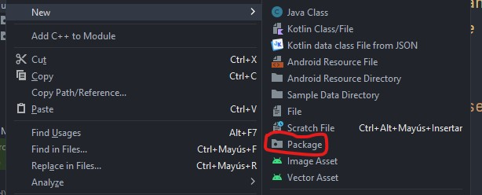

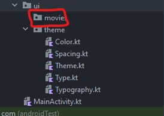

Dentro de este paquete vamos a crear 2 archivos de Kotlin tipo **File**:

1. MovieItem
2. MovieList

El contenido de **MovieItem** será el siguiente.

```
import android.content.res.Configuration  
import androidx.compose.foundation.background  
import androidx.compose.foundation.layout.*  
import androidx.compose.foundation.shape.RoundedCornerShape  
import androidx.compose.material3.MaterialTheme  
import androidx.compose.material3.Text  
import androidx.compose.runtime.Composable  
import androidx.compose.ui.Modifier  
import androidx.compose.ui.draw.clip  
import androidx.compose.ui.draw.shadow  
import androidx.compose.ui.geometry.Offset  
import androidx.compose.ui.graphics.Brush  
import androidx.compose.ui.graphics.Color  
import androidx.compose.ui.layout.ContentScale  
import androidx.compose.ui.platform.LocalContext  
import androidx.compose.ui.res.painterResource  
import androidx.compose.ui.text.font.FontWeight  
import androidx.compose.ui.text.style.TextOverflow  
import androidx.compose.ui.tooling.preview.Preview  
import androidx.compose.ui.unit.dp  
import coil.compose.AsyncImage  
import coil.request.ImageRequest  
import com.example.myapplication.ui.theme.AppTheme  
import com.example.myapplication.ui.theme.spacing  
import com.example.myapplication.R  
  
@Composable  
fun MovieItem() {  
    val spacing = MaterialTheme.spacing  
    Box(  
        modifier = Modifier  
            .background(  
                brush = Brush.linearGradient(  
                    colors = listOf(MaterialTheme.colorScheme.surfaceVariant, MaterialTheme.colorScheme.surface),  
                    start = Offset(0f, Float.POSITIVE_INFINITY),  
                    end = Offset(Float.POSITIVE_INFINITY, 0f)  
                )  
            )  
            .fillMaxWidth()  
            .wrapContentHeight()  
            .padding(spacing.extraSmall)  
            .clip(RoundedCornerShape(spacing.small))  
            .shadow(elevation = 1.dp)  
    ) {  
  
        Row(  
            modifier = Modifier  
                .padding(spacing.small)  
                .fillMaxWidth()  
        ) {  
  
            AsyncImage(  
                model = ImageRequest.Builder(LocalContext.current)  
                    .data(R.drawable.bg_jurassic_world)  
                    .crossfade(true)  
                    .build(),  
                placeholder = painterResource(R.drawable.bg_image_placeholder),  
                contentDescription = "",  
                contentScale = ContentScale.Fit,  
                modifier = Modifier.weight(0.4f)  
            )  
  
            Column(  
                modifier = Modifier  
                    .weight(0.6f)  
                    .padding(start = spacing.medium)  
            ) {  
                Text(  
                    text = "Jurassic World Dominion",  
                    style = MaterialTheme.typography.titleLarge,  
                    color = MaterialTheme.colorScheme.onSurface  
                )  
  
                Spacer(modifier = Modifier.size(spacing.medium))  
  
                Text(  
                    text = "Four years after Isla Nublar was destroyed, dinosaurs now live—and hunt—alongside humans all over the world. This fragile balance will reshape the future and determine, once and for all, whether human beings are to remain the apex predators on a planet they now share with history’s most fearsome creatures.",  
                    style = MaterialTheme.typography.bodyMedium,  
                    color = MaterialTheme.colorScheme.onSurface,  
                    maxLines = 7,  
                    overflow = TextOverflow.Ellipsis  
                )  
  
                Spacer(modifier = Modifier.size(spacing.medium))  
  
                Text(  
                    text = "IMDB 8.9",  
                    style = MaterialTheme.typography.bodySmall,  
                    fontWeight = FontWeight.Bold,  
                    modifier = Modifier  
                        .clip(RoundedCornerShape(spacing.extraSmall))  
                        .background(Color.Yellow)  
                        .padding(  
                            start = spacing.small,  
                            end = spacing.small,  
                            top = spacing.extraSmall,  
                            bottom = spacing.extraSmall  
                        )  
                )  
            }  
        }  
    }  
}  
  
@Preview(showBackground = true, uiMode = Configuration.UI_MODE_NIGHT_YES)  
@Composable  
fun MovieItemPreviewDark() {  
    AppTheme {  
        MovieItem()  
    }  
}  
  
@Preview(showBackground = true, uiMode = Configuration.UI_MODE_NIGHT_NO)  
@Composable  
fun MovieItemPreviewLight() {  
    AppTheme {  
        MovieItem()  
    }  
}
```

Si tienes problemas con las llamadas a **R.drawable...** verifica el import de la línea 27, debe hacer match con el paquete principal de tu proyecto.

```
import com.example.myapplication.R
```

Ahora el contenido de **MovieList** es el siguiente:

```
import androidx.compose.foundation.layout.fillMaxSize  
import androidx.compose.foundation.lazy.LazyColumn  
import androidx.compose.foundation.lazy.items  
import androidx.compose.material3.Surface  
import androidx.compose.runtime.Composable  
import androidx.compose.ui.Modifier  
  
@Composable  
fun MovieList() {  
    val data = mutableListOf<Int>(1,2,3,4,5,6,7,8,9,10)  
    Surface(  
        modifier = Modifier  
            .fillMaxSize()  
    ) {  
        LazyColumn {  
            items(data) {  
                MovieItem()  
            }  
        }  
    }  
}
```

Con lo anterior ya tenemos una base de interfaz hecha, en ese sentido no es nada nuevo a lo que realizamos en el laboratorio anterior, por eso no me detengo a revisarlo, en todo caso vamos a destacar en **MovieItem** en la línea 54 el uso de **AsyncImage**, esta es una librería externa para poder cargar imágenes desde internet sin realizar una configuración adicional, solo es necesario pasar la url. Esta la usaremos bien más adelante.

Antes de correr el proyecto necesitamos actualizar nuestro **ActivityMain** por lo que borra las funciones de Compose **Greeting y GreetingPreview**. y dentro de **setcontent** coloca lo siguiente.

```
setContent {  
    AppTheme {  
        MovieList()  
    }  
}
```

Ahora sí, corre el proyecto, el resultado debe ser una lista con varios elementos pero con la misma información.

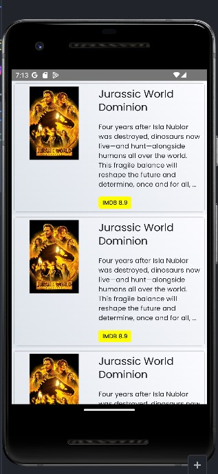

Con esta estructura ya podemos trabajar en lo que nos interesa en este laboratorio, los modelos.

### Paso 3 Configuración de KTOR

KTOR es una librería que utiliza Kotlin para hacer llamadas HTTP, es importante que sigas la estructura que veremos a continuación ya que una llamada incorrecta puede generarte errores por lógica.

Para comenzar vamos a cerrar el paquete de **ui**, por ahora no vamos a utilizarlo más.

Pero a la misma altura de **ui** vamos a crear un nuevo paquete llamado **data**.

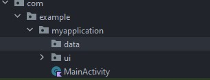

Dentro de este vamos a crear 2 nuevos paquetes que se llamen **models** y **network** respectivamente.

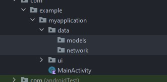

Ahora dentro del paquete **network** vamos a crear el archivo de tipo **Class** llamado **TmdbHttpClient**

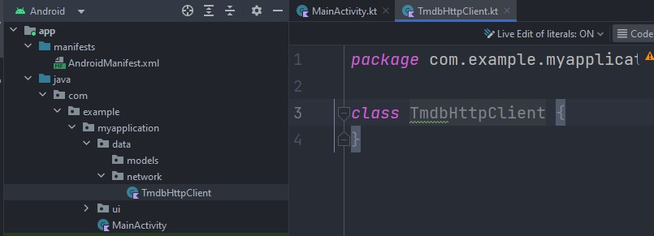

Este archivo nos permite configurar KTOR para nuestro proyecto ya que cada API tiene sus propias características.

Dentro de la clase vamos a generar la función **getHttpClient()**, esta función nos permitirá crear un objeto HttpClient cada vez que vayamos a realizar una llamada a internet.

```
class TmdbHttpClient {  
    fun getHttpClient() = HttpClient(Android){  
  
    }  
}
```

Dentro de esta función vamos a usar la forma de KTOR para inicializar la configuración, esto se hace mediante la generación de módulos de instalación que agregan funcionalidad a nuestro objeto.

El primero que agregaremos será el serializador y el tiempo de conexión

```
install(JsonFeature){  
    serializer = KotlinxSerializer(Json{  
        prettyPrint = true  
        isLenient = true  
        ignoreUnknownKeys = true  
    })  
  
    engine {  
        connectTimeout = TIME_OUT  
        socketTimeout = TIME_OUT  
    }  
}
```

El serializador como ya te mencioné antes, nos permite convertir el resultado de una llamada a un API, donde por lo general es un resultado en formato JSON y poder convertirlo directamente en un **data class**.

Ahora bien, podemos agregar varias propiedades al serializador para que al momento de cargar el JSON sea más fácil.

- prettyPrint: Permite la generación de impresiones de manera limpia legible para el desarrollador.
- isLenient: Permite al serializador ser más flexible con JSON en un mal formato.
- ignoreUnknownKeys: Permite ignorar llaves que no vengan en el**data class** ya que en caso de desactivarlo, si se detecta una llave no existente, el serializador mandará una excepción.

Para el caso de engine, solamente definimos el tiempo de conexión en timeouts, el valor lo definiremos en una constante en un momento.

Para generar constantes accesibles dentro de una clase necesitamos un valor o clase estática. Dentro de Kotlin estas no existen, pero su equivalente son los **companion object**. Define en la parte inferior del archivo pero dentro de la clase lo siguiente:

```
companion object{  
    private const val TIME_OUT = 10_000  
    private const val TAG_KTOR_LOGGER = "ktor_logger:"  
    private const val TAG_HTTP_STATUS_LOGGER = "http_status:"  
}
```

Esto deberá quitar los errores del TIME_OUT, las otras 2 constantes las usaremos al agregar los install que nos hacen falta.

Debajo del install que ya tenemos coloca el siguiente:

```
install(Logging){  
    logger = object : Logger{  
        override fun log(message: String) {  
            Log.i(TAG_KTOR_LOGGER,message)  
        }  
    }  
}
```

Este en particular nor  permite imprimir cualquier mensaje de error que nos mande una llamada al API, esto en caso de revisar algún error.

Ahora el siguiente install será este:

```
install(ResponseObserver){  
    onResponse {response->  
        Log.i(TAG_HTTP_STATUS_LOGGER,"${response.status.value}")  
    }  
}
```

Esta configuración se ejecuta al momento de hacer una llamada al API y nos devuelve el resultado obtenido, igualmente para visualizar si tenemos algún error en la conexión, para saber que regreso correctamente o en su defecto un error.

Por último vamos a agregar el siguiente install:

```
install(DefaultRequest){  
    header(HttpHeaders.ContentType,ContentType.Application.Json)  
    header(HttpHeaders.Authorization, "Bearer ${TmdbApiKeys.API_KEY}")  
}
```

Esta configuración agrega a todas las llamadas del API un header para configurar el resultado como JSON, y se agrega la autenticación que usaremos para el API de TMDB.

Este último paso del API_KEY deberá marcarte un error ya que no hemos configurado esta llave.

Para hacerlo vamos a crear un nuevo paquete que se llame **secret.**

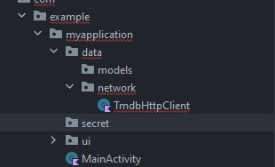

Dentro de este paquete vamos a crear un archivo llamado **TmdbApiKeys** que será de tipo **Object**. El contenido será el siguiente:

```
object TmdbApiKeys {  
    const val API_KEY = ""  
}
```

**Nota: Aquí sustituye el api key por el que obtuviste dentro de la página de TMDB, no uses el corto, utiliza el largo.**

Si regresas a **TmdbHttpClient** y vas a donde marca error en **TmdbApiKeys** solo necesitas importar la nueva clase, coloca el cursor dentro de **TmdbApiKeys** y presiona alt+enter o cmd+enter. La importación se hará automáticamente.

Para terminar la configuración vamos a crear un nuevo archivo tipo **File** dentro del paquete **network** que se llamará **BaseUrl** y su contenido será el siguiente.

```
const val BASE_URL = "https://api.themoviedb.org/3/movie"
```

Aquí estamos definiendo la url base del API, lo normal es que todas las API cuentan con una url base y sus compuestos son las diferentes variaciones que se pueden obtener, tanto en nombres como en métodos como GET, POST, PUT, DELETE.

### Paso 4 Generación de Modelos

Ya que terminamos con la configuración del API, ahora es el turno de los modelos. Siguiendo con lo que dije al inicio, es necesario convertir el JSON en un archivo **data class** para su fácil manejo.

Lo normal es crear estos archivos desde 0, lo que implica generar cada propiedad individualmente, si bien en un proyecto pequeño esto es fácil, cuando tenemos proyectos con múltiples llamadas y objetos inter comunicados este paso puede hacerse tedioso.

Es por eso que para cuando tengas modelos de APIs ya creadas te recomiendo que uses un plugin, el cual instalaremos ahora mismo.

Vamos a la opción **file** en la parte superior de Android Studio y seleccionaremos la opción de **Settings**.

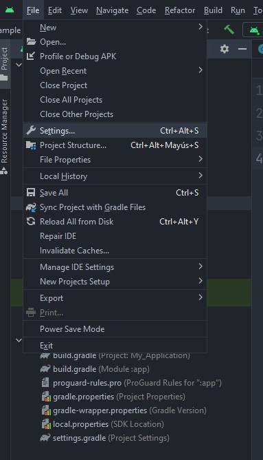

Después seleccionaremos **plugins**.

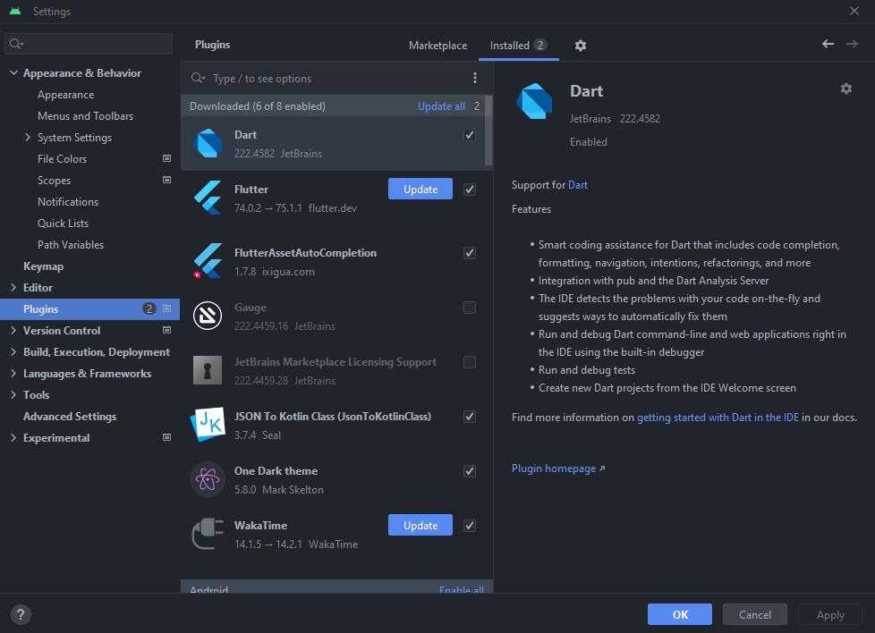

Asegurándote que tienes seleccionado **Marketplace**, busca **JSON to Kotlin** y después selecciona la opción de **Install**.

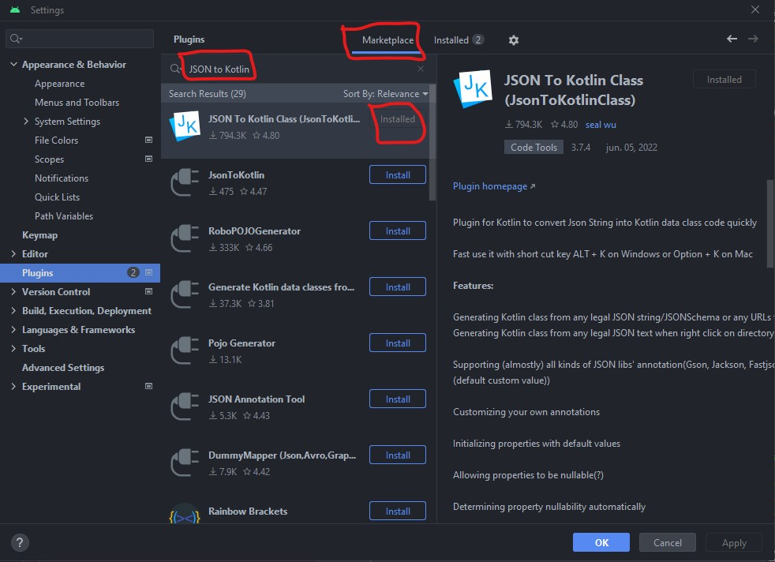

**Nota: Es probable que Android Studio requiera reiniciarse para poder continuar.**

Para saber que la instalación fue exitosa, selecciona cualquier paquete del proyecto y dando clic derecho **New**, deberá aparecer la opción **Kotlin data class file from JSON**

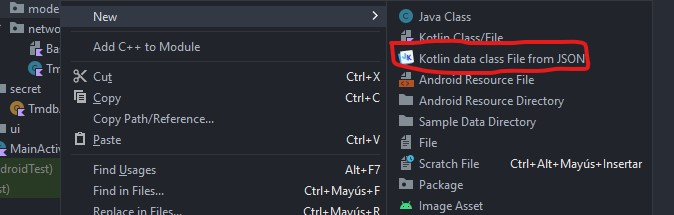


Ahora nos vamos a la página de [TMDB](https://developer.themoviedb.org/reference/movie-popular-list), en esta página veremos el API que queremos llamar.

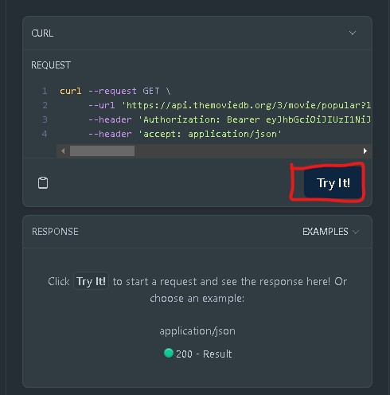

Si ejecutamos una prueba, veremos que nos regresa lo siguiente

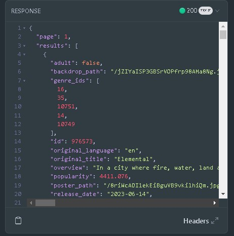

```
{
  "page": 1,
  "results": [
    {
      "adult": false,
      "backdrop_path": "/jZIYaISP3GBSrVOPfrp98AMa8Ng.jpg",
      "genre_ids": [
        16,
        35,
        10751,
        14,
        10749
      ],
      "id": 976573,
      "original_language": "en",
      "original_title": "Elemental",
      "overview": "In a city where fire, water, land and air residents live together, a fiery young woman and a go-with-the-flow guy will discover something elemental: how much they have in common.",
      "popularity": 4411.076,
      "poster_path": "/8riWcADI1ekEiBguVB9vkilhiQm.jpg",
      "release_date": "2023-06-14",
      "title": "Elemental",
      "video": false,
      "vote_average": 7.8,
      "vote_count": 1500
    },
    {
      "adult": false,
      "backdrop_path": "/xVMtv55caCEvBaV83DofmuZybmI.jpg",
      "genre_ids": [
        53,
        28
      ],
      "id": 724209,
      "original_language": "en",
      "original_title": "Heart of Stone",
      "overview": "An intelligence operative for a shadowy global peacekeeping agency races to stop a hacker from stealing its most valuable — and dangerous — weapon.",
      "popularity": 2899.65,
      "poster_path": "/vB8o2p4ETnrfiWEgVxHmHWP9yRl.jpg",
      "release_date": "2023-08-09",
      "title": "Heart of Stone",
      "video": false,
      "vote_average": 6.9,
      "vote_count": 824
    },
    {
      "adult": false,
      "backdrop_path": "/8pjWz2lt29KyVGoq1mXYu6Br7dE.jpg",
      "genre_ids": [
        28,
        878,
        27
      ],
      "id": 615656,
      "original_language": "en",
      "original_title": "Meg 2: The Trench",
      "overview": "An exploratory dive into the deepest depths of the ocean of a daring research team spirals into chaos when a malevolent mining operation threatens their mission and forces them into a high-stakes battle for survival.",
      "popularity": 3247.593,
      "poster_path": "/FQHtuf2zc8suMFE28RyvFt3FJN.jpg",
      "release_date": "2023-08-02",
      "title": "Meg 2: The Trench",
      "video": false,
      "vote_average": 6.9,
      "vote_count": 828
    },
    {
      "adult": false,
      "backdrop_path": "/4HodYYKEIsGOdinkGi2Ucz6X9i0.jpg",
      "genre_ids": [
        16,
        28,
        12
      ],
      "id": 569094,
      "original_language": "en",
      "original_title": "Spider-Man: Across the Spider-Verse",
      "overview": "After reuniting with Gwen Stacy, Brooklyn’s full-time, friendly neighborhood Spider-Man is catapulted across the Multiverse, where he encounters the Spider Society, a team of Spider-People charged with protecting the Multiverse’s very existence. But when the heroes clash on how to handle a new threat, Miles finds himself pitted against the other Spiders and must set out on his own to save those he loves most.",
      "popularity": 1872.207,
      "poster_path": "/8Vt6mWEReuy4Of61Lnj5Xj704m8.jpg",
      "release_date": "2023-05-31",
      "title": "Spider-Man: Across the Spider-Verse",
      "video": false,
      "vote_average": 8.4,
      "vote_count": 3811
    },
    {
      "adult": false,
      "backdrop_path": "/nHf61UzkfFno5X1ofIhugCPus2R.jpg",
      "genre_ids": [
        35,
        12,
        14
      ],
      "id": 346698,
      "original_language": "en",
      "original_title": "Barbie",
      "overview": "Barbie and Ken are having the time of their lives in the colorful and seemingly perfect world of Barbie Land. However, when they get a chance to go to the real world, they soon discover the joys and perils of living among humans.",
      "popularity": 1869.493,
      "poster_path": "/iuFNMS8U5cb6xfzi51Dbkovj7vM.jpg",
      "release_date": "2023-07-19",
      "title": "Barbie",
      "video": false,
      "vote_average": 7.4,
      "vote_count": 3433
    },
    {
      "adult": false,
      "backdrop_path": "/2vFuG6bWGyQUzYS9d69E5l85nIz.jpg",
      "genre_ids": [
        28,
        12,
        878
      ],
      "id": 667538,
      "original_language": "en",
      "original_title": "Transformers: Rise of the Beasts",
      "overview": "When a new threat capable of destroying the entire planet emerges, Optimus Prime and the Autobots must team up with a powerful faction known as the Maximals. With the fate of humanity hanging in the balance, humans Noah and Elena will do whatever it takes to help the Transformers as they engage in the ultimate battle to save Earth.",
      "popularity": 2030.046,
      "poster_path": "/gPbM0MK8CP8A174rmUwGsADNYKD.jpg",
      "release_date": "2023-06-06",
      "title": "Transformers: Rise of the Beasts",
      "video": false,
      "vote_average": 7.5,
      "vote_count": 2961
    },
    {
      "adult": false,
      "backdrop_path": "/yF1eOkaYvwiORauRCPWznV9xVvi.jpg",
      "genre_ids": [
        28,
        12,
        878
      ],
      "id": 298618,
      "original_language": "en",
      "original_title": "The Flash",
      "overview": "When his attempt to save his family inadvertently alters the future, Barry Allen becomes trapped in a reality in which General Zod has returned and there are no Super Heroes to turn to. In order to save the world that he is in and return to the future that he knows, Barry's only hope is to race for his life. But will making the ultimate sacrifice be enough to reset the universe?",
      "popularity": 1830.716,
      "poster_path": "/rktDFPbfHfUbArZ6OOOKsXcv0Bm.jpg",
      "release_date": "2023-06-13",
      "title": "The Flash",
      "video": false,
      "vote_average": 7,
      "vote_count": 2553
    },
    {
      "adult": false,
      "backdrop_path": "/axIU0Ay88ZSfZHL5AlsQm64Bcb8.jpg",
      "genre_ids": [
        16,
        878,
        28,
        12
      ],
      "id": 1121575,
      "original_language": "en",
      "original_title": "Babylon 5: The Road Home",
      "overview": "Travel across the galaxy with John Sheridan as he unexpectedly finds himself transported through multiple timelines and alternate realities in a quest to find his way back home. Along the way he reunites with some familiar faces, while discovering cosmic new revelations about the history, purpose, and meaning of the Universe.",
      "popularity": 1635.934,
      "poster_path": "/qlXLiFKf2kvJ4K2VDBC5Z048vm3.jpg",
      "release_date": "2023-08-15",
      "title": "Babylon 5: The Road Home",
      "video": false,
      "vote_average": 6.8,
      "vote_count": 40
    },
    {
      "adult": false,
      "backdrop_path": "/nYDPmxvl0if5vHBBp7pDYGkTFc7.jpg",
      "genre_ids": [
        27
      ],
      "id": 709631,
      "original_language": "en",
      "original_title": "Cobweb",
      "overview": "Eight year old Peter is plagued by a mysterious, constant tapping from inside his bedroom wall—one that his parents insist is all in his imagination. As Peter's fear intensifies, he believes that his parents could be hiding a terrible, dangerous secret and questions their trust.",
      "popularity": 1646.909,
      "poster_path": "/cGXFosYUHYjjdKrOmA0bbjvzhKz.jpg",
      "release_date": "2023-07-19",
      "title": "Cobweb",
      "video": false,
      "vote_average": 6.8,
      "vote_count": 230
    },
    {
      "adult": false,
      "backdrop_path": "/rRcNmiH55Tz0ugUsDUGmj8Bsa4V.jpg",
      "genre_ids": [
        35,
        10749
      ],
      "id": 884605,
      "original_language": "en",
      "original_title": "No Hard Feelings",
      "overview": "On the brink of losing her childhood home, Maddie discovers an intriguing job listing: wealthy helicopter parents looking for someone to “date” their introverted 19-year-old son, Percy, before he leaves for college. To her surprise, Maddie soon discovers the awkward Percy is no sure thing.",
      "popularity": 1362.424,
      "poster_path": "/gD72DhJ7NbfxvtxGiAzLaa0xaoj.jpg",
      "release_date": "2023-06-15",
      "title": "No Hard Feelings",
      "video": false,
      "vote_average": 7.1,
      "vote_count": 941
    },
    {
      "adult": false,
      "backdrop_path": "/4XM8DUTQb3lhLemJC51Jx4a2EuA.jpg",
      "genre_ids": [
        28,
        80,
        53
      ],
      "id": 385687,
      "original_language": "en",
      "original_title": "Fast X",
      "overview": "Over many missions and against impossible odds, Dom Toretto and his family have outsmarted, out-nerved and outdriven every foe in their path. Now, they confront the most lethal opponent they've ever faced: A terrifying threat emerging from the shadows of the past who's fueled by blood revenge, and who is determined to shatter this family and destroy everything—and everyone—that Dom loves, forever.",
      "popularity": 1479.399,
      "poster_path": "/fiVW06jE7z9YnO4trhaMEdclSiC.jpg",
      "release_date": "2023-05-17",
      "title": "Fast X",
      "video": false,
      "vote_average": 7.3,
      "vote_count": 3498
    },
    {
      "adult": false,
      "backdrop_path": "/bz66a19bR6BKsbY8gSZCM4etJiK.jpg",
      "genre_ids": [
        28,
        27,
        53
      ],
      "id": 1006462,
      "original_language": "en",
      "original_title": "The Flood",
      "overview": "A horde of giant hungry alligators is unleashed on a group of in-transit prisoners and their guards after a massive hurricane floods Louisiana.",
      "popularity": 1437.801,
      "poster_path": "/mvjqqklMpHwOxc40rn7dMhGT0Fc.jpg",
      "release_date": "2023-07-14",
      "title": "The Flood",
      "video": false,
      "vote_average": 6.9,
      "vote_count": 170
    },
    {
      "adult": false,
      "backdrop_path": "/1Ju8s25F6l1K1cQRU2mHaODQvzj.jpg",
      "genre_ids": [
        28,
        12,
        10752
      ],
      "id": 961420,
      "original_language": "ja",
      "original_title": "キングダム2 遥かなる大地へ",
      "overview": "It follows a young man who dreams of becoming a general and Ying Zheng, whose goal is unification.",
      "popularity": 1342.266,
      "poster_path": "/wE4NqJosSPjiyqStBEv67mQbR1b.jpg",
      "release_date": "2022-07-15",
      "title": "Kingdom 2: Far and Away",
      "video": false,
      "vote_average": 7,
      "vote_count": 24
    },
    {
      "adult": false,
      "backdrop_path": "/hPcP1kv6vrkRmQO3YgV1H97FE5Q.jpg",
      "genre_ids": [
        27,
        9648,
        53
      ],
      "id": 614479,
      "original_language": "en",
      "original_title": "Insidious: The Red Door",
      "overview": "To put their demons to rest once and for all, Josh Lambert and a college-aged Dalton Lambert must go deeper into The Further than ever before, facing their family's dark past and a host of new and more horrifying terrors that lurk behind the red door.",
      "popularity": 1268.898,
      "poster_path": "/d07phJqCx6z5wILDYqkyraorDPi.jpg",
      "release_date": "2023-07-05",
      "title": "Insidious: The Red Door",
      "video": false,
      "vote_average": 6.9,
      "vote_count": 981
    },
    {
      "adult": false,
      "backdrop_path": "/rbqxeMXNCCwGErcO4e6eUZA9LG1.jpg",
      "genre_ids": [
        878,
        27
      ],
      "id": 981314,
      "original_language": "en",
      "original_title": "Alien Invasion",
      "overview": "A group of friends find a large egg, but little do they know it contains an unwelcome predator. Now they must stop it from reaching civilization.",
      "popularity": 1237.098,
      "poster_path": "/kaSvEH3RJvQa6NfAuEVqDMBEk5E.jpg",
      "release_date": "2023-05-11",
      "title": "Alien Invasion",
      "video": false,
      "vote_average": 4.3,
      "vote_count": 24
    },
    {
      "adult": false,
      "backdrop_path": "/AioRI7M077BBR33VimFiyFop2Rc.jpg",
      "genre_ids": [
        28,
        12,
        53
      ],
      "id": 1149381,
      "original_language": "pl",
      "original_title": "Operacja: Soulcatcher",
      "overview": "A military contractor hired to seize a weapon that turns people into savage killers seeks revenge when his brother falls victim to the device.",
      "popularity": 1344.844,
      "poster_path": "/l1f9JSPjCfNftigEii1SDK1g2b3.jpg",
      "release_date": "2023-08-02",
      "title": "Soulcatcher",
      "video": false,
      "vote_average": 6.5,
      "vote_count": 150
    },
    {
      "adult": false,
      "backdrop_path": "/ru2LECaGqWtsL3kRWWJ3EoDlF5J.jpg",
      "genre_ids": [
        53,
        28,
        18
      ],
      "id": 633374,
      "original_language": "ko",
      "original_title": "리멤",
      "overview": "Pil-ju, an Alzheimer's patient in his 80s, who lost all his family during the Japanese colonial era, and devotes his lifelong revenge before his memories disappear, and a young man in his 20s who helps him.",
      "popularity": 1214.986,
      "poster_path": "/8y9mhh3PqGPXbZVhX7Mc25OJpHP.jpg",
      "release_date": "2022-10-26",
      "title": "Remember",
      "video": false,
      "vote_average": 7.5,
      "vote_count": 30
    },
    {
      "adult": false,
      "backdrop_path": "/97bwlJw220Z5XE3xAHF6G8gA8g6.jpg",
      "genre_ids": [
        27,
        14,
        28
      ],
      "id": 644124,
      "original_language": "it",
      "original_title": "Dampyr",
      "overview": "Haunted by nightmares, con artist Harlan Draka wanders through the war-torn Balkan countryside, making money out of ridding superstitious villagers of imaginary monsters. But after being hired by soldiers who are under attack by actual vampires, Harlan discovers the truth: he's a Dampyr, half-human and half-vampire. While trying to stop a Master of the Night and his undead army, Harlan will have to learn to manage his newfound powers and uncover his origins.",
      "popularity": 1080.303,
      "poster_path": "/zAWfB7kaEUUrnTX9ZlaeySAAGgM.jpg",
      "release_date": "2022-10-28",
      "title": "Dampyr",
      "video": false,
      "vote_average": 6.6,
      "vote_count": 62
    },
    {
      "adult": false,
      "backdrop_path": "/mXBth6deOA3XLU6HKwoNor9UivP.jpg",
      "genre_ids": [
        27
      ],
      "id": 758769,
      "original_language": "en",
      "original_title": "Unwelcome",
      "overview": "Londoners Maya and Jamie escape their urban nightmare to the tranquility of rural Ireland only to discover malevolent, murderous goblins lurking in the gnarled, ancient wood at the foot of their new garden. When heavily pregnant Maya’s relationship with a local family turns sour, who – or what – will come to her rescue and to what extremes will she go to protect her unborn child?",
      "popularity": 1166.537,
      "poster_path": "/88bGObx8YKLQDOOhcrBHHzXpiAv.jpg",
      "release_date": "2023-01-27",
      "title": "Unwelcome",
      "video": false,
      "vote_average": 5.9,
      "vote_count": 73
    },
    {
      "adult": false,
      "backdrop_path": "/lDCIQ1Qe7cRnhZ4ybQVVEbadMZ.jpg",
      "genre_ids": [
        27,
        53
      ],
      "id": 1008042,
      "original_language": "en",
      "original_title": "Talk to Me",
      "overview": "When a group of friends discover how to conjure spirits using an embalmed hand, they become hooked on the new thrill, until one of them goes too far and unleashes terrifying supernatural forces.",
      "popularity": 964.003,
      "poster_path": "/kdPMUMJzyYAc4roD52qavX0nLIC.jpg",
      "release_date": "2023-07-26",
      "title": "Talk to Me",
      "video": false,
      "vote_average": 7.1,
      "vote_count": 252
    }
  ],
  "total_pages": 39745,
  "total_results": 794893
}
```

Copia el resultado y dentro de Android Studio, en el paquete de **models** selecciona la opción con el plugin que acabamos de instalar.

En la sección de código, pega el JSON de la respuesta del API que acabamos de copiar.

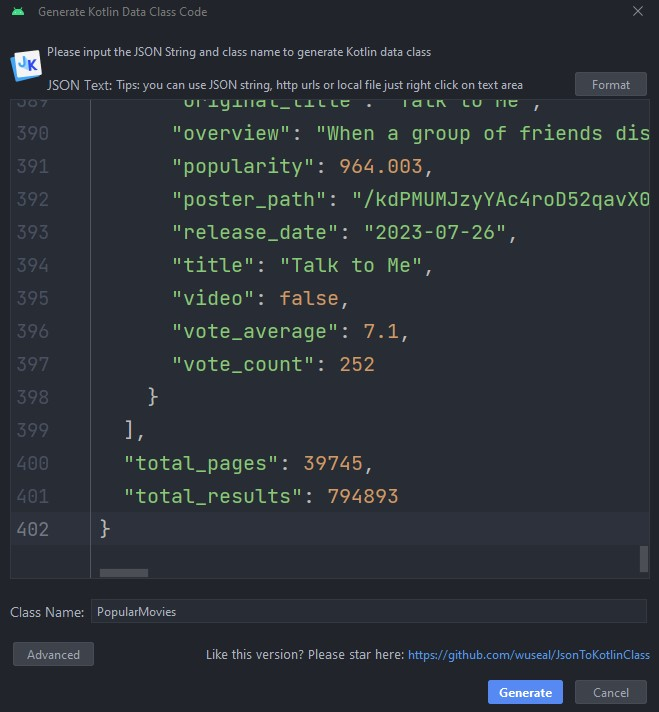

Antes de finalizar selecciona la opción **Advanced**, en las opciones de **Annotation** asegúrate que este seleccionado **kotlinx.serialization**.

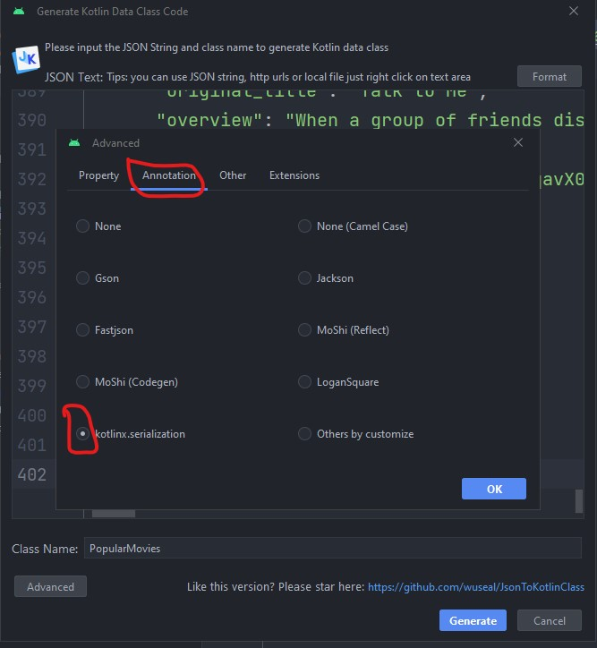

Damos clic en **Ok** y luego en **Generate**.

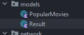

Verás que de manera automática se crearán 2 nuevas clases, donde su contenido será simplificar el resultado de la llamada JSON que pegamos hace un momento.

Para el caso de **PopularMovies** el contenido es el siguiente

```
@Serializable  
data class PopularMovies(  
    @SerialName("page")  
    val page: Int,  
    @SerialName("results")  
    val results: List<Result>,  
    @SerialName("total_pages")  
    val totalPages: Int,  
    @SerialName("total_results")  
    val totalResults: Int  
)
```

Observa que como en las funciones **@Composable** usamos para los modelos la etiqueta **@Serializable**, ya hemos mencionado a detalle para que sirve. Ahora observa como se definen los campos, por ejemplo:

```
@SerialName("page")  
val page: Int
```

Con **@SerialName** lo que hacemos es llamar el campo como viene definido en la respuesta JSON del API, después declaramos una variable con el mismo tipo como viene en el JSON. Esto te permite ver que puedes nombrar como quieras las propiedades, aunque la buena práctica es usas el mismo nombre.

El plugin que instalamos lee todo el archivo JSON y convierte de manera automática todas las propiedades y cuando encuentra sub niveles, los separa en archivos diferentes, tal y como paso con **Results**, aquí, se detectó que es una lista por lo que de inmediato se creo el archivo nuevo.

```
@SerialName("results")  
val results: List<Result>
```

Ahora el nombre que toman estos archivos nuevamente coincide con el de la propiedad, sin embargo aquí a veces no es suficiente el nombre como es el caso, puesto que Result no nos dice mucho de que es lo que contiene este modelo. Por facilidad vamos a cambiar el nombre del archivo **Result** por **Movie** para que haga más sentido.

Dando clic derecho en **Result**, vamos a buscar la propiedad **Refactor > Rename...**

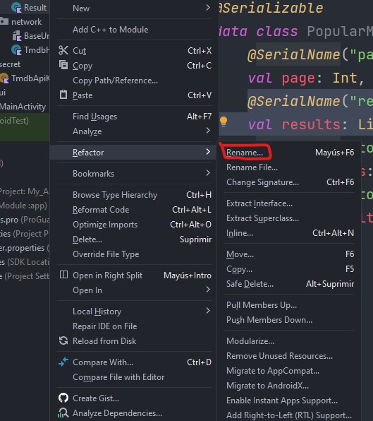

Y sustituimos el nombre por **Movie**.

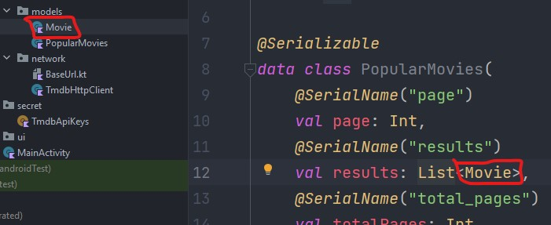

En el resultado final se actualizará el nombre del archivo, y también en **PopularMovies** veremos reflejado el cambio de manera automática.

### Paso 5 Preparar las llamadas al API con el Repositorio

En los siguientes pasos vamos a configurar las llamadas para que desde cualquier lugar de nuestra aplicación podamos realizarlas.

Primero vamos a crear un nuevo archivo en el paquete **data** que se llame **Resource**.

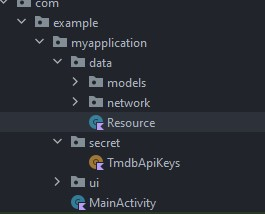

Este archivo nos ayudará a definir estados según sea el caso para cada llamada del API. Esto lo podemos segmentar en llamadas de éxito, llamadas con error y llamadas en curso.

Por tanto el contenido del archivo es el siguiente:

```
sealed class Resource<out R>{  
    data class Success<out R>(val result:R):Resource<R>()  
    data class Failure(val exception:Exception):Resource<Nothing>()  
    object Loading: Resource<Nothing>()  
}
```

Observa que cada estado se define como un data class excepto el **Loading** ya que para este en particular queremos mostrar un widget de carga.

Igualmente los valores que recibe el **Success** y el **Failure** respectivamente son los valores de éxito o la excepción según sea el caso. Esta clase es más estandarizada pero siempre se puede adecuar según sea el caso.

Ahora vamos a crear el archivo **MoviesRepository** de tipo **Class** dentro del paquete **data**. Los repositorios son patrones de diseño que permiten conectar diferentes fuentes de información, en este caso solo tenemos la conexión al API, pero podríamos tener una base de datos local, una conexión a otra API, etc. Para centralizar todo esto en un solo lugar por eso usamos el repositorio.

Para comenzar, fuera de la definición de la clase vamos a agregar la siguiente línea

```
private const val POPULAR_MOVIES = "${BASE_URL}/popular"
```

Aquí estamos llamando la url base que ya habíamos definido y le estamos concatenando la que va a utilizar nuestro repositorio. Si el proyecto fuera más grande existen varias opciones que podemos tomar:

1. Crear un repositorio para cada variante del API o por categoría.
2. Centralizar todo en el mismo archivo repositorio.

No existe una respuesta correcta ya que depende mucho del servicio a conectar pero mientras tú lo entiendas es lo principal.

Ahora vamos a agregar un parámetro al constructor de la clase de la siguiente manera:

```
class MoviesRepository(  
    private val httpClient: HttpClient  
) {

}
```

Esto nos permitirá recibir un objeto que pueda hacer las llamadas a Internet, para nuestro caso será el objeto que creamos de configuración con KTOR.

Dentro de la definición de la clase vamos a agregar la siguiente función:

```
suspend fun getPopularMovies(): Resource<List<Movie>> {

}
```

Las funciones definidas como **suspend** son las llamadas funciones asíncronas, es decir, su valor no regresa de manera inmediata por que en algún momento van a tardarse mucho tiempo en ejecutar algo, como en este caso la llamada al servidor.

También veremos que el resultado de la función no será directamente la lista de películas, sino el objeto intermedio que creamos **Resource** en su versión del estado de **Success**.

Ahora la pregunta vendría en como podemos manejar también el error. La respuesta es muy sencilla, con un **try catch**.

Dentro de la función agregaremos lo siguiente:


```
return try{

}catch (e:Exception){

}
```

En la sección del try, agregaremos lo siguiente:

```
Resource.Success(  
    httpClient.get<PopularMovies>{  
       url(POPULAR_MOVIES)  
    }.results  
)
```

Esta es la parte más delicada de todo el proyecto, pues aquí realizamos una petición GET a nuestro API, y le decimos que de resultado obtendremos **PopularMovies**, y todo esto a través de la url **POPULAR_MOVIES** que definimos al inicio de este paso. Todo lo anterior mediante un Resource.Success que recibe la lista de resultados.

Ahora, en la sección del catch agregaremos lo siguiente:

```
e.printStackTrace()  
Resource.Failure(e)
```

En caso de que tengas marcados errores verifica que el import sea el correcto

```
import io.ktor.client.request.*
```

Si tienes el siguiente sustituye por el anterior:

```
 io.ktor.client.features.get
```

Con esto ya podemos llamar a nuestra API desde cualquier lugar de la aplicación.

### Paso 6 Uniendo los modelos con la interfaz (ViewModel)

Hasta ahora ya cargamos una llamada al API y por el otro lado tenemos una interfaz cargada, es momento de agregar el elemento integrador de estos elementos.

Dentro del mundo de Android esto se le conoce como arquitectura MVVM ó Model, View, ViewModel. Tanto el Model y el View se entiende cuales son, para el caso del ViewModel es tal cual el elemento que integra la comunicación entre ambos.

Un punto a destacar es que el ViewModel hace uso del patrón de diseño de observación para avisar cuando un elemento ha sufrido cambios, esto permite que del lado de la interfaz no exista código referente a las llamadas a internet y sea muy flexible el acceso a la información.

Para comenzar vamos a crear un archivo de tipo **Class** que se llame **MainViewModel**, este lo crearemos en el paquete de **ui**.

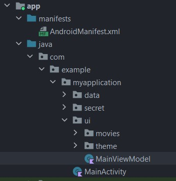

Aprovechando que estamos trabajando la capa de interfaz, vamos a arrastrar el **MainActivity** al paquete de **ui**.

La estructura final deberá quedar como la siguiente.

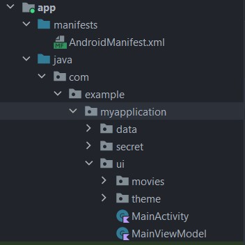

Ahora, para el código de **MainViewModel** vamos a empezar modificando la declaración de la clase inicial por lo siguiente

```
class MainViewModel:ViewModel() {

}
```

Aquí lo único que hemos hecho es declarar la herencia a la clase **ViewModel** que Android ya trae.

Dentro de la clase vamos a agregar las siguientes 2 líneas

```
private val httpClient = TmdbHttpClient()  
private val repository = MoviesRepositoryImpl(httpClient.getHttpClient())
```

La primera es la declaración del objeto de configuración de KTOR Http que creamos al inicio del trabajo con los modelos.

El segundo es la declaración de nuestro repositorio para poder hacer la llamada al API. De acuerdo a lo que declaramos al inicio nuestro repositorio recibe un objeto HTTP normal, por eso es que en nuestro TmdbHttpClient definimos un método que regresa este objeto pero la diferencia es que aquí ya está configurado.

Ahora vamos a definir las siguientes 2 líneas:

```
private val _movies = MutableStateFlow<Resource<List<Movie>>?>(value = null)  
val movies:StateFlow<Resource<List<Movie>>?> = _movies
```

Aquí definimos 2 variables que tienen el mismo resultado pero por buena práctica se recomienda se separen. 

La variable la primera variable movies con guion bajo es privada, y es para que solo el ViewModel pueda modificar sus valores. 

La segunda variable iguala el valor de movies y permite que se acceda a ella desde fuera en cualquier otra clase.

Este es un comportamiento normal puesto que la interfaz no debería poder modificar los valores de la lista de movies.

También observa el uso de **MutableStateFlow**  y de **StateFlow** a nivel de uso es la misma idea que con la definición de la variable privada y pública, pero estas clases en particular son los objetos que observan cuando existe un cambio dentro de la aplicación. En un momento verás como funciona, pero algo que no debes olvidar es que siempre deben ser inicializadas aunque sea a nulo cualquiera de sus estados.

Debajo de estas declaraciones vamos a añadir lo siguiente:

```
init {  
    viewModelScope.launch {  
        _movies.value = Resource.Loading  
        _movies.value = repository.getPopularMovies()  
    }  
}
```

El método **init** nos permite ejecutar una función al momento de inicializar un objeto, esto sería en su constructor por defecto.

Dentro de **init** es necesario usar un método que trae el **ViewModel** por default que es **viewModelScope.launch**. Esta llamada cambia el hilo actual donde estamos trabajando. Esto debe hacerse ya que si hacemos la llamada a internet esta tomará tiempo, y durante esos segundos en la parte default bloquearía la aplicación haciendo parecer que está congelada. 

Este principio se debe a que todo corre en el hilo de la interfaz de manera default, entonces lo que hacemos es cambiarnos a un hilo para no bloquear y desde ahí ejecutamos la llamada primero al estado de Loading, y luego a nuestro repositorio.

También observa que solo necesitamos igualar **movies.value**, y  dado que se usa un objeto de la clase **State** de manera automática, quienes lo estén escuchando recibirán sus valores, esto lo agregaremos en el siguiente paso dentro de **MainActivity**.

### Paso 7 Conectando la interfaz con los valores del modelo

Ahora vamos con **MainActivity**, lo primero que debemos hacer es declarar una variable global, es decir, dentro de la definición de la clase, pero fuera de las otras funciones que sea de tipo ViewModel.

```
private val viewModel by viewModels<MainViewModel>()
```

Dentro de Android esta declaración es un poco diferente a lo normal, el **by viewModels<>**, esto se hace por que si lo declaramos de la forma tradicional al momento de inicializar la variable esta existirá mientras nuestra clase exista, en este caso **MainActivity**, ahora bien nuestro Activity es raro, pues no es una clase común, es una clase que vive a través de un ciclo de vida especial que es mantenido y usado por el sistema operativo.

Con la declaración especial, nuestro ViewModel actúa de forma independiente haciendo que aunque la aplicación entre en segundo plano, siga existiendo el ViewModel, para ejecutar tareas adicionales de actualización según sea programado.

Ahora, dentro de **setContent** vamos a agregar lo siguiente:

```
val context = LocalContext.current  
val movies = viewModel.movies.collectAsState()
```

La variable de contexto nos permitirá crear objetos adicionales, en Android es muy común utilizarla por lo que te recomiendo siempre tengas un objeto declarado.

Para el caso de movies, observa como se hace la conexión con nuestro **ViewModel** para acceder a la información actual disponible. Con esto ya no necesitamos realizar llamadas continuas dentro del viewModel, puesto que al crearlo se ejecuta nuestro repositorio y con 1 vez que obtengamos la información es suficiente.

Ahora dentro de AppTheme vamos a sustituir la llamada simple que tenemos a **MovieList()** y vamos a sustituirlo por lo siguiente.

```
movies.value?.let {

}
```

Esto le va a decir a la aplicación que cuando la lista de valores no sea nula ejecute el código interno. Esta es la forma de Kotlin de ahorrarse los famosos **if(movies == null)**.

Si recuerdas el valor dentro de movies, no es la lista de películas como tal, sino que es un estado de **Resource**, aquí lo que haremos será definir cada estado para adecuarnos al formato que necesitamos.

1. En caso de error: Mostrar un mensaje de error
2. En caso de estar cargando: Mostrar un loader
3. En caso de éxito: Cargar **MovieList()** pero pasando la lista resultado como parámetro.

Así bien, el código quedaría de la siguiente manera:

```
when(it){  
    is Resource.Failure->{     Toast.makeText(context,it.exception.message!!,Toast.LENGTH_LONG).show()  
    }  
    Resource.Loading -> {  
        //@todo create progressbar here  
    }  
    is Resource.Success -> {  
        MovieList(it.result)  
    }  
}
```

El resultado completo de **MainActivity**, es el siguiente:

```
class MainActivity : ComponentActivity() {  
    private val viewModel by viewModels<MainViewModel>()  
  
    override fun onCreate(savedInstanceState: Bundle?) {  
        super.onCreate(savedInstanceState)  
  
        setContent {  
            val context = LocalContext.current  
            val movies = viewModel.movies.collectAsState()  
  
            AppTheme {  
                movies.value?.let {  
                    when(it){  
                        is Resource.Failure->{  
                            Toast.makeText(context,it.exception.message!!, Toast.LENGTH_LONG).show()  
                        }  
                        Resource.Loading -> {  
                            //@todo create progressbar here  
                        }  
                        is Resource.Success -> {  
                            MovieList(it.result)  
                        }  
                    }  
                }  
            }  
        }  
    }  
}
```

Todo debería estar en orden, excepto **MovieList** que como modificamos a pasar la lista resultante, debemos actualizar para que maneje nuestra lista.

Vamos al archivo **MovieList** y vamos a modificar el constructor vació por el siguiente:

```
@Composable  
fun MovieList(movies:List<Movie>) {
	...
}
```

Ahora vamos a eliminar la lista default **data** que declaramos para tener elementos en la lista.

Y dentro de **LazyColumn** vamos a modificar los items para que en vez de **data** se reciba **movies**.

Con esto **MovieList** queda listo, pero ahora necesitamos enviar la película individual a **MovieItem**.

Dentro de **MovieItem** vamos a actualizar el **LazyColumn**

```
LazyColumn {  
    items(movies) {  
        MovieItem(it)  
    }  
}
```

Aquí solo agregamos **it** dentro de **MovieItem** como parámetro, la convención de it viene ya que al usar una función lambda o anónima, no estamos definiendo un nombre para el resultado.

Si queremos definir un nombre para ser más expresivo podríamos actualizarlo a lo siguiente.

```
LazyColumn {  
    items(movies) { movie ->  
        MovieItem(movie)  
    }  
}
```

En ambos casos el resultado es el mismo.

Ahora vamos a **MovieItem()** y vamos a añadir a su constructor la recepción de **movie**

En la declaración de la clase modifica lo siguiente:

```
fun MovieItem(movie: Movie) {
	...
}
```

Ahora vamos a buscar el siguiente **Text**

```
Text(  
    text = "Jurassic World Dominion",  
    style = MaterialTheme.typography.titleLarge,  
    color = MaterialTheme.colorScheme.onSurface  
)
```

Y en la propiedad text, vamos a sustituir el valor de Jurassic World por lo siguiente:

```
text = movie.title,
```

Busca la descripción y el rating y sustituye por los siguientes:

```
Text(  
    text = movie.overview,  
    style = MaterialTheme.typography.bodyMedium,  
    color = MaterialTheme.colorScheme.onSurface,  
    maxLines = 7,  
    overflow = TextOverflow.Ellipsis  
)
```

```
Text(  
    text = "IMDB ${movie.voteAverage}",  
    style = MaterialTheme.typography.bodySmall,  
    fontWeight = FontWeight.Bold,  
    modifier = Modifier  
        .clip(RoundedCornerShape(spacing.extraSmall))  
        .background(Color.Yellow)  
        .padding(  
            start = spacing.small,  
            end = spacing.small,  
            top = spacing.extraSmall,  
            bottom = spacing.extraSmall  
        )  
)
```

El último que nos falta modificar es la imagen del archivo, pero tenemos un pequeño problema, el API de TMDB no nos devuelve una url completa en la propiedad **posterPath**, esto podemos solucionarlo de varias formas, pero vamos a aprender a hacerlo desde el mismo modelo.

Ve al modelo **Movie** en el paquete de modelos. Como recordarás toda la definición del modelo se realiza dentro del constructor del **data class**, como te mencioné no es común agregar funciones dentro del cuerpo de la clase, a menos que tengamos un caso como el de la imagen.

Crea las llaves de la clase y agrega la siguiente función.

```
{  
    val fullPosterPath:String  
        get() = "https://image.tmdb.org/t/p/original$posterPath"  
}
```

Como puedes ver esta variable, crea una función get default que concatena la url adicional del poster que hace falta a lo que nos devuelve el API.

Entonces, si regresamos a **MovieItem**, vamos a buscar el elemento **AsyncImage**, que como te había dicho nos permite cargar una imagen usando su url.

```
AsyncImage(  
    model = ImageRequest.Builder(LocalContext.current)  
        .data(movie.fullPosterPath)  
        .crossfade(true)  
        .build(),  
    placeholder = painterResource(R.drawable.bg_image_placeholder),  
    contentDescription = "",  
    contentScale = ContentScale.Fit,  
    modifier = Modifier.weight(0.4f)  
)
```

Llamamos la nueva propiedad que acabamos de crear **movie.fullPosterPath** y en automático debería de cargar la url la imagen correspondiente.

En la parte de abajo de **MovieItem** el preview debe marcarte error, comenta estas líneas pues ya nos las vamos a utilizar.

Ejecuta la aplicación y observa el resultado final.


La aplicación deberá cargar el resultado final con una lista de películas variadas con su respectivo título, descripción, calificación e imagen.

## Reto Adicional
Intenta generar el estado de Loading de **Resource**, esto es en **MainActivity** dejamos el siguiente comentario **//@todo create progressbar here**, investiga como puedes hacer esto con Compose e intenta añadirlo a tu flujo de interfaz.

## Conclusión
En el resultado de este laboratorio hemos incorporado la conexión con un API y hemos conectado la misma a una interfaz utilizando nuestro ViewModel. Dentro de una aplicación este es el flujo más completo que vas a encontrar. No olvides entender el código para poder configurar correctamente cada punto de conexión.
