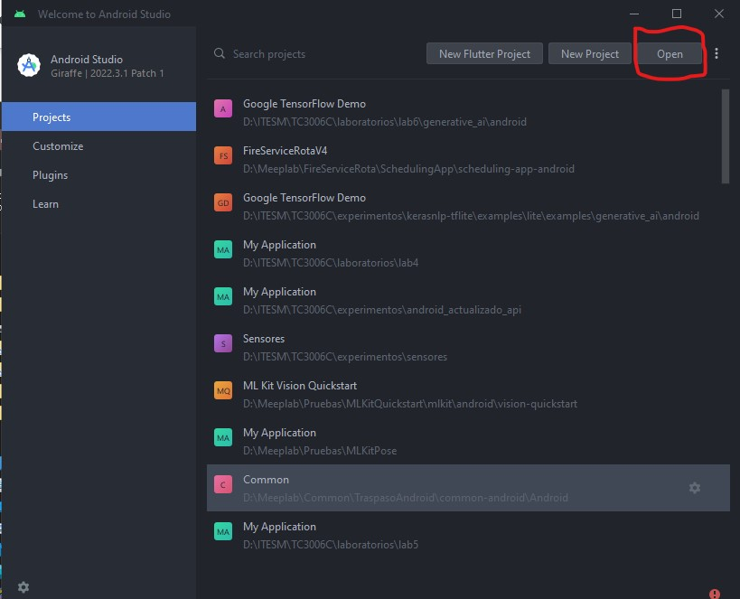

## Objetivo

Este corto laboratorio será la culminación de todo lo aprendido en este módulo, pues aprenderás a como a partir de un modelo de lenguaje se puede reducir el uso de un servidor de alto rendimiento utilizando la tecnología de Tensorflow Lite la cual permite importar un modelo inteligente dentro de dispositivos móviles, en nuestro caso Android.

Este laboratorio se basa en el siguiente [Google Codelab](https://codelabs.developers.google.com/kerasnlp-tflite?hl=es-419#0)

## Pre-requisitos
De preferencia un dispositivo Android para poder probar los diferentes sensores y sus valores.

## Instrucciones

Sigue los pasos descritos en la siguiente práctica, si tienes algún problema no olvides que tus profesores están para apoyarte.

## Laboratorio
### Paso 1 Preparar la base del proyecto

Para este laboratorio no estaremos creando un nuevo proyecto, al contrario te pido que descargues el siguiente archivo [zip](7_kerasnlp_tflite/generative_ai.zip).

Una vez que tengas el zip, descarga la app de android que viene adentro y guárdalo en una carpeta para importarlo desde Android Studio.

El proyecto incluye la ruta **generative_ai/android**. Al momento de importarlo en Android Studio selecciona la carpeta de android.

La aplicación instalará los recursos necesarios, cuando este listo ejecuta la aplicación, y verás lo siguiente.

La aplicación permite autogenerar texto, para realizar la ejecución no es necesario utilizar internet.

Por ahora introduce el siguiente texto en el espacio **I am enjoying a**. El resultado será el siguiente.

La aplicación esta construida pero le hace falta el modelo. Para poder continuar con la aplicación, es necesario que construyas el modelo.

### Paso 2 Construir el modelo de tensorflow lite

Para este paso es necesario que continúes en el [Google Colab](https://colab.research.google.com/github/tensorflow/codelabs/blob/main/KerasNLP/io2023_workshop.ipynb?hl=es-419#scrollTo=WD5aj3e-tHAh) ,  ejecuta los pasos para generar el modelo de TFLite, cuando termines regresa y sigue con el próximo paso.

**Nota: Existe un paso opcional en el Colab, este paso no lo ejecutes a menos que tengas acceso a una unidad mejor que la T4 pues en caso de que no, tardarás 30 minutos y eventualmente te quedarás sin RAM, por lo que no podrás terminar y deberás volver a empezar.**

### Paso 3 Introducir el modelo de TFLite

Ahora que tienes descargado el modelo, regresemos a Android Studio.

Primero vamos a cambiar la visión de archivos de Android por el del Proyecto.

Una vez desplegado el proyecto selecciona la carpeta abre hasta la carpeta **main**

Da clic derecho y selecciona la opción **Directory**.

Ahora selecciona la carpeta predefinida **assets**.

El resultado es que la carpeta se agrega al folder del proyecto.

Ahora desde la carpeta **assets** da clic derecho y selecciona la opcion **open in** y dependiendo tu sistema operativo selecciona **explorer** o **finder**.

Abre la carpeta **assets** y agrega tu modelo descargado, recuerda que el colab solicita que el nombre sea **autocomplete.tflite**.

Una vez agregado vuelve a ejecutar la aplicación. Nuevamente introduce el texto **I am enjoying a** y da clic en **Generate**, esta vez aunque tarde un poco debe generarse el texto autocompletado.

Intenta con algunos otros casos y observa los resultados obtenidos.

Un punto importante qu eno hemos mencionado es como esta construida la app en general.

Regresa a la vista de **Android**.

Durante los laboratorios anteriores aprendimos a estructurar un proyecto en **Compose**, además de introducir un modelo de capas para segmentar las conexiones externas de la aplicación, observa el uso de **AutoCompleteService** para conectar el modelo que agregamos a assets y como se hacen las llamadas entre el **viewmodelModule** y la interfaz para mostrar los resultados de la predicción.

## Conclusión
El uso de modelos de lenguaje y de Inteligencia Artificial generativa es muy popular en estos días, con este laboratorio puedes ver que no se necesita un servidor de super capacidad para realizar predicciones para el modelo de lenguaje generado.

Otro punto a destacar que introducir el modelo en la aplicación permite ahorrar la consulta a un servidor externo dando portabilidad al sistema de uso.

El modelo que trabajamos en este laboratorio es para uso exclusivo para aprendizaje, **bajo ninguna circunstancia debe usarse en un entorno productivo**, ya que los datasets que utilizan son demasiado amplios y no distinguen de un propósito específico.

Existe un alcance bastante amplio sobre este tema y existen varios recursos adicionales al respecto que te recomiendo veas en las implicaciones modelos seguros y responsables.

[OpenAI. Better language models and their implications](https://openai.com/research/better-language-models)
[Safe and responsible development with generatrive language models](https://www.youtube.com/watch?v=oAc0ZhbCfi8&t=300s)

La nuevas prácticas en IA requieren de desarrolladores que apuesten por objetivos que:
- Sean socialmente benéficos.
- Eviten crear o reforzar conductas  inapropiadas.
- Sean construidos y probados para seguridad
- Den cuenta hacia las personas
- Incorporen diseño de principios de privacidad
- Mantengan altos estándares de excelencia científica.
- Sean disponibles para usuarios que sigan estos principios.